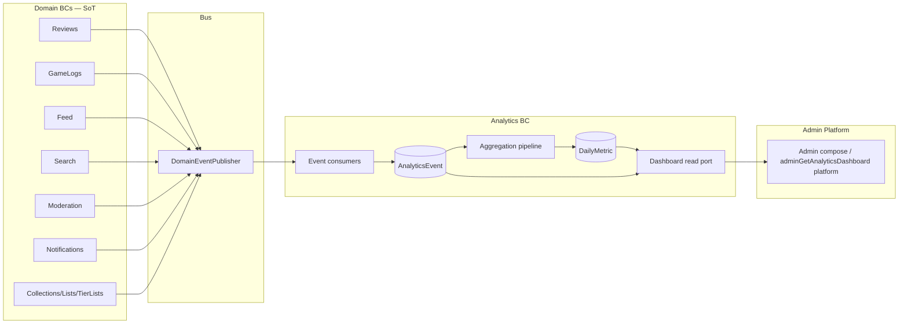

# Analytics Architecture

**Document:** `docs/01_ARCHITECTURE/ANALYTICS_ARCHITECTURE.md`  
**Status:** **Frozen — Analytics Platform Freeze v1.0** (Sprint 14.0)  
**SSOT contracts:** Existing Prisma analytics models + `ADMIN_API.yaml` `adminGetAnalyticsDashboard` (read-only; no invent in implementation without change-control)  
**Freeze declaration:** [`ANALYTICS_PLATFORM_FREEZE_v1.md`](../00_PROJECT/ANALYTICS_PLATFORM_FREEZE_v1.md)  
**Related:** [ADR_Analytics_Platform.md](./ADR/ADR_Analytics_Platform.md)  
**Scope:** [`MODULE_14_SCOPE_REPORT.md`](../00_PROJECT/MODULE_14_SCOPE_REPORT.md)

> **Supersedes normative conflicts** with the product overview [`docs/13_ANALYTICS/ANALYTICS_ARCHITECTURE.md`](../13_ANALYTICS/ANALYTICS_ARCHITECTURE.md) for Module 14+ decisions. That folder remains useful for metrics dictionary / retention narrative; **this document + Freeze win** on BC ownership, MVP allowlist, and PostgreSQL-first path.

---

## Purpose

GMRLOG Analytics Platform is the **internal event-consumer & metric-store bounded context** for product KPIs and operator dashboards.

Analytics **never owns** Users, Games, Reviews, GameLogs, Feed, Search queries, Notifications, Moderation policy, Collections, Lists, or TierLists as source of truth. Domains publish lifecycle events; Analytics **consumes**, **appends** analytics rows, and **aggregates** daily metrics.

North Star: trustworthy internal metrics help keep GMRLOG a healthier digital home for gaming culture — without turning Analytics into a second product database or a B2B Analytics Product (monetization / Feature Matrix Future).

---

## Bounded context

```text
Analytics Platform
  ├── Event consumers (DomainEventPublisher subscribers)     [14.1]
  ├── AnalyticsEvent append store (PostgreSQL)               [14.1]
  ├── Aggregation pipeline → DailyMetric (+ RetentionMetric) [14.2]
  ├── Staff / Admin dashboard read ports                     [14.3]
  └── Privacy / retention / cache hardening                  [14.4]

Does NOT own (hard rule)
  ├── User / sanction / PlatformRole SoT          → Users
  ├── Game catalog                                → Games
  ├── Review bodies / hide                        → Reviews
  ├── Game logs / progress / play sessions        → GameLogs
  ├── Feed fanout / items                         → Feed
  ├── SearchEvent / SERP / Discover               → Search
  ├── Notification inbox                          → Notifications
  ├── Reports / queue / appeals                    → Moderation
  ├── Collections / Lists / TierLists             → Owning BCs
  └── Admin operational triage counters           → Admin compose (domain stats ports)
```

---

## Pillars

| Pillar | Meaning |
|--------|---------|
| **Ingestion** | Subscribe to Freeze-allowlisted domain events; map → `AnalyticsEvent` (append-only) |
| **Aggregation** | Idempotent jobs write `DailyMetric` (and later `RetentionMetric`) for frozen KPI keys |
| **Dashboard** | Staff-readable aggregates; Admin may **compose** Analytics read ports for `platform` dashboard |
| **Privacy** | No PII in properties; GDPR unlink; retention per Freeze |
| **Deferred** | Client SDK batch, warehouse, third-party BI, AI/ML, funnels/cohorts productization |

---

## Orchestration model



**Rules:**

1. Domains **publish** after successful writes (existing pattern).  
2. Analytics consumers run **after** publish — must not block or mutate domain transactions.  
3. Analytics **never** calls domain mutation services to “fix” metrics.  
4. Admin **never** writes Analytics tables directly — uses Analytics read ports (compose).  
5. V1 bus is in-process `DomainEventPublisher` — **best-effort** delivery (no outbox in Module 14 V1 unless Freeze amendment).

---

## Ownership — Analytics tables

| Model | Owner | V1 use |
|-------|-------|--------|
| `AnalyticsEvent` | **Analytics BC** | Append from consumers |
| `DailyMetric` | **Analytics BC** | Aggregation pipeline SoT for platform KPIs |
| `RetentionMetric` | **Analytics BC** | Schema reuse; **writers deferred** past MVP core (optional 14.2 stub only if cheap) |
| `ScreenView` / `GameView` / `ReviewView` | **Analytics BC** (derived facts) | **Deferred writers** until client SDK / change-control — do not dual-write from domains |
| `SearchEvent` | **Search BC** | **Not** Analytics — see SearchEvent boundary |

---

## Event consumers

- Register only events listed in [`ANALYTICS_EVENT_MATRIX.md`](../03_EVENTS/ANALYTICS_EVENT_MATRIX.md).  
- Map payload → `AnalyticsEventType` + `name` (versioned domain event type) + `properties` (**ids / enums / counts only**).  
- Idempotency guidance: prefer `(eventType, name, createdAt bucket, aggregateId)` dedupe keys in implementation; do not invent new Prisma unique constraints without Freeze amendment.  
- **Do not invent** Analytics-published domain lifecycle events (`analytics.user.banned.v1`, etc.).

---

## Aggregation pipeline

1. Input: `AnalyticsEvent` rows only for V1 aggregation. **MALP proxy** = distinct `userId` on approved GameLog events (`gamelog.created.v1`, `game.progress.completed.v1`) in rolling 30d UTC — **never GameLogs SQL**. GameLogs remain SoT for log rows; Analytics stores the **derived** `malp_proxy` number in `DailyMetric` until a future client analytics SDK.  
2. Output: `DailyMetric` rows keyed by `(metricDate, metricKey)` — unique constraint already in schema.  
3. Schedule: hourly or nightly job (implementation choice in 14.2); must be **idempotent upsert**.  
4. KPI keys: Freeze allowlist only (`PRODUCT_METRICS` definitions with **MVP proxies** where client events absent).

---

## Admin compose relationship

| Surface | Owner | Rule |
|---------|-------|------|
| `GET /admin/dashboard` (shell counters) | **Admin** via domain `*AdminStatsService` | Operational triage — **not** replaced by Analytics in V1 |
| `adminGetAnalyticsDashboard` `platform` | **Analytics** read + Admin HTTP compose | Product KPI dashboard subset |
| `adminGetAnalyticsDashboard` `moderation` volume | Optional Analytics counts of `moderation.*` events | Does **not** replace Moderation queue SoT |
| `adminGetAnalyticsDashboard` `ai` / `releases` | **Deferred** | Out of Module 14 V1 |
| Player profile / game-log statistics APIs | **Users / GameLogs** | Unchanged |

**Non-duplication rule:** When both exist, document which is authoritative:

- Queue depth / pending reports for **ops triage** → Admin/Moderation compose.  
- Daily platform KPIs (DAU proxy, MALP proxy, reviews/day) → `DailyMetric`.

---

## MVP allowlist (Module 14 V1)

**In:** Nest Analytics module skeleton; allowlisted consumers; `AnalyticsEvent` append; `DailyMetric` aggregation for frozen keys; staff `platform` dashboard read; privacy/retention baseline; targeted Redis cache.

**Out:** Client SDK as required path; PostHog/Firebase/Grafana as V1 runtime; warehouse; AI/ML; funnels/cohorts product UI; heatmaps; session replay; A/B; revenue analytics; Studio Analytics Products; `searchAnalytics` OpenAPI product; inventing new domain events.

---

## Related documents

- [ADR_Analytics_Platform.md](./ADR/ADR_Analytics_Platform.md)  
- [ANALYTICS_PLATFORM_FREEZE_v1.md](../00_PROJECT/ANALYTICS_PLATFORM_FREEZE_v1.md)  
- [ANALYTICS_EVENT_MATRIX.md](../03_EVENTS/ANALYTICS_EVENT_MATRIX.md)  
- [ANALYTICS_CACHE_STRATEGY.md](../04_CACHE/ANALYTICS_CACHE_STRATEGY.md)  
- [ANALYTICS_PERMISSION_MATRIX.md](../05_SECURITY/ANALYTICS_PERMISSION_MATRIX.md)  
- [ANALYTICS_VISIBILITY_MATRIX.md](../05_SECURITY/ANALYTICS_VISIBILITY_MATRIX.md)  
- Product metrics: [`docs/13_ANALYTICS/PRODUCT_METRICS.md`](../13_ANALYTICS/PRODUCT_METRICS.md)  
- Retention narrative: [`docs/13_ANALYTICS/DATA_RETENTION.md`](../13_ANALYTICS/DATA_RETENTION.md)
