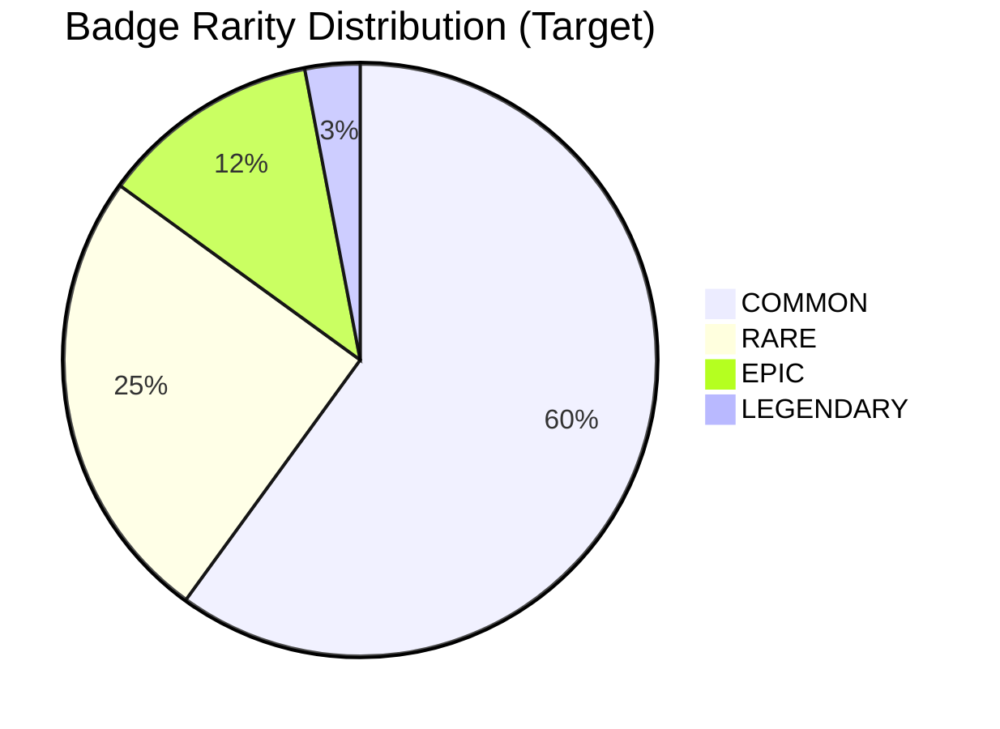
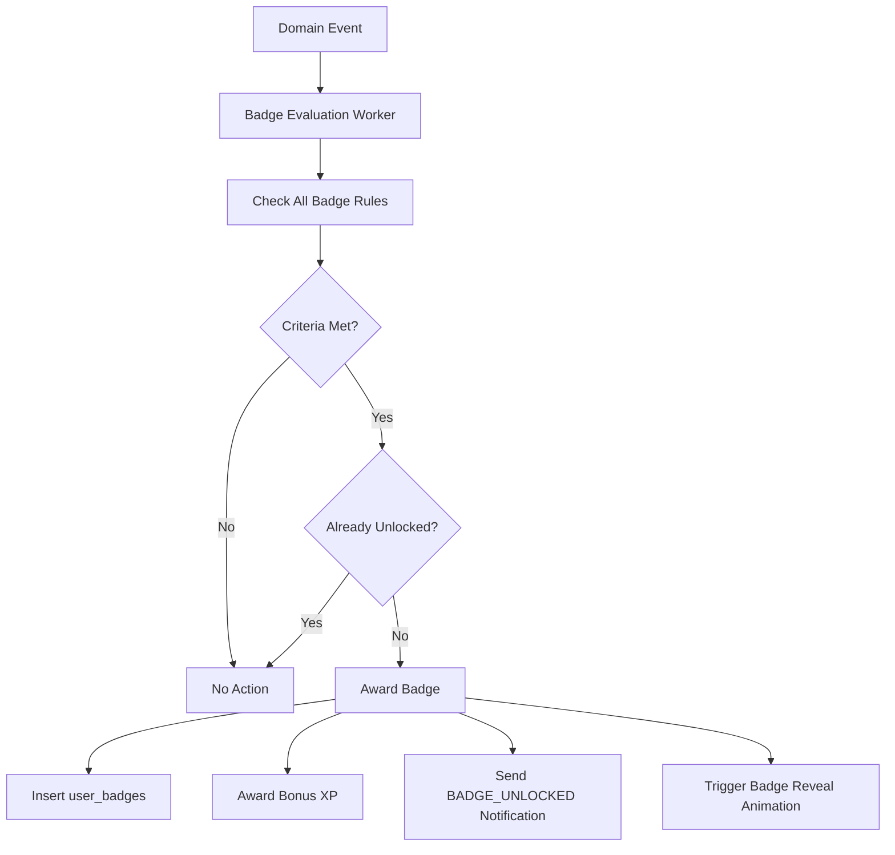

# GMRLOG OS

**Version:** 1.0.0 Alpha

**Document:** `docs/01_PRODUCT/BADGE_SYSTEM.md`

**Status:** Approved

**Owner:** Product Team

**Classification:** Internal Product Documentation

---

# Badge System

## Purpose

This document defines badge types, unlock rules, rarity tiers, and display mechanics for GMRLOG player badges.

Badges are collectible achievements that represent milestones in a player's gaming journey. They complement the XP/level system defined in `GAMIFICATION.md` by providing specific, showcase-worthy accomplishments.

---

# Design Principles

1. **Badges tell a story** — Each badge represents a meaningful gaming moment
2. **Rarity must be genuine** — Legendary badges require extraordinary achievement
3. **No badge spam** — Quality over quantity; targeted catalog of ~80 badges at launch
4. **Showcase pride** — Players display badges prominently on their profile
5. **Surprise and delight** — Some badges are hidden until unlocked

---

# Badge Anatomy

| Property | Type | Description |
|----------|------|-------------|
| `id` | UUID | Unique badge identifier |
| `name` | string | Display name (e.g., "First Steps") |
| `description` | string | How the badge was earned |
| `icon` | URL | SVG/PNG icon on CDN |
| `rarity` | enum | `COMMON`, `RARE`, `EPIC`, `LEGENDARY` |
| `category` | enum | Badge type category |
| `isHidden` | boolean | Concealed until unlocked |
| `unlockedAt` | datetime | When the player earned it |

API schema: `Badge` in `USER_API.yaml`.

---

# Rarity Tiers

| Rarity | Color Token | Drop Rate Target | Visual Treatment |
|--------|-------------|------------------|------------------|
| `COMMON` | `--color-badge-common` (silver) | ~60% of unlocks | Standard icon |
| `RARE` | `--color-badge-rare` (blue) | ~25% of unlocks | Subtle glow |
| `EPIC` | `--color-badge-epic` (purple) | ~12% of unlocks | Animated border |
| `LEGENDARY` | `--color-badge-legendary` (gold) | ~3% of unlocks | Particle effect on reveal |

Rarity is a property of the badge definition, not random assignment. A specific badge always has the same rarity.

---

# Badge Categories

## 1. Milestone Badges

Earned by reaching cumulative thresholds.

| Badge | Rarity | Unlock Rule |
|-------|--------|-------------|
| First Steps | COMMON | Log your first game |
| Getting Started | COMMON | Log 10 games |
| Game Library | RARE | Log 50 games |
| Century Club | EPIC | Log 100 games |
| Thousand Strong | LEGENDARY | Log 1,000 games |
| First Review | COMMON | Publish first review |
| Critic | RARE | Publish 25 reviews |
| Master Critic | EPIC | Publish 100 reviews |
| Voice of the Community | LEGENDARY | Receive 500 helpful votes |

## 2. Streak Badges

Earned through consistent engagement.

| Badge | Rarity | Unlock Rule |
|-------|--------|-------------|
| On a Roll | COMMON | 7-day streak |
| Dedicated | RARE | 30-day streak |
| Unstoppable | EPIC | 100-day streak |
| Eternal Flame | LEGENDARY | 365-day streak |

## 3. Social Badges

Earned through community interaction.

| Badge | Rarity | Unlock Rule |
|-------|--------|-------------|
| Friendly | COMMON | Add 5 friends |
| Popular | RARE | Reach 100 followers |
| Influencer | EPIC | Reach 1,000 followers |
| Community Pillar | LEGENDARY | Reach 10,000 followers |
| Conversation Starter | COMMON | Receive 50 comments on posts |
| Helpful Hand | RARE | 25 helpful review votes given |

## 4. Gaming Identity Badges (Gamer DNA)

Earned by demonstrating a gaming personality type. Aligned with `GamerDNA` types in `USER_API.yaml`.

| Badge | Rarity | Unlock Rule |
|-------|--------|-------------|
| Explorer | RARE | Log games in 10+ genres |
| Completionist | RARE | Complete 25 games (100% or "completed" status) |
| Story Lover | RARE | Log 20 narrative-focused games |
| Achievement Hunter | EPIC | Log 10 games with 100% achievement completion |
| Retro Gamer | RARE | Log 15 games released before 2005 |
| Indie Supporter | RARE | Log 20 indie-tagged games |
| Competitive | RARE | Log 10 competitive/multiplayer-focused games |
| Collector | EPIC | Create 5 collections with 20+ games each |
| Social Gamer | COMMON | Log 10 co-op/multiplayer games |
| Casual Player | COMMON | Log 20 casual-tagged games |

## 5. Platform Badges

Earned through GMRLOG platform activity.

| Badge | Rarity | Unlock Rule |
|-------|--------|-------------|
| Early Adopter | LEGENDARY | Account created during beta |
| Tier Maker | RARE | Create 5 tier lists |
| Curator | RARE | Create a collection followed by 50+ users |
| Founding Member | LEGENDARY | Among first 10,000 registered users |
| Bug Hunter | EPIC | Report 5 confirmed bugs |
| Premium Member | RARE | Subscribe to GMRLOG Premium |

## 6. Seasonal and Event Badges

Limited-time badges tied to events.

| Badge | Rarity | Unlock Rule |
|-------|--------|-------------|
| Launch Day | LEGENDARY | Active on platform launch day |
| Summer Game Fest 2026 | EPIC | Log 3 games during event window |
| Year One | EPIC | Active account for 1 year |
| Holiday Gamer 2026 | RARE | Log a game on Dec 25 or Jan 1 |

Event badges become unavailable after the event window closes. They cannot be earned retroactively.

## 7. Developer and Studio Badges

Earned through verified developer accounts.

| Badge | Rarity | Unlock Rule |
|-------|--------|-------------|
| Verified Developer | EPIC | Developer account verified |
| Verified Studio | EPIC | Studio account verified |
| Community Champion | LEGENDARY | Developer with 10,000+ followers |

---

# Unlock Engine

### Event Triggers

| Domain Event | Badges Evaluated |
|--------------|------------------|
| `gamelog.session.completed.v1` | Milestone, Gaming Identity |
| `review.review.created.v1` | Milestone (review count) |
| `review.review.liked.v1` | Milestone (helpful votes) |
| `social.follow.created.v1` | Social (follower count) |
| `auth.user.registered.v1` | Platform (Early Adopter, Founding Member) |
| `user.streak.updated.v1` | Streak |
| `collection.collection.created.v1` | Gaming Identity (Collector) |
| `tierlist.tierlist.created.v1` | Platform (Tier Maker) |

### Evaluation Rules

* Badge evaluation is idempotent (same event processed once)
* Multiple badges may unlock from a single event
* Count-based badges check denormalized `user_stats` counters
* Percentage-based badges (e.g., genre diversity) computed on evaluation
* Hidden badges reveal name and description only upon unlock

---

# Profile Display

## Badge Showcase

Players select up to **5 featured badges** displayed on their profile (`featuredBadgeIds` in user profile API).

| Profile Section | Display |
|-----------------|---------|
| Profile header | Top 3 featured badges as icons |
| Badges tab | Full grid of all earned badges |
| Badge detail | Tap for name, description, rarity, unlock date |
| Feed card | No badge display (keeps cards clean) |

## Badge Reveal Animation

On unlock (see `MOTION_GUIDELINES.md`):

1. Notification arrives with badge preview
2. Tap opens full-screen reveal (0.6s animation)
3. Rarity-appropriate visual treatment (glow, particles)
4. Option to "Add to Showcase" or "View Collection"

---

# Admin Badge Management

Admin panel capabilities (see Admin domain in `PROJECT_SCOPE.md`):

| Action | Permission |
|--------|------------|
| Create new badge definition | Admin |
| Grant badge to user (manual) | Admin |
| Revoke badge from user | Admin (with audit log) |
| Create seasonal event badge | Product + Admin |
| View badge analytics | Moderator + Admin |

Manual grants require a reason field and appear in audit logs.

---

# Data Model

| Table | Key Fields |
|-------|------------|
| `badges` | `id`, `name`, `description`, `icon`, `rarity`, `category`, `rule`, `isHidden`, `isActive` |
| `user_badges` | `userId`, `badgeId`, `unlockedAt` |
| `badge_events` | Seasonal/event window definitions |

Unique constraint: `(userId, badgeId)` — each badge earned once per user.

---

# Analytics

| Metric | Target |
|--------|--------|
| Badge unlock rate (weekly active) | > 15% earn ≥ 1 badge/week |
| Showcase usage | > 50% of badge earners feature ≥ 1 |
| Legendary badge prestige | < 5% of users hold any legendary |
| Hidden badge surprise rate | Track `badge.discovered` event |

---

# Related Documents

* [GAMIFICATION.md](GAMIFICATION.md)
* [PRODUCT_VISION.md](PRODUCT_VISION.md)
* [FEATURE_MATRIX.md](FEATURE_MATRIX.md)
* [MOTION_GUIDELINES.md](../02_DESIGN/MOTION_GUIDELINES.md)
* [DESIGN_SYSTEM.md](../02_DESIGN/DESIGN_SYSTEM.md)
* [EVENT_ARCHITECTURE.md](../06_BACKEND/EVENT_ARCHITECTURE.md)
* [USER_API.yaml](../08_API/USER_API.yaml)
* [DATABASE_SPECIFICATION.md](../07_DATABASE/DATABASE_SPECIFICATION.md)
* [NOTIFICATION_API.yaml](../08_API/NOTIFICATION_API.yaml)

---

# Revision History

| Version | Date | Change |
|---------|------|--------|
| 1.0.0 Alpha | 2026-07-10 | Initial badge system specification |
