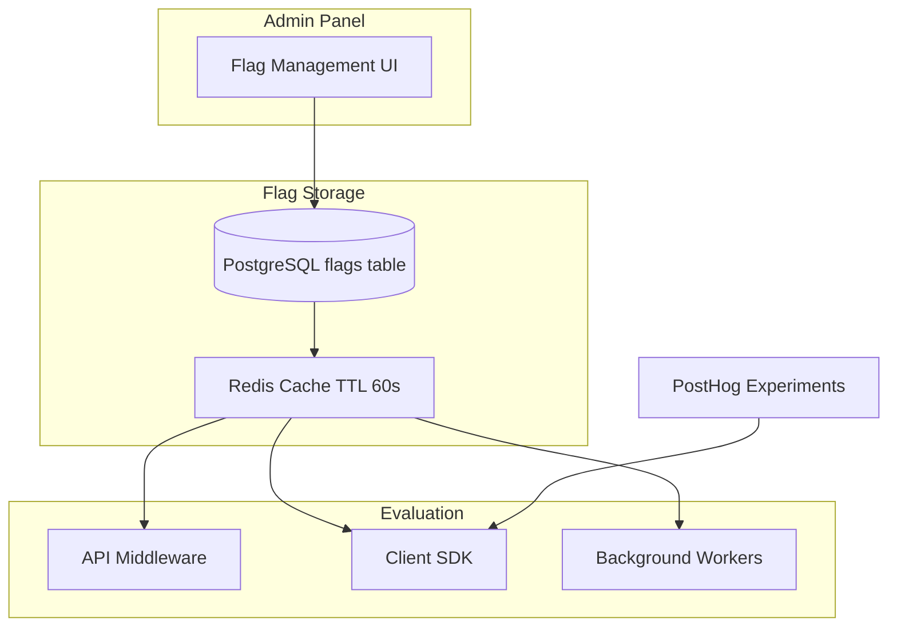
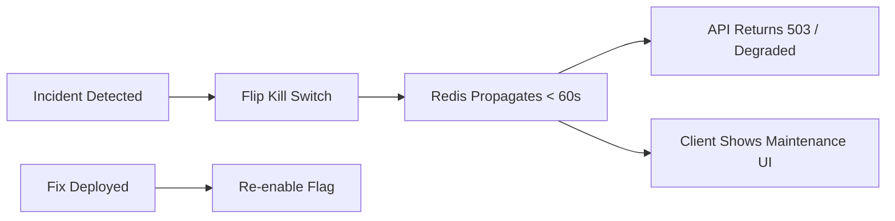
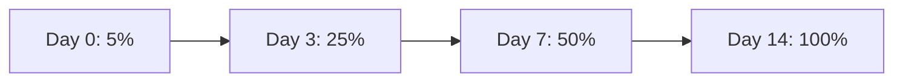
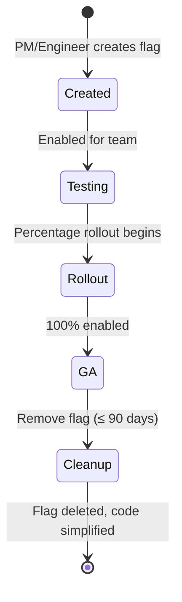

# GMRLOG OS

**Version:** 1.0.0 Alpha

**Document:** `docs/01_PRODUCT/FEATURE_FLAGS.md`

**Status:** Approved

**Owner:** Product Team

**Classification:** Internal Product Documentation

---

# Feature Flags

## Purpose

This document defines the feature flag system for GMRLOG, including flag types, rollout strategies, kill switches, and governance.

Feature flags decouple deployment from release, enabling safe progressive rollouts, A/B experiments, and instant kill switches without redeployment.

---

# Design Principles

1. **Ship dark, launch bright** — Code deploys disabled; flags enable release
2. **Kill switches are sacred** — Critical flags can disable features in < 60 seconds
3. **Minimize flag debt** — Flags are temporary; max lifespan 90 days (unless permanent ops flags)
4. **Consistent evaluation** — Same flag returns same value for a user within a session
5. **Audit everything** — Every flag change is logged in the audit trail

---

# Flag Provider Architecture

GMRLOG uses a hybrid flag system:

| Layer | Provider | Use Case |
|-------|----------|----------|
| Build-time | Environment variables (`EXPO_PUBLIC_*`) | Features compiled into client bundles |
| Runtime (server) | Redis-backed flag store + Admin API | Backend feature gates, kill switches |
| Runtime (client) | `@gmrlog/analytics` flag SDK | UI toggles, experiments |
| Experiments | PostHog | A/B tests with analytics integration |



---

# Flag Types

## 1. Release Flags

Control visibility of incomplete or staged features.

| Property | Value |
|----------|-------|
| Lifespan | Temporary (≤ 90 days) |
| Default | `false` |
| Owner | Feature team |
| Removal | Required after full rollout |

Examples:

| Flag Key | Feature | Status |
|----------|---------|--------|
| `release.ai_recommendations` | AI recommendation engine | Staged rollout |
| `release.tier_lists` | Tier list creation | V1 enabled |
| `release.chat` | Direct messaging | V1 enabled |
| `release.collections_v2` | Enhanced collections | Development |

## 2. Ops Flags (Kill Switches)

Instantly disable functionality during incidents.

| Property | Value |
|----------|-------|
| Lifespan | Permanent |
| Default | `true` (feature enabled) |
| Owner | Platform Engineering |
| Response time | < 60 seconds globally |

| Flag Key | Controls | Default |
|----------|----------|---------|
| `ops.writes_enabled` | All write endpoints | `true` |
| `ops.websocket_enabled` | WebSocket connections | `true` |
| `ops.uploads_enabled` | File upload pipeline | `true` |
| `ops.notifications_enabled` | Notification delivery | `true` |
| `ops.search_enabled` | Search endpoints | `true` |
| `ops.recommendations_enabled` | Recommendation engine | `true` |
| `ops.registrations_enabled` | New user signups | `true` |
| `ops.ai_enabled` | All AI endpoints | `false` (V1 alpha) |



## 3. Permission Flags

Gate features by user role or subscription.

| Flag Key | Requirement |
|----------|-------------|
| `perm.premium_analytics` | Premium subscription |
| `perm.developer_portal` | Developer role |
| `perm.studio_dashboard` | Studio role |
| `perm.admin_panel` | Admin role |
| `perm.beta_features` | Gamer Level ≥ 40 or beta invite |

## 4. Experiment Flags

A/B test variants with analytics tracking.

| Property | Value |
|----------|-------|
| Provider | PostHog |
| Lifespan | Duration of experiment (≤ 30 days) |
| Assignment | Sticky per user (deterministic hash) |
| Measurement | PostHog + `ANALYTICS_SPECIFICATION.md` events |

Example:

| Experiment Key | Variants | Metric |
|----------------|----------|--------|
| `exp.onboarding_flow_v2` | `control`, `streamlined` | Registration completion rate |
| `exp.feed_algorithm` | `chronological`, `ranked` | DAU / session duration |
| `exp.recommendation_explain` | `with`, `without` | Recommendation CTR |

## 5. Client Build Flags

Compiled into client bundles via environment variables.

| Variable | Feature | Default (V1) |
|----------|---------|--------------|
| `EXPO_PUBLIC_ENABLE_CHAT` | Chat module | `true` |
| `EXPO_PUBLIC_ENABLE_TIERLISTS` | Tier lists module | `true` |
| `EXPO_PUBLIC_ENABLE_AI` | AI features UI | `false` |

From `ENVIRONMENT_VARIABLES.md`. Changing build flags requires a new client release.

---

# Rollout Strategies

## Percentage Rollout

Gradually expose a feature to an increasing user percentage.



| Phase | Percentage | Gate |
|-------|------------|------|
| Canary | 5% | No error rate increase |
| Early access | 25% | Positive KPI trend |
| Majority | 50% | Support ticket review |
| Full rollout | 100% | Product sign-off |

### Deterministic Assignment

```
hash(userId + flagKey) % 100 < rolloutPercentage → enabled
```

Same user always gets the same result for a given flag and percentage.

## Targeted Rollout

Enable for specific segments:

| Target | Example |
|--------|---------|
| User IDs | Internal team testing |
| Roles | Developers only |
| Regions | EU users first |
| Gamer Level | Level ≥ 20 |
| Account age | > 30 days |
| Platform | iOS only |

Targets are OR-combined: if any target matches, the flag is enabled (unless percentage rollout also applies).

## Scheduled Rollout

| Property | Description |
|----------|-------------|
| `enabledAt` | Auto-enable at future timestamp |
| `disabledAt` | Auto-disable (event features) |
| Timezone | UTC |

Used for seasonal features and coordinated launches.

---

# Flag Evaluation

## Server-Side (API Middleware)

```typescript
// packages/analytics/src/feature-flags/evaluate.ts
interface FlagEvaluation {
  key: string;
  enabled: boolean;
  variant?: string;
  reason: 'default' | 'rollout' | 'target' | 'override';
}
```

Evaluation order:

1. Kill switch check (if `false` → feature disabled globally)
2. User-specific override (admin grant)
3. Target rules match
4. Percentage rollout bucket
5. Default value

## Client-Side

```typescript
import { useFeatureFlag } from '@gmrlog/analytics';

const isAIEnabled = useFeatureFlag('release.ai_recommendations');
```

Client flags are fetched on app launch and cached for the session. Refresh interval: 5 minutes (configurable).

## Caching

| Layer | TTL | Invalidation |
|-------|-----|--------------|
| Redis (server) | 60 seconds | On flag update event |
| Client memory | Session lifetime | On app restart or pull-to-refresh |
| CDN (build flags) | Until next release | New deployment |

From `CACHE_STRATEGY.md`: Feature flags are Level 1 (application memory) and Level 2 (Redis) cached.

---

# Kill Switch Playbook

### When to Activate

* Error rate > 5% on a feature's endpoints
* Data corruption risk identified
* Security vulnerability discovered
* Dependency outage (AI provider, OAuth)
* Database degradation (disable writes)

### Activation Steps

1. Incident Commander identifies affected feature
2. Flip corresponding `ops.*` flag in Admin panel
3. Verify propagation (< 60 seconds)
4. Confirm error rate stabilization
5. Update Statuspage if user-facing
6. Investigate and fix root cause
7. Re-enable flag after fix verified in staging

### Kill Switch Response Codes

| Flag Disabled | API Response |
|---------------|-------------|
| `ops.writes_enabled` | `503 Service Unavailable` with `WRITES_DISABLED` |
| `ops.search_enabled` | `503` with `SEARCH_UNAVAILABLE` |
| `ops.ai_enabled` | `503` with `AI_UNAVAILABLE` |
| Feature release flag | Feature hidden in UI; endpoint returns `404` |

---

# Governance

## Flag Lifecycle



## Ownership

| Action | Role |
|--------|------|
| Create release flag | Feature engineer + PM approval |
| Create ops kill switch | Platform Engineering only |
| Modify rollout percentage | Feature owner |
| Activate kill switch | On-call engineer (any) |
| Delete flag | Feature owner + code cleanup PR |
| Create experiment | PM + Data analyst |

## Naming Convention

```
<category>.<feature_name>[.<variant>]
```

| Category | Prefix |
|----------|--------|
| Release | `release.` |
| Ops / kill switch | `ops.` |
| Permission | `perm.` |
| Experiment | `exp.` |
| Client build | `EXPO_PUBLIC_ENABLE_` |

## Audit Trail

Every flag mutation is logged:

```json
{
  "action": "flag.updated",
  "flagKey": "release.ai_recommendations",
  "previousValue": { "enabled": false, "rollout": 25 },
  "newValue": { "enabled": true, "rollout": 50 },
  "actorId": "usr_admin_123",
  "timestamp": "2026-07-10T14:00:00Z",
  "reason": "Positive KPI trend at 25%"
}
```

Audit logs retained for 1 year (see `LOGGING.md`).

---

# Admin Panel Integration

Flag management is part of the Admin domain (`PROJECT_SCOPE.md`):

| Capability | UI Location |
|------------|-------------|
| List all flags | Admin → Feature Flags |
| Create / edit flag | Admin → Feature Flags → New |
| Toggle kill switch | Admin → System Health → Kill Switches |
| View audit history | Admin → Feature Flags → History |
| User override | Admin → Users → {user} → Feature Overrides |

Admin API: `ADMIN_API.yaml` (feature flag endpoints).

---

# Testing

| Test Type | Approach |
|-----------|----------|
| Unit | Mock flag evaluator with fixed contexts |
| Integration | Toggle flag in test setup; verify behavior |
| E2E | Test both enabled and disabled paths |
| Load | Verify flag evaluation < 1ms P95 |
| Failover | Redis unavailable → fall back to database → fall back to defaults |

Flag evaluation must never block request processing. On evaluation failure, the default (safe) value is used.

---

# Related Documents

* [PROJECT_SCOPE.md](../00_PROJECT/PROJECT_SCOPE.md)
* [ENVIRONMENT_VARIABLES.md](../00_PROJECT/ENVIRONMENT_VARIABLES.md)
* [CACHE_STRATEGY.md](../06_BACKEND/CACHE_STRATEGY.md)
* [MONOREPO_STRUCTURE.md](../00_PROJECT/MONOREPO_STRUCTURE.md)
* [CI_CD.md](../10_DEVOPS/CI_CD.md)
* [DISASTER_RECOVERY.md](../10_DEVOPS/DISASTER_RECOVERY.md)
* [ANALYTICS_SPECIFICATION.md](../13_ANALYTICS/ANALYTICS_SPECIFICATION.md)
* [LOGGING.md](../10_DEVOPS/LOGGING.md)

---

# Revision History

| Version | Date | Change |
|---------|------|--------|
| 1.0.0 Alpha | 2026-07-10 | Initial feature flags specification |
