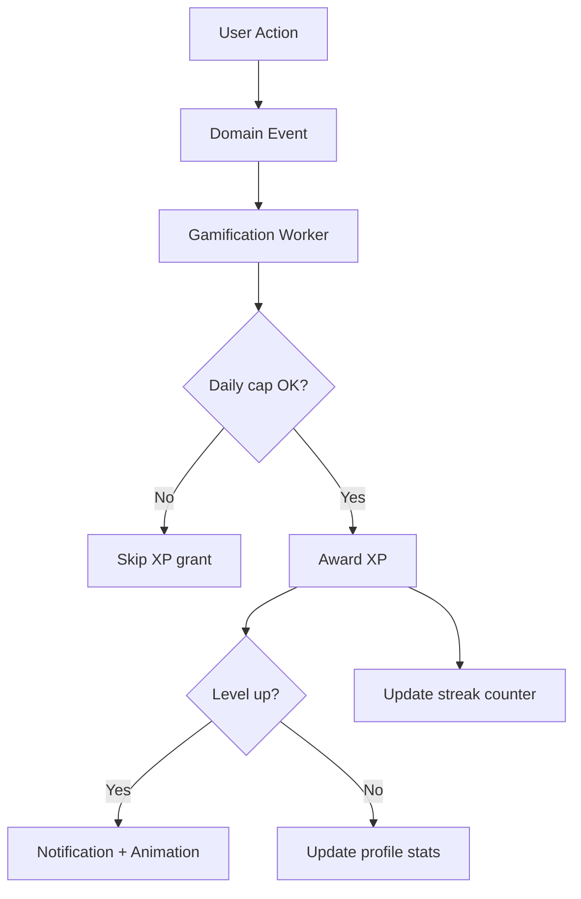
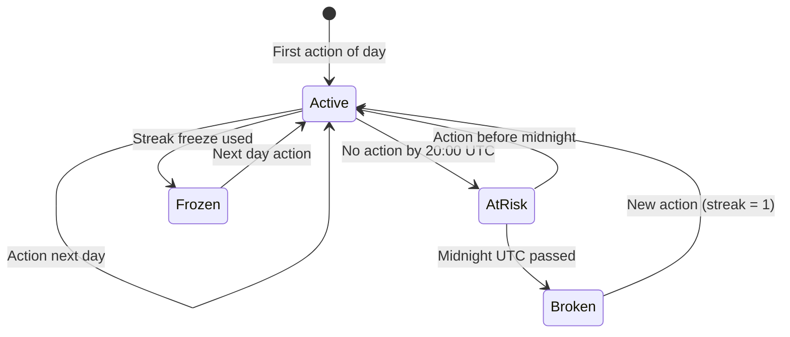
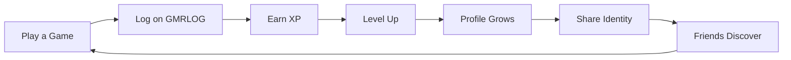
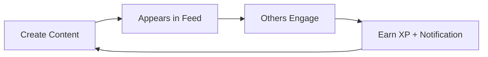
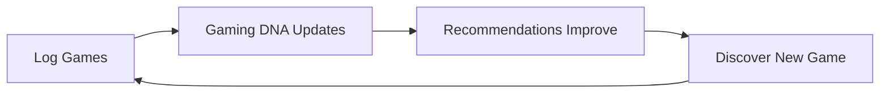

# GMRLOG OS

**Version:** 1.0.0 Alpha

**Document:** `docs/01_PRODUCT/GAMIFICATION.md`

**Status:** Approved

**Owner:** Product Team

**Classification:** Internal Product Documentation

---

# Gamification System

## Purpose

This document defines the gamification mechanics that drive long-term engagement on GMRLOG.

Gamification reinforces meaningful gaming actions—not vanity metrics. Every XP source maps to a behavior that strengthens a player's gaming identity and platform habit formation, aligned with the North Star Metric (MALP) in `SUCCESS_METRICS.md`.

---

# Design Principles

1. **Reward identity, not addiction** — XP reflects genuine gaming activity, not infinite scroll
2. **Progress must feel earned** — Significant milestones require sustained engagement
3. **Social visibility is optional** — Players control public display of level and streaks
4. **No pay-to-win** — Premium does not grant XP multipliers
5. **Transparent rules** — Players can view how XP is earned (settings → Gamification)

---

# Core Mechanics

## Experience Points (XP)

XP is the universal progression currency. It accumulates from qualifying actions and never decreases.

### XP Sources

| Action | XP | Daily Cap | Notes |
|--------|-----|-----------|-------|
| Log a game (first time) | 50 | — | Per unique game |
| Complete a game | 100 | — | Marked as "completed" status |
| Write a review (> 100 chars) | 75 | 3 reviews (225 XP) | Quality gate: min length |
| Receive helpful vote on review | 25 | 5 votes (125 XP) | Voter must have played game |
| Daily login streak | 10 × streak day | Day 7 cap (70 XP) | Resets on miss |
| Add game to collection | 15 | 5 games (75 XP) | — |
| Create a tier list | 50 | 1 list (50 XP) | Min 5 games placed |
| Publish a post | 20 | 5 posts (100 XP) | — |
| Friend accepts request | 30 | 3 friends (90 XP) | Both players earn XP |
| Finish weekly challenge | 200 | 1 challenge | See challenges below |
| Unlock platform achievement | 50–500 | — | Varies by achievement |

### XP Anti-Abuse

* Self-interaction (liking own content) earns no XP
* Duplicate game logs for the same game earn no additional XP
* XP grants are processed asynchronously via `gamelog.session.completed.v1` and related domain events
* Suspicious patterns (bot-like velocity) trigger review and XP freeze



---

# Gamer Levels

## Level Curve

Gamer Level is derived from total lifetime XP using a progressive curve:

```
XP required for level N = floor(100 × N^1.5)
```

| Level | Total XP Required | Title |
|-------|-------------------|-------|
| 1 | 0 | Newcomer |
| 5 | 1,118 | Regular |
| 10 | 3,162 | Enthusiast |
| 20 | 8,944 | Veteran |
| 30 | 16,432 | Expert |
| 50 | 35,355 | Master |
| 75 | 64,952 | Legend |
| 100 | 100,000 | Icon |

Levels beyond 100 continue with the same curve. Level 100+ players receive the "Icon" title with a numeric suffix (Icon II, Icon III, etc.).

## Level Benefits

Levels are primarily cosmetic and social—no gameplay advantage.

| Benefit | Unlock Level |
|---------|-------------|
| Profile level badge display | 1 (default on) |
| Custom profile accent color | 10 |
| Additional showcase slots | 20 (+1 slot), 50 (+2 slots) |
| Profile flair animations | 30 |
| Early access to beta features | 40 (via feature flags) |
| Community flair (forum posts) | 50 |

---

# Streaks

## Daily Login Streak

A streak increments when a player performs at least one meaningful action in a calendar day (UTC).

**Meaningful actions for streak:** game log, review, post, comment, message sent, collection update.

Simply opening the app does not maintain a streak.

| Streak Day | Bonus XP | Visual |
|------------|----------|--------|
| 1–3 | 10–30 | Small flame icon |
| 4–6 | 40–60 | Growing flame |
| 7+ | 70 (capped) | Golden flame + profile border |

### Streak Rules

* Streak resets to 0 after missing a full UTC day
* **Streak freeze** (1 per month, Premium: 3 per month): preserves streak through one missed day
* `currentStreak` and `longestStreak` exposed on user statistics API
* Streak milestone notifications at days 7, 30, 100, 365



## Activity Streaks (Future — V2)

| Streak Type | Trigger | Display |
|-------------|---------|---------|
| Review streak | Review published weekly | "Critic streak: 4 weeks" |
| Discovery streak | New game logged weekly | "Explorer streak: 3 weeks" |
| Social streak | Comment/post weekly | "Community streak: 6 weeks" |

---

# Engagement Loops

## Primary Loop — Gaming Identity



## Secondary Loop — Social Reinforcement



## Tertiary Loop — Discovery



---

# Weekly Challenges

Rotating challenges provide burst engagement opportunities.

| Challenge Example | Requirement | XP Reward |
|-------------------|-------------|-----------|
| "Critic's Week" | Publish 2 reviews | 200 XP |
| "Explorer" | Log 3 games you've never played | 200 XP |
| "Social Butterfly" | Comment on 5 posts | 150 XP |
| "Completionist" | Mark 1 game as completed | 150 XP |
| "Curator" | Add 5 games to a collection | 150 XP |

* One active challenge per week per player
* Challenge assigned Monday 00:00 UTC
* Progress tracked in-app with notification on completion
* Incomplete challenges expire without penalty

---

# Reputation

Reputation is separate from XP—a measure of community trust.

| Factor | Impact |
|--------|--------|
| Helpful review votes | +reputation |
| Content reported and upheld | −reputation |
| Account age | Slow positive drift |
| Verified status | Badge display only |

Reputation does not gate features in V1. Future: low-reputation accounts have reduced feed visibility.

---

# Notifications and Feedback

| Event | Notification Type | In-App Animation |
|-------|-------------------|------------------|
| Level up | `LEVEL_UP` | Badge reveal animation |
| Streak milestone | `STREAK_MILESTONE` | Flame burst |
| Challenge complete | `CHALLENGE_COMPLETE` | Confetti (subtle) |
| Achievement unlocked | `BADGE_EARNED` | Badge reveal (see `BADGE_SYSTEM.md`) |
| XP earned (milestone only) | — | Toast for > 100 XP grants |

Animations follow `MOTION_GUIDELINES.md` — celebratory but not disruptive.

---

# Privacy and Display Controls

Users control gamification visibility in Settings → Privacy:

| Setting | Default | Options |
|---------|---------|---------|
| Show level on profile | On | On / Off |
| Show streak on profile | On | On / Off |
| Show XP progress bar | On | On / Off |
| Show on leaderboards | Off | Opt-in only |

---

# Data Model

| Entity | Storage | Key Fields |
|--------|---------|------------|
| `user_xp` | PostgreSQL | `userId`, `totalXp`, `level`, `updatedAt` |
| `xp_transactions` | PostgreSQL | `userId`, `amount`, `source`, `referenceId`, `createdAt` |
| `user_streaks` | PostgreSQL | `userId`, `currentStreak`, `longestStreak`, `lastActionDate` |
| `weekly_challenges` | PostgreSQL | `userId`, `challengeId`, `progress`, `completedAt` |

XP transactions are append-only for audit purposes.

---

# Analytics

Track gamification health via `ANALYTICS_SPECIFICATION.md` events:

| Event | Purpose |
|-------|---------|
| `xp.earned` | XP source distribution |
| `level.up` | Level progression funnel |
| `streak.milestone` | Streak retention |
| `challenge.completed` | Challenge engagement rate |
| `streak.broken` | Churn signal |

Target: 40%+ of MAU earn XP at least once per week.

---

# Related Documents

* [BADGE_SYSTEM.md](BADGE_SYSTEM.md)
* [SUCCESS_METRICS.md](../00_PROJECT/SUCCESS_METRICS.md)
* [PRODUCT_VISION.md](PRODUCT_VISION.md)
* [PRODUCT_PRINCIPLES.md](PRODUCT_PRINCIPLES.md)
* [FEATURE_MATRIX.md](FEATURE_MATRIX.md)
* [EVENT_ARCHITECTURE.md](../06_BACKEND/EVENT_ARCHITECTURE.md)
* [USER_API.yaml](../08_API/USER_API.yaml)
* [MOTION_GUIDELINES.md](../02_DESIGN/MOTION_GUIDELINES.md)

---

# Revision History

| Version | Date | Change |
|---------|------|--------|
| 1.0.0 Alpha | 2026-07-10 | Initial gamification specification |
