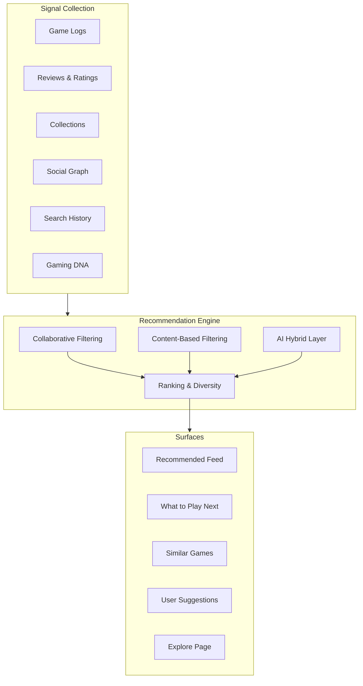
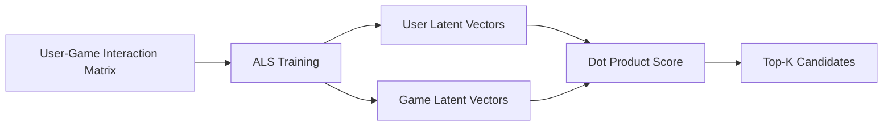
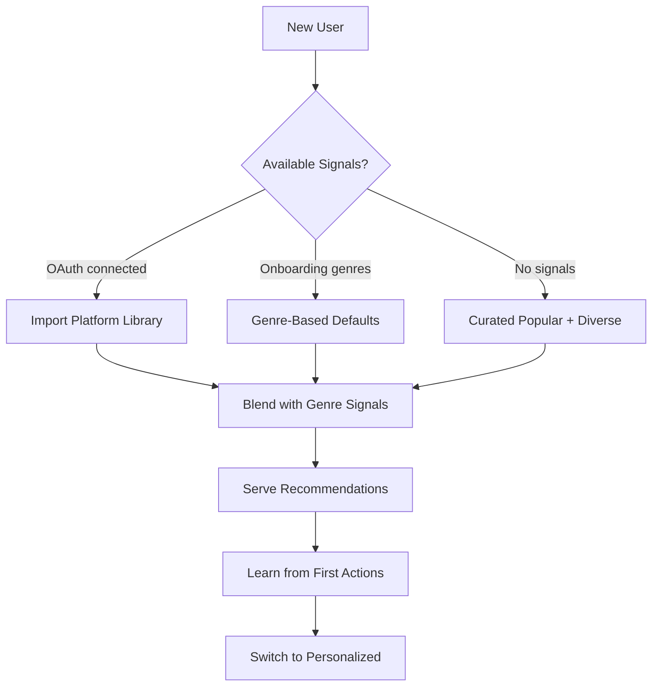

# GMRLOG OS

**Version:** 1.0.0 Alpha

**Document:** `docs/01_PRODUCT/RECOMMENDATION_ENGINE.md`

**Status:** Approved

**Owner:** Product Team

**Classification:** Internal Product Documentation

---

# Recommendation Engine

## Purpose

This document defines the recommendation system that powers game discovery, social suggestions, and personalized feeds on GMRLOG.

The engine must answer three questions for every player:

1. **What game should I play next?**
2. **Which games are similar to one I love?**
3. **Who should I follow?**

Recommendations improve with usage—cold-start users receive quality defaults within their first session.

---

# Design Principles

1. **Taste over popularity** — Recommendations reflect individual preference, not global trends
2. **Explainability** — Every recommendation includes a human-readable reason
3. **Diversity** — Avoid filter bubbles; inject discovery items
4. **Freshness** — New releases and trending games surface appropriately
5. **Privacy** — Recommendations use behavioral signals, never sold to third parties

---

# System Architecture



---

# Recommendation Types

## 1. Game Recommendations

Personalized game suggestions based on player taste.

| Surface | API Endpoint | Refresh |
|---------|-------------|---------|
| Home feed "For You" | `GET /ai/recommendations` | Every 6 hours |
| "What should I play next?" | `GET /ai/recommendations/next` | On demand |
| Similar games | `GET /ai/recommendations/similar/{gameId}` | Daily |
| Explore page | `GET /explore` | Every 12 hours |
| Search suggestions | `GET /search/recommendations` | On demand |

### Response Schema

```json
{
  "game": { "id": "...", "title": "...", "coverUrl": "..." },
  "score": 0.87,
  "confidence": 0.72,
  "explanation": "Because you loved Hollow Knight and enjoy metroidvanias"
}
```

Fields from `Recommendation` schema in `AI_API.yaml`.

## 2. Social Recommendations

| Surface | Endpoint | Signal |
|---------|----------|--------|
| Suggested users to follow | `GET /social/users/suggestions` | Mutual friends, taste match |
| Friend recommendations | Social API | Gaming DNA compatibility |

## 3. Content Recommendations

| Surface | Signal |
|---------|--------|
| Feed ranking | Engagement history, relationship strength |
| Review highlights | Quality score, relevance to user's games |
| Collection suggestions | Similar curators, genre overlap |

---

# Algorithm Stack

## Layer 1 — Collaborative Filtering

User-based and item-based collaborative filtering on implicit feedback.

### Signal Matrix

| Signal | Weight | Implicit/Explicit |
|--------|--------|-------------------|
| Game logged | 1.0 | Implicit |
| Game completed | 2.0 | Implicit |
| Rating (1–10) | 3.0 | Explicit |
| Review published | 2.5 | Explicit |
| Collection add | 1.5 | Implicit |
| Wishlist add | 1.2 | Implicit |
| Hours played (if available) | 0.5/hour (cap 5.0) | Implicit |
| Negative signal (dropped/not interested) | −2.0 | Explicit |

### Matrix Factorization

* Algorithm: ALS (Alternating Least Squares) via offline batch job
* Latent factors: 64 dimensions
* Training frequency: Nightly on full interaction matrix
* Minimum interactions for CF: 5 (below → content-based fallback)



## Layer 2 — Content-Based Filtering

Uses game metadata and player Gaming DNA profile.

| Feature | Source |
|---------|--------|
| Genre affinity | Computed from game logs |
| Platform preference | Most-used platforms |
| Developer affinity | Followed/logged developers |
| Game mechanics tags | Game database metadata |
| Release era preference | Distribution of logged game years |
| Session length preference | Average play session duration |
| Gamer DNA type | `EXPLORER`, `COMPLETIONIST`, etc. |

Content-based scoring uses cosine similarity between user taste vector and game feature vector.

## Layer 3 — AI Hybrid

LLM-powered layer for explanation generation and semantic matching.

| Capability | Model | Latency Budget |
|------------|-------|----------------|
| Explanation generation | Fine-tuned small LLM | < 200ms |
| Semantic game similarity | Embedding model (768-dim) | < 100ms |
| Natural language search | Embedding + rerank | < 300ms |
| Review summarization | LLM (async) | < 5s |

AI layer does not replace CF/CB scoring—it reranks top-50 candidates and generates explanations.

### Hybrid Scoring Formula

```
final_score = (0.45 × cf_score) + (0.30 × cb_score) + (0.25 × ai_rerank_score)
```

Weights tunable via feature flags without deployment.

---

# Cold Start Strategy

Players with insufficient interaction history receive tailored defaults.



### Cold Start Tiers

| Tier | Interactions | Strategy |
|------|-------------|----------|
| Tier 0 | 0 | Onboarding genre picks + trending diverse |
| Tier 1 | 1–4 | Content-based + popular in preferred genres |
| Tier 2 | 5–19 | CF warmup + content-based blend |
| Tier 3 | 20+ | Full hybrid pipeline |

### Platform Import

When a user connects Steam/PlayStation/Xbox:

1. Import game library (read-only)
2. Map to GMRLOG game IDs
3. Pre-populate interaction matrix with logged status
4. Immediate personalized recommendations (skip Tier 0–1)

---

# Ranking and Diversity

### Re-Ranking Rules

After scoring, candidates pass through re-ranking:

| Rule | Effect |
|------|--------|
| Genre diversity | Max 3 games per genre in top 10 |
| Recency boost | Games released within 90 days get 1.2× multiplier |
| Already played penalty | Logged games excluded (unless "replay" signal) |
| Backlog boost | Wishlisted games get 1.1× multiplier |
| Friend activity | Games friends are playing get 1.15× multiplier |
| Exploration injection | 2 of top 10 are outside user's top genres |
| Developer diversity | Max 2 games per developer in top 10 |

### Feedback Loop

| User Action | Effect on Future Recommendations |
|-------------|----------------------------------|
| Click recommendation | Positive signal (+0.5) |
| Log recommended game | Strong positive (+2.0) |
| Dismiss ("Not interested") | Negative signal (−2.0) |
| Ignore (impression, no click) | Mild negative (−0.1) after 3 exposures |

---

# Caching and Performance

| Data | Cache | TTL |
|------|-------|-----|
| User recommendation list | Redis | 6 hours |
| Similar games | Redis | 24 hours |
| User taste vector | Redis | 1 hour |
| Game feature vector | Redis | 24 hours |
| CF model vectors | In-memory (worker) | Refreshed nightly |
| AI embeddings | Vector store (PostgreSQL pgvector) | Updated on game create |

Latency budget: P95 < 500ms (see `PERFORMANCE_BUDGET.md`).

---

# Evaluation Metrics

Aligned with `SUCCESS_METRICS.md`:

| Metric | Target | Measurement |
|--------|--------|-------------|
| Recommendation CTR | 18% | Clicks / impressions |
| Recommendation conversion | 8% | Games logged within 7 days of click |
| Search success rate | 95% | User finds intended result |
| Diversity score | > 0.6 | Intra-list genre entropy |
| Explanation helpfulness | 70% positive | Thumbs up/down on explanations |
| Cold start satisfaction | 12% CTR | Tier 0–1 users specifically |

### Offline Evaluation

| Metric | Method |
|--------|--------|
| Precision@10 | Hold-out test set (20% interactions) |
| NDCG@10 | Graded relevance from ratings |
| Coverage | % of catalog recommended weekly |
| Novelty | Average popularity rank of recommendations |

Monthly offline evaluation report shared with Product and Engineering.

---

# Privacy and Ethics

* Recommendations are never influenced by payment from developers/publishers
* Sponsored placements (future) are clearly labeled and excluded from this engine
* User can reset taste profile in Settings → Privacy → "Reset Recommendations"
* Deleted account data removed from interaction matrix within 30 days
* Recommendations for users under 16 exclude M-rated games unless age-verified

---

# API Integration

Primary endpoints in `AI_API.yaml`:

| Endpoint | Purpose |
|----------|---------|
| `GET /ai/recommendations` | Personalized game list |
| `GET /ai/recommendations/next` | Single next-game suggestion |
| `GET /ai/recommendations/similar/{gameId}` | Similar games |
| `GET /search/recommendations` | Search-context recommendations |
| `GET /explore` | Curated explore sections |

Feedback endpoints (future V2):

| Endpoint | Purpose |
|----------|---------|
| `POST /ai/recommendations/{id}/feedback` | Thumbs up/down |
| `POST /ai/recommendations/{id}/dismiss` | "Not interested" |

---

# Related Documents

* [GAMIFICATION.md](GAMIFICATION.md)
* [PRODUCT_VISION.md](PRODUCT_VISION.md)
* [SUCCESS_METRICS.md](../00_PROJECT/SUCCESS_METRICS.md)
* [COMPETITOR_ANALYSIS.md](COMPETITOR_ANALYSIS.md)
* [AI_API.yaml](../08_API/AI_API.yaml)
* [SEARCH_API.yaml](../08_API/SEARCH_API.yaml)
* [CACHE_STRATEGY.md](../06_BACKEND/CACHE_STRATEGY.md)
* [ANALYTICS_SPECIFICATION.md](../13_ANALYTICS/ANALYTICS_SPECIFICATION.md)
* [FEATURE_FLAGS.md](FEATURE_FLAGS.md)

---

# Revision History

| Version | Date | Change |
|---------|------|--------|
| 1.0.0 Alpha | 2026-07-10 | Initial recommendation engine specification |
