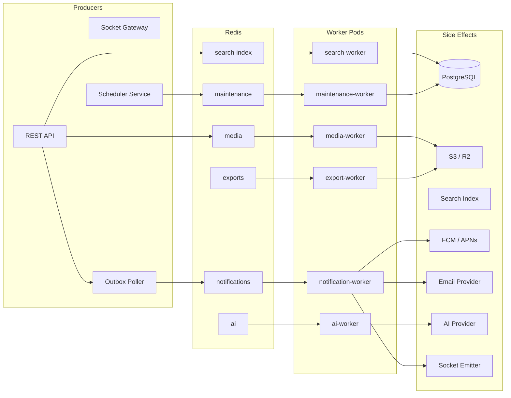
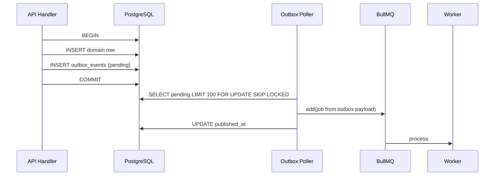

# GMRLOG OS — Background Jobs

**Version:** 1.0.0  
**Document:** `docs/06_BACKEND/BACKGROUND_JOBS.md`  
**Status:** Approved  
**Owner:** Backend Team

---

## Purpose

Define the asynchronous job processing architecture for GMRLOG using **BullMQ** and **Redis**. Background jobs decouple user-facing request latency from durable side effects: notifications, search indexing, AI inference, media processing, and data exports.

This document is the operational contract for queue topology, job types, retry semantics, priority, scheduling, and worker deployment.

---

## Scope

| In scope | Out of scope |
|----------|--------------|
| BullMQ queue definitions and naming | Synchronous request handling |
| Job payloads, idempotency, retry, DLQ | Kafka / event streaming (v2+) |
| Worker process topology and scaling | Cron on individual API pods |
| Scheduled and recurring jobs | Real-time socket delivery (see [WEBSOCKET_ARCHITECTURE.md](WEBSOCKET_ARCHITECTURE.md)) |
| Observability and alerting for queues | |

---

## Architecture Overview



Domain events from [EVENT_ARCHITECTURE.md](EVENT_ARCHITECTURE.md) enter queues via the **transactional outbox** poller or direct `Queue.add()` from handlers when outbox is not required (e.g. fire-and-forget analytics).

---

## Queue Registry

| Queue name | Purpose | Default concurrency | Max attempts | Priority range |
|------------|---------|---------------------|--------------|----------------|
| `notifications` | Push, email, in-app, socket fan-out | 20 | 5 | 1–10 |
| `search-index` | FTS document upsert/delete | 10 | 5 | 1–5 |
| `ai` | Recommendations, moderation, translation | 5 | 3 | 1–10 |
| `media` | Image resize, thumbnail, virus scan | 8 | 4 | 1–8 |
| `exports` | GDPR export, admin CSV reports | 2 | 3 | 1–3 |
| `maintenance` | Cleanup, aggregation, trending | 4 | 5 | 1–5 |
| `integration.sync` | Steam/CSV library sync jobs | 4 | 5 | 1–5 |
| `integration.import` | First import / CSV ingest | 4 | 5 | 1–5 |
| `integration.reconcile` | Post-sync reconcile | 2 | 5 | 1–3 |
| `integration.cleanup` | Stale external rows / job hygiene | 2 | 5 | 1–3 |
| `integration.retry` | Dead-letter replay for integration jobs | 2 | 5 | 1–3 |
| `dlq` | Dead-letter inspection (manual replay) | 1 | 1 | — |
| `game.metadata` | Catalog enrichment (D3.25 — **implemented**) | 2 | 5 | — |
| `game.media` | Catalog media mirroring (D3.25 — **implemented**) | 4 | 5 | — |

Queue names are lowercase kebab-case. Redis key prefix: `bull:gmrlog:{env}:{queueName}`.

**Note on this table:** `notifications`, `ai`, `exports`, and the outbox poller
referenced below remain aspirational — `SPRINT_0_PROJECT_AUDIT.md` §1 found
none of them exist in code as of Sprint 0. `game.metadata` and `game.media`
are the exception: both are real, tested, and running as of D3.25. Full detail
in `docs/18_CATALOG/METADATA_QUEUES.md`.

---

## Job Types

### Notifications Queue

| Job name | Trigger | Payload | Side effect |
|----------|---------|---------|-------------|
| `notification.push` | Domain event | `{ userId, type, title, body, deepLink, data }` | FCM/APNs |
| `notification.email` | Domain event | `{ userId, templateId, variables }` | SendGrid/SES |
| `notification.inapp` | Domain event | `{ userId, notificationId }` | PostgreSQL insert (if not done in TX) |
| `notification.socket` | After in-app persist | `{ userId, envelope }` | Redis adapter emit |
| `notification.digest` | Cron (daily) | `{ userId, windowHours }` | Batched email |

Idempotency key: `notification:{type}:{aggregateId}:{userId}` stored in Redis 24h.

### Search Index Queue

| Job name | Trigger | Payload | Side effect |
|----------|---------|---------|-------------|
| `search.upsert` | `*.created.v1`, `*.updated.v1` | `{ entityType, entityId, document }` | PostgreSQL FTS + `search_documents` |
| `search.delete` | `*.deleted.v1` | `{ entityType, entityId }` | Remove from index |
| `search.reindex` | Admin action | `{ entityType, cursor }` | Batch reindex |
| `search.suggest.warm` | Cron (hourly) | `{ locale }` | Redis suggest cache |

Indexed entity types: `game`, `review`, `user`, `collection`, `tierlist`, `developer`, `studio`, `post`.

### AI Queue

| Job name | Trigger | Payload | Side effect |
|----------|---------|---------|-------------|
| `ai.moderation.review` | Review published | `{ reviewId, content }` | Flag/spam score |
| `ai.moderation.image` | Media uploaded | `{ mediaId, s3Key }` | NSFW classification |
| `ai.translation` | User request | `{ entityType, entityId, targetLocale }` | Cached translation row |
| `ai.recommendation.user` | Cron / on-demand | `{ userId }` | `user_recommendations` table |
| `ai.review.assist` | Draft save | `{ draftId, prompt }` | Suggestion stored on draft |
| `ai.insights.aggregate` | Cron (weekly) | `{ scope }` | Analytics tables |

AI jobs use **lower concurrency** and **stricter rate limits** to control provider cost. Failed provider timeouts retry with longer backoff.

### Media Queue

| Job name | Trigger | Payload | Side effect |
|----------|---------|---------|-------------|
| `media.image.process` | Upload complete | `{ assetId, s3Key, variants[] }` | WebP/AVIF variants to S3 |
| `media.image.thumbnail` | Upload complete | `{ assetId, sizes[] }` | Thumbnail keys |
| `media.video.poster` | Video upload (future) | `{ assetId }` | Poster frame |
| `media.scan` | Upload complete | `{ assetId, s3Key }` | ClamAV / vendor scan |
| `media.purge` | Delete entity | `{ keys[] }` | S3 delete |

### Exports Queue

| Job name | Trigger | Payload | Side effect |
|----------|---------|---------|-------------|
| `export.user.gdpr` | User request | `{ userId, requestId }` | ZIP to S3, signed URL email |
| `export.admin.users` | Admin dashboard | `{ adminId, filters }` | CSV to S3 |
| `export.admin.reports` | Admin scheduled | `{ reportType, range }` | CSV/PDF to S3 |

Exports are long-running; lock duration 30 minutes, single attempt extension on heartbeat.

### Maintenance Queue

| Job name | Schedule | Payload | Side effect |
|----------|----------|---------|-------------|
| `maintenance.outbox.publish` | Every 100ms | `{}` | Drain `outbox_events` → queues |
| `maintenance.trending.games` | Hourly | `{ window }` | Redis + materialized view |
| `maintenance.trending.reviews` | Hourly | `{ window }` | Redis cache |
| `maintenance.session.cleanup` | Daily | `{ olderThanDays }` | Delete expired refresh tokens |
| `maintenance.soft-delete.purge` | Weekly | `{ table, retentionDays }` | Hard delete anonymized rows |
| `maintenance.feed.compact` | Daily | `{ batchSize }` | Archive old feed items |

### Integration Queues (D3.23)

Queues use dot-separated names per `docs/10_INTEGRATIONS/SYNC_ENGINE.md`. Producers enqueue via `IntegrationJobsPublisher`; when Redis is unavailable, sync/import runs inline in the API process.

| Queue | Job name | Payload (data) | Side effect |
|-------|----------|----------------|-------------|
| `integration.sync` | `integration.sync.run` | `{ kind, userId, integrationId, syncJobId, syncType }` | Owned games fetch → `external_games` → library merge → `sync_history` |
| `integration.import` | `integration.import.run` | `{ …, csvRows?, conflictResolution? }` | CSV or first Steam import |
| `integration.reconcile` | `integration.reconcile.run` | `{ … }` | Conflict / mapping reconcile |
| `integration.cleanup` | `integration.cleanup.run` | `{ … }` | Stale rows, orphaned mappings |
| `integration.retry` | `integration.retry.run` | `{ … }` | Manual replay of failed sync jobs |

Idempotency key: `integration.{kind}:{syncJobId}`. Backoff: exponential 2s, 5 attempts. Inline fallback when `JobsService` is null (local dev).

### Game Catalog Metadata Queues (D3.25 — implemented)

Full detail: `docs/18_CATALOG/METADATA_QUEUES.md`. Producer:
`GameMetadataPublisher` in `apps/backend/src/games/metadata/`.

| Queue | Job name | Payload (data) | Side effect |
|-------|----------|-----------------|-------------|
| `game.metadata` | `game.metadata.enrich` | `{ gameId, reason, steamAppId?, igdbId? }` | Provider lookup → catalog write (`GameMetadataService`) |
| `game.metadata` | `game.metadata.backfill.scan` | `{}` (repeatable, hourly) | Enqueues pending/stale/retryable-failed games |
| `game.metadata` | `game.metadata.refresh.scan` | `{}` (repeatable, daily 02:20 UTC) | Marks stale, enqueues refresh |
| `game.media` | `game.media.ingest` | `{ gameId, kind, sourceUrl, provider, sortOrder, width, height, promote }` | Download → validate → object storage |

**Deliberate divergence from every other publisher in this file:**
`GameMetadataPublisher` has **no synchronous fallback** when Redis is
unavailable. Every other publisher above falls back to running its side
effect inline on the request thread. A synchronous fallback here would put a
third-party HTTP call on the request path — the one behavior D3.25 forbids. A
dropped enqueue is recovered by the hourly backfill scan; a blocked request is
not recoverable. See `docs/18_CATALOG/METADATA_QUEUES.md` §3.

A successful enrichment (D3.25.1) also publishes a search reindex
(`SearchIndexPublisher.publishUpsert('game', gameId)`) after the metadata
transaction commits — see the search reindex/backfill note directly below.

### Search Reindex / Backfill (D3.25.1 — implemented, closes risk R6/H10)

`docs/00_PROJECT/SPRINT_0_PROJECT_AUDIT.md` §3 (risk R6) and §9 (finding H10)
both flagged that no reindex/backfill job existed for Meilisearch — index
drift, once it occurred, was permanent. As of D3.25.1 this is closed two ways:

1. **Automatic, incremental** — every successful catalog enrichment reindexes
   that one game immediately (above).
2. **Manual, full reconciliation** — `pnpm repair:index` walks every
   `SearchHitType` (not just games), upserts every active Postgres row into
   its Meili index, and deletes any indexed document with no matching active
   row. Batched (1000 rows/call) — the first, per-row implementation did not
   complete against this project's own seed data (500k+ reviews) and had to
   be rewritten before this could be called done. Full detail:
   `docs/18_CATALOG/CATALOG_OPERATIONS.md` §7.

Not yet automated on a schedule — currently an on-demand operator command.
A cron entry is a reasonable follow-up once there's evidence of recurring drift.

---

## Job Payload Standard

```typescript
interface JobPayload<T = unknown> {
  schemaVersion: 1;
  correlationId: string;     // Matches REST requestId
  causationId?: string;      // Parent event id
  idempotencyKey: string;
  enqueuedAt: string;        // ISO 8601
  data: T;
}
```

BullMQ job options (set at enqueue time):

```typescript
interface JobOptions {
  jobId?: string;            // Set to idempotencyKey when dedup needed
  priority?: number;         // 1 = highest
  delay?: number;            // ms
  attempts?: number;
  backoff?: { type: 'exponential'; delay: number };
  removeOnComplete?: { age: 86400; count: 1000 };
  removeOnFail?: false;      // Keep for DLQ inspection
}
```

---

## Retry Policy

| Queue | Max attempts | Backoff | Notes |
|-------|--------------|---------|-------|
| `notifications` | 5 | Exponential 1s → 32s | Push failures retry; permanent token invalid → ack + deactivate token |
| `search-index` | 5 | Exponential 1s → 32s | DB deadlock retriable |
| `ai` | 3 | Exponential 5s → 60s | Provider 429 uses `retryAfter` |
| `media` | 4 | Exponential 2s → 32s | S3 transient errors |
| `exports` | 3 | Fixed 60s | Large jobs |
| `maintenance` | 5 | Exponential 1s → 16s | Outbox poller idempotent |
| `integration.sync` | 5 | Exponential 2s → 32s | Inline fallback when Redis absent |
| `integration.import` | 5 | Exponential 2s → 32s | Same |
| `integration.reconcile` | 5 | Exponential 2s → 32s | Same |
| `integration.cleanup` | 5 | Exponential 2s → 32s | Same |
| `integration.retry` | 5 | Exponential 2s → 32s | Same |

### Dead Letter Handling

After max attempts, jobs move to `failed` set. Operations:

1. **Alert** — PagerDuty when `failed` count > threshold per queue.
2. **Inspect** — Bull Board / custom admin UI at `/admin/jobs` (admin auth).
3. **Replay** — `job.retry()` after root cause fix; must remain idempotent.
4. **Discard** — Manual remove with audit log for poison messages.

---

## Priority Semantics

BullMQ priority: **lower number = higher priority** (1 is highest).

| Priority | Use case |
|----------|----------|
| 1 | Security moderation, account lockout emails |
| 2 | Real-time push + socket for social interactions |
| 3 | Standard notifications |
| 5 | Search index updates |
| 7 | AI batch / recommendations |
| 8 | Media processing |
| 10 | Maintenance, analytics, non-urgent reindex |

Within the same priority, FIFO order is preserved.

---

## Scheduling

Recurring jobs use **BullMQ repeatable jobs** registered at worker startup (leader election via Redis lock prevents duplicate registration across replicas).

| Job | Cron pattern | Queue |
|-----|--------------|-------|
| Outbox poller | `*/1 * * * * *` (every second; internal 100ms loop) | `maintenance` |
| Trending games | `0 * * * *` | `maintenance` |
| Notification digest | `0 8 * * *` UTC | `notifications` |
| Session cleanup | `0 3 * * *` UTC | `maintenance` |
| Soft-delete purge | `0 4 * * 0` UTC | `maintenance` |

One-off delayed jobs (e.g. "remind user in 24h") use `delay` option, not cron.

---

## Worker Topology

### Process Model

Workers run as **separate Node.js processes** from the API and socket gateway. One deployment manifest per worker type allows independent scaling.

```
backend/apps/
├── api/                    # REST — enqueues only, no consumers
├── socket-gateway/         # WebSocket — enqueues socket jobs
└── workers/
    ├── notification-worker/
    ├── search-worker/
    ├── ai-worker/
    ├── media-worker/
    ├── export-worker/
    └── maintenance-worker/
```

### Scaling Guidelines

| Worker | Scale trigger | Baseline replicas |
|--------|---------------|-------------------|
| `notification-worker` | Queue wait time p95 > 2s | 2 |
| `search-worker` | Index lag > 30s | 2 |
| `ai-worker` | Provider quota headroom | 1–3 |
| `media-worker` | Upload rate | 2 |
| `export-worker` | Queue depth | 1 |
| `maintenance-worker` | Fixed | 1 |

Horizontal scaling increases **consumer concurrency** per pod first (up to CPU limit), then pod count.

### Graceful Shutdown

On `SIGTERM`:

1. Stop accepting new jobs (`worker.close()`).
2. Wait for in-flight jobs (max 30s).
3. Extend lock on long-running export jobs via `job.updateProgress()` heartbeat.
4. Exit; unacked jobs return to queue for redelivery.

---

## Idempotency

| Mechanism | Storage | TTL |
|-----------|---------|-----|
| `jobId = idempotencyKey` | BullMQ dedup | — |
| `processed_event_ids` | Redis SET per worker | 7 days |
| `event_inbox` table | PostgreSQL | Permanent |

Workers must check idempotency **before** irreversible side effects (send push, charge API, delete S3).

---

## Outbox Integration

Transactional writes use the outbox pattern (see [EVENT_ARCHITECTURE.md](EVENT_ARCHITECTURE.md)):



Poller runs in `maintenance-worker` with 100ms interval. Duplicate publish is safe due to idempotent workers.

---

## Security

- Job payloads must not contain passwords, refresh tokens, or full credit card data.
- PII in export jobs encrypted at rest (S3 SSE); signed URLs expire in 24 hours.
- Admin export jobs require `ADMIN` role and audit log entry.
- AI moderation content truncated to provider limits; logs store `reviewId` only.
- Redis queue access restricted to worker service account network policy.

---

## Observability

| Metric | Description |
|--------|-------------|
| `bullmq_queue_waiting` | Jobs waiting per queue |
| `bullmq_queue_active` | In-flight jobs |
| `bullmq_queue_failed` | Failed job count |
| `bullmq_job_duration_ms` | Histogram by job name |
| `bullmq_job_retries_total` | Retry counter |
| `outbox_lag_seconds` | Oldest unpublished outbox row age |

Structured log fields: `queue`, `jobName`, `jobId`, `correlationId`, `attempt`, `durationMs`, `errorCode`.

Alerts:

- `failed` jobs > 50 in 5 minutes (any queue)
- Outbox lag > 60 seconds
- Notification queue wait p95 > 5 seconds

---

## Local Development

```bash
# Start Redis
docker compose up redis -d

# Run all workers in dev (single process)
pnpm --filter @gmrlog/workers dev

# Inspect queues
pnpm --filter @gmrlog/workers bullboard
# → http://localhost:3030/admin/queues
```

Environment variables:

```text
REDIS_URL
BULL_PREFIX=gmrlog:local
WORKER_CONCURRENCY_NOTIFICATIONS=5
```

---

## Acceptance Criteria

- [ ] All async side effects route through BullMQ queues; no fire-and-forget `setTimeout` in API handlers.
- [ ] Six production queues (`notifications`, `search-index`, `ai`, `media`, `exports`, `maintenance`) deployed with dedicated workers.
- [ ] Retry, backoff, and DLQ behavior match tables in this document.
- [ ] Transactional outbox poller drains events within 1 second under normal load.
- [ ] Jobs are idempotent; duplicate delivery does not duplicate push notifications or index rows.
- [ ] Metrics and alerts configured for queue depth, failures, and outbox lag.

---

## Related Documents

- [EVENT_ARCHITECTURE.md](EVENT_ARCHITECTURE.md) — Domain events and outbox pattern
- [WEBSOCKET_ARCHITECTURE.md](WEBSOCKET_ARCHITECTURE.md) — Socket fan-out from notification jobs
- [BACKEND_ARCHITECTURE.md](BACKEND_ARCHITECTURE.md) — Service boundaries
- [CACHE_STRATEGY.md](CACHE_STRATEGY.md) — Redis usage alongside queues
- [ERROR_HANDLING.md](ERROR_HANDLING.md) — `QUEUE_ERROR` mapping
- [ERROR_CODES.md](../08_API/ERROR_CODES.md) — Client-visible error codes
- [DEPLOYMENT.md](../10_DEVOPS/DEPLOYMENT.md) — Worker deployment manifests

---

## Revision History

| Version | Date | Change |
|---------|------|--------|
| 1.0.0 | 2026-07-10 | Initial background jobs architecture |
