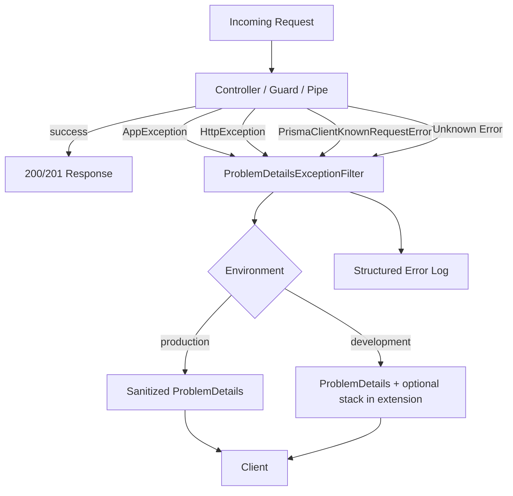

# GMRLOG OS — Error Handling

**Version:** 1.0.0  
**Document:** `docs/06_BACKEND/ERROR_HANDLING.md`  
**Status:** Approved  
**Owner:** Backend Team

---

## Purpose

Define the unified error handling strategy for all GMRLOG backend services. Every HTTP API response, WebSocket `connect_error`, and worker failure path must produce predictable, machine-readable errors that clients can localize and automate against.

Errors follow **RFC 7807** (`application/problem+json`) for HTTP and align with the canonical code registry in [ERROR_CODES.md](../08_API/ERROR_CODES.md).

---

## Scope

| In scope | Out of scope |
|----------|--------------|
| ProblemDetails response shape | Business validation rules per endpoint (see OpenAPI modules) |
| Global exception filter (NestJS) | Client UI copy / i18n files |
| Error code → HTTP status mapping | Third-party provider error formats (wrapped internally) |
| Logging, correlation IDs, redaction | Sentry/Datadog dashboard configuration |
| Client handling contract | |

---

## Design Principles

1. **Predictable** — Same failure condition always yields the same `type` URI and `code` extension.
2. **Actionable** — Clients receive enough detail to retry, redirect, or show field errors.
3. **Safe** — Production responses never expose stack traces, SQL, or internal hostnames.
4. **Traceable** — Every error log includes `traceId` / `requestId` for cross-service lookup.
5. **Localizable** — Backend returns stable codes; clients map codes to locale strings.

---

## RFC 7807 ProblemDetails

All non-2xx HTTP responses use `Content-Type: application/problem+json`.

### Schema

Aligned with `docs/08_API/common/schemas/problem-details.yaml` plus GMRLOG extensions:

```typescript
interface ProblemDetails {
  type: string;              // URI identifying error category
  title: string;             // Short human summary (English, stable)
  status: number;            // HTTP status code
  detail?: string;           // Specific explanation (English, may include safe context)
  instance?: string;         // Request path, e.g. /api/v1/reviews/abc
  traceId: string;           // Correlation ID (also X-Request-Id response header)
  code: string;              // Machine code from ERROR_CODES.md
  timestamp: string;         // ISO 8601 UTC
  errors?: FieldError[];     // Validation failures only
  retryAfter?: number;       // Seconds; rate limits and 503
  documentation?: string;    // Link to public docs for this error
}

interface FieldError {
  field: string;             // JSON pointer or field path, e.g. body.rating
  code: string;              // e.g. VALIDATION_TOO_SHORT
  message: string;
}
```

### Example: Authentication Failure

```json
{
  "type": "https://gmrlog.com/errors/auth-invalid-token",
  "title": "Invalid access token",
  "status": 401,
  "detail": "The provided access token is invalid or malformed.",
  "instance": "/api/v1/users/me",
  "traceId": "req_7f3a9c2e1b4d",
  "code": "AUTH_INVALID_TOKEN",
  "timestamp": "2026-07-10T14:30:00.000Z"
}
```

### Example: Validation Failure (422)

```json
{
  "type": "https://gmrlog.com/errors/validation-failed",
  "title": "Validation failed",
  "status": 422,
  "detail": "One or more fields failed validation.",
  "instance": "/api/v1/reviews",
  "traceId": "req_8a1b2c3d4e5f",
  "code": "VALIDATION_FAILED",
  "timestamp": "2026-07-10T14:31:00.000Z",
  "errors": [
    {
      "field": "body.rating",
      "code": "VALIDATION_OUT_OF_RANGE",
      "message": "Rating must be between 0 and 10."
    },
    {
      "field": "body.body",
      "code": "VALIDATION_TOO_SHORT",
      "message": "Review body must be at least 50 characters."
    }
  ]
}
```

### Example: Rate Limit (429)

```json
{
  "type": "https://gmrlog.com/errors/rate-limit-exceeded",
  "title": "Too many requests",
  "status": 429,
  "detail": "Rate limit exceeded for this endpoint.",
  "instance": "/api/v1/auth/login",
  "traceId": "req_9b2c3d4e5f6a",
  "code": "RATE_LIMIT_EXCEEDED",
  "timestamp": "2026-07-10T14:32:00.000Z",
  "retryAfter": 42
}
```

Response headers (see [RATE_LIMITING.md](RATE_LIMITING.md)):

```http
Retry-After: 42
X-RateLimit-Limit: 10
X-RateLimit-Remaining: 0
X-RateLimit-Reset: 1720619520
```

---

## Error Code Registry

All `code` values must exist in [ERROR_CODES.md](../08_API/ERROR_CODES.md). Categories include:

| Category | Example codes | Typical HTTP status |
|----------|---------------|---------------------|
| Authentication | `AUTH_INVALID_TOKEN`, `AUTH_EXPIRED_TOKEN` | 401 |
| Authorization | `FORBIDDEN`, `INSUFFICIENT_PERMISSIONS` | 403 |
| Resource | `USER_NOT_FOUND`, `REVIEW_NOT_FOUND` | 404 |
| Conflict | `USERNAME_TAKEN`, `ALREADY_LIKED` | 409 |
| Validation | `VALIDATION_FAILED`, field-level codes | 422 |
| Rate limit | `RATE_LIMIT_EXCEEDED`, `UPLOAD_LIMIT_REACHED` | 429 |
| Payload | `PAYLOAD_TOO_LARGE` | 413 |
| Server | `INTERNAL_SERVER_ERROR`, `DATABASE_ERROR` | 500 |
| Unavailable | `SERVICE_UNAVAILABLE`, `DEPENDENCY_TIMEOUT` | 503 |

**Rule:** Never invent ad-hoc codes in handlers. Add new codes to `ERROR_CODES.md` first, then implement.

### Type URI Convention

```
https://gmrlog.com/errors/{kebab-case-code-without-prefix}
```

Examples:

- `AUTH_INVALID_TOKEN` → `https://gmrlog.com/errors/auth-invalid-token`
- `RATE_LIMIT_EXCEEDED` → `https://gmrlog.com/errors/rate-limit-exceeded`

---

## Exception Hierarchy

NestJS services throw typed exceptions; the global filter maps them to ProblemDetails.

```
AppException (base)
├── AuthException          → 401
├── ForbiddenException     → 403
├── NotFoundException      → 404
├── ConflictException      → 409
├── ValidationException    → 422 (+ errors[])
├── RateLimitException     → 429 (+ retryAfter)
├── PayloadTooLargeException → 413
├── ServiceUnavailableException → 503
└── InternalException      → 500
```

```typescript
class AppException extends Error {
  constructor(
    public readonly code: string,
    public readonly status: number,
    public readonly title: string,
    public readonly detail?: string,
    public readonly errors?: FieldError[],
    public readonly retryAfter?: number,
  ) {
    super(title);
  }
}
```

Framework exceptions are mapped at the filter boundary:

| Source | Mapping |
|--------|---------|
| `NotFoundException` (Nest) | `*_NOT_FOUND` or `RESOURCE_NOT_FOUND` |
| `BadRequestException` | `VALIDATION_FAILED` or parse `errors` |
| `UnauthorizedException` | `AUTH_UNAUTHORIZED` |
| `ForbiddenException` | `FORBIDDEN` |
| `PayloadTooLargeException` | `PAYLOAD_TOO_LARGE` |
| Prisma `P2002` unique | `CONFLICT` with field hint |
| Prisma `P2025` not found | Appropriate `*_NOT_FOUND` |
| Prisma other | `DATABASE_ERROR` (500, logged) |
| Unknown | `INTERNAL_SERVER_ERROR` (500) |

---

## Global Exception Filter

Single `ProblemDetailsExceptionFilter` registered globally in `main.ts`:



### Filter Responsibilities

1. Assign or propagate `traceId` from `X-Request-Id` header or generate UUID v7.
2. Map exception to ProblemDetails shape.
3. Set `Content-Type: application/problem+json`.
4. Set `X-Request-Id` response header = `traceId`.
5. Log at appropriate level (4xx → `warn`, 5xx → `error`).
6. Strip stack traces and internal cause chains in production.
7. Increment Prometheus counter `http_errors_total{code, status}`.

### Implementation Location

```
backend/apps/api/src/common/filters/
├── problem-details-exception.filter.ts
└── problem-details.mapper.ts

backend/packages/common/src/errors/
├── app-exception.ts
├── error-codes.ts          # Re-exports from @gmrlog/types
└── problem-details.builder.ts
```

---

## Validation Errors

`ValidationPipe` uses `class-validator`. On failure, throw `ValidationException` with mapped field errors:

| class-validator constraint | Field `code` |
|----------------------------|--------------|
| `@IsNotEmpty()` | `VALIDATION_REQUIRED` |
| `@MinLength()` / `@MaxLength()` | `VALIDATION_TOO_SHORT` / `VALIDATION_TOO_LONG` |
| `@Min()` / `@Max()` | `VALIDATION_OUT_OF_RANGE` |
| `@IsEmail()` | `VALIDATION_INVALID_EMAIL` |
| `@IsUUID()` | `VALIDATION_INVALID_UUID` |
| `@IsEnum()` | `VALIDATION_INVALID_ENUM` |
| Custom | `VALIDATION_FAILED` |

Unknown request properties are rejected (`whitelist: true`, `forbidNonWhitelisted: true`) with:

```json
{
  "code": "VALIDATION_UNKNOWN_FIELD",
  "field": "body.unknownField"
}
```

---

## WebSocket Errors

Socket.IO connections use `connect_error` with a compact payload (not full ProblemDetails):

```typescript
interface SocketConnectError {
  code: string;       // From ERROR_CODES.md
  message: string;    // English summary
  retryAfter?: number;
}
```

After connection, application errors emit on the `error` event with the same `code` discipline. See [WEBSOCKET_ARCHITECTURE.md](WEBSOCKET_ARCHITECTURE.md).

---

## Worker and Internal Errors

Background jobs do not return HTTP ProblemDetails. Failures:

1. Log with `correlationId`, `queue`, `jobName`, `code`.
2. Retry per [BACKGROUND_JOBS.md](BACKGROUND_JOBS.md).
3. Surface to users only via resulting domain state (e.g. notification not delivered → no push; export failed → in-app notification with `EXPORT_FAILED`).

API endpoints that enqueue jobs return `202 Accepted` only when enqueue succeeds; enqueue failure returns `503` with `QUEUE_ERROR`.

---

## Logging

Every error log is structured JSON:

```json
{
  "level": "error",
  "message": "Request failed",
  "traceId": "req_7f3a9c2e1b4d",
  "userId": "uuid-or-null",
  "method": "POST",
  "path": "/api/v1/reviews",
  "status": 422,
  "code": "VALIDATION_FAILED",
  "durationMs": 45,
  "timestamp": "2026-07-10T14:31:00.000Z"
}
```

### Redaction Rules

Never log:

- Passwords, tokens, refresh tokens, API keys
- Full request bodies for auth endpoints
- Credit card or government ID fields
- Stack traces in client responses (logs only, 5xx)

Always log:

- `traceId`, `userId` (if authenticated), `code`, `status`, latency
- Prisma error code (e.g. `P2002`) on 5xx — not raw SQL

### Log Levels

| Status range | Level |
|--------------|-------|
| 400–422 | `warn` |
| 401, 403, 404 | `info` (expected client errors) |
| 429 | `warn` (+ abuse monitoring) |
| 500–503 | `error` |

---

## Client Handling Contract

Clients (web, mobile, admin) must implement consistent handling per [ERROR_CODES.md](../08_API/ERROR_CODES.md#client-handling-rules):

| HTTP status | Client behavior |
|-------------|-----------------|
| 401 | Clear session; redirect to login; attempt refresh once if `AUTH_EXPIRED_TOKEN` |
| 403 | Show permission denied; do not retry |
| 404 | Show not found state |
| 409 | Show conflict resolution UI (e.g. username taken) |
| 422 | Highlight `errors[].field` in form |
| 429 | Show countdown from `retryAfter`; backoff retry |
| 500 | Generic error screen; offer retry with idempotency key |
| 503 | Retry with exponential backoff; show maintenance message if prolonged |

### Localization

Backend `title` and `detail` are English fallbacks. Clients prefer `code` → i18n key mapping:

```
AUTH_INVALID_TOKEN → auth.errors.sessionExpired
VALIDATION_FAILED → common.errors.validation
```

---

## Monitoring and Alerting

| Condition | Alert severity |
|-----------|----------------|
| 5xx rate > 1% over 5 min | Critical |
| `DATABASE_ERROR` any | Critical |
| `QUEUE_ERROR` spike | High |
| `AUTH` failures spike (possible attack) | Medium |
| 422 rate spike on single endpoint | Low (possible client bug) |

Dashboards group by `code`, `status`, `path` (normalized template).

---

## Testing Requirements

| Test type | Requirement |
|-----------|-------------|
| Unit | `ProblemDetailsMapper` maps each `AppException` correctly |
| Unit | Prisma error codes map to expected HTTP status |
| Integration | `POST` invalid body returns 422 with `errors[]` |
| Integration | Unknown route returns 404 ProblemDetails |
| Contract | OpenAPI `common/responses.yaml` examples match runtime shape |
| E2E | Client SDK parses `application/problem+json` |

---

## Acceptance Criteria

- [ ] All HTTP error responses use `application/problem+json` with RFC 7807 fields plus `code` and `traceId`.
- [ ] Every `code` value is registered in [ERROR_CODES.md](../08_API/ERROR_CODES.md).
- [ ] Global `ProblemDetailsExceptionFilter` handles AppException, HttpException, Prisma, and unknown errors.
- [ ] Production responses exclude stack traces; 5xx messages are generic.
- [ ] Structured logs include `traceId`, `code`, `status`; sensitive data redacted.
- [ ] Clients documented to handle status codes per contract above.

---

## Related Documents

- [ERROR_CODES.md](../08_API/ERROR_CODES.md) — Canonical error code registry
- [API_ARCHITECTURE.md](../08_API/API_ARCHITECTURE.md) — OpenAPI error conventions
- [API_SPECIFICATION.md](../08_API/API_SPECIFICATION.md) — HTTP status reference
- [RATE_LIMITING.md](RATE_LIMITING.md) — 429 responses and headers
- [WEBSOCKET_ARCHITECTURE.md](WEBSOCKET_ARCHITECTURE.md) — Socket error codes
- [BACKGROUND_JOBS.md](BACKGROUND_JOBS.md) — Queue failure handling
- [CODING_STANDARDS.md](../00_PROJECT/CODING_STANDARDS.md) — TypeScript error patterns
- [SECURITY.md](../11_SECURITY/SECURITY.md) — Information disclosure rules

---

## Revision History

| Version | Date | Change |
|---------|------|--------|
| 1.0.0 | 2026-07-10 | Initial error handling specification |
