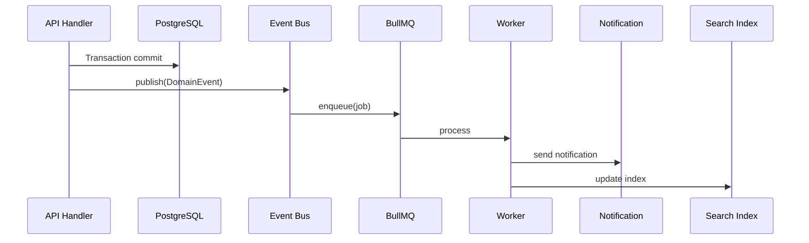

# GMRLOG OS — Event Architecture

**Version:** 1.0.0  
**Document:** `docs/06_BACKEND/EVENT_ARCHITECTURE.md`  
**Status:** Approved  
**Owner:** Backend Team

---

## Purpose

Define domain events, async messaging, and side-effect orchestration for GMRLOG. Events decouple write paths from notifications, search indexing, analytics, and gamification.

---

## Scope

Domain events (in-process + BullMQ), event naming, payloads, idempotency, retry policy. Not: full event sourcing, Kafka (future).

---

## Event Flow



---

## Event Naming Convention

```
{context}.{aggregate}.{action}.v{major}
```

Examples:

- `review.review.created.v1`
- `social.follow.created.v1`
- `gamelog.session.completed.v1`
- `user.profile.updated.v1`

---

## Core Event Catalog (v1)

| Event | Publisher | Consumers |
|-------|-----------|-----------|
| `auth.user.registered.v1` | Auth | Analytics, welcome email |
| `review.review.created.v1` | Review | Feed, Search, Notification |
| `review.review.liked.v1` | Review | Notification, Gamification |
| `social.follow.created.v1` | Social | Notification, Feed |
| `social.reaction.created.v1` | Social | Notification |
| `gamelog.session.completed.v1` | Game Log | Feed, Stats, Achievements |
| `notification.delivered.v1` | Notification | Analytics |
| `collection.collection.followed.v1` | Collection | Notification |

Full payload schemas live in `packages/types/src/events/` (generated from this doc at implementation time).

---

## Payload Structure

```typescript
interface DomainEvent<T = unknown> {
  id: string;           // UUID v7, unique per emission
  type: string;         // e.g. review.review.created.v1
  occurredAt: string;   // ISO 8601
  aggregateId: string;
  aggregateType: string;
  actorId: string | null;
  correlationId: string;
  schemaVersion: 1;
  payload: T;
}
```

---

## Idempotency

- Workers store `processed_event_ids` in Redis (TTL 7 days) or PostgreSQL `event_inbox`.
- Duplicate `event.id` → ack without side effects.
- Business idempotency keys on commands (e.g. `Idempotency-Key` header).

---

## Retry & Dead Letter

| Setting | Value |
|---------|-------|
| Max attempts | 5 |
| Backoff | Exponential, 1s → 32s |
| DLQ | `bull:{queue}:failed` + alert |
| Poison message | Manual replay after fix |

---

## Outbox Pattern

v1 uses **transactional outbox**:

1. Insert domain row + `outbox_events` row in same transaction.
2. Poller publishes to BullMQ every 100ms.
3. Mark outbox row `published_at`.

Prevents lost events on crash between DB commit and queue publish.

---

## CQRS Projections

| Projection | Source events | Storage |
|------------|---------------|---------|
| `feed_items` | review.*, gamelog.*, social.* | PostgreSQL |
| `search_documents` | *.*.created, *.*.updated | PostgreSQL FTS + future ES |
| `user_stats` | gamelog.*, review.* | PostgreSQL denormalized |

---

## Security

- Events must not contain passwords, tokens, or raw PII beyond `userId`.
- Admin events audited separately.

---

## Acceptance Criteria

- [ ] Every async side effect triggered only via domain event or explicit job.
- [ ] Event types versioned; breaking changes increment major version.
- [ ] Workers idempotent and observable (see `OBSERVABILITY.md`).

---

## Related Documents

- [SYSTEM_DESIGN.md](SYSTEM_DESIGN.md)
- [BACKGROUND_JOBS.md](BACKGROUND_JOBS.md)
- [NOTIFICATION_API](../08_API/NOTIFICATION_API.yaml)
- [BACKEND_ARCHITECTURE.md](BACKEND_ARCHITECTURE.md)

---

## Revision History

| Version | Date | Change |
|---------|------|--------|
| 1.0.0 | 2026-07-10 | Initial event architecture |
