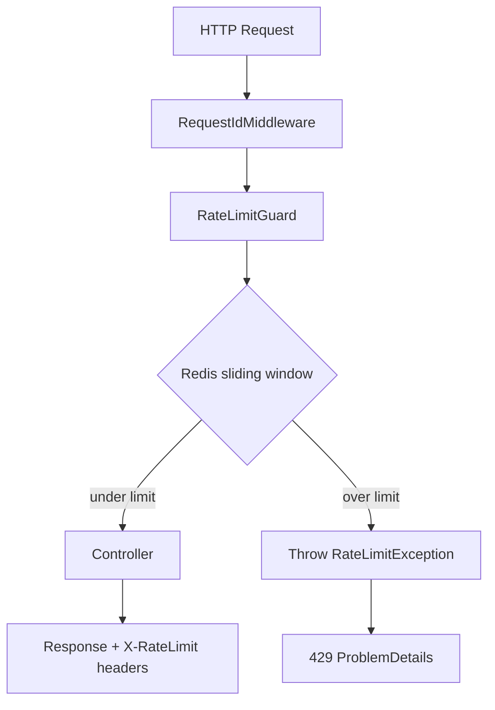

# GMRLOG OS — Rate Limiting

**Version:** 1.0.0  
**Document:** `docs/06_BACKEND/RATE_LIMITING.md`  
**Status:** Approved  
**Owner:** Backend Team

---

## Purpose

Define the rate limiting architecture for GMRLOG HTTP APIs, WebSocket events, and upload endpoints. Rate limits protect platform stability, prevent abuse, and ensure fair resource allocation across millions of users.

Implementation uses **Redis sliding window** counters with standardized response headers and RFC 7807 error bodies (see [ERROR_HANDLING.md](ERROR_HANDLING.md)).

---

## Scope

| In scope | Out of scope |
|----------|--------------|
| Redis sliding window algorithm | CDN / WAF edge rate limiting (complementary) |
| Per-endpoint-class limits | Per-tenant billing quotas (see monetization docs) |
| `X-RateLimit-*` response headers | IP blocklist management (see [SECURITY.md](../11_SECURITY/SECURITY.md)) |
| 429 ProblemDetails responses | DDoS mitigation at network layer |
| Socket event rate limits | |

---

## Algorithm: Sliding Window Log

GMRLOG uses a **sliding window log** implemented in Redis for accuracy at scale. Fixed window counters are not used — they allow burst at window boundaries.

### Redis Key Structure

```
ratelimit:{scope}:{identifier}:{endpointClass}
```

| Segment | Values |
|---------|--------|
| `scope` | `ip`, `user`, `device`, `apikey` |
| `identifier` | IP address, `userId`, `deviceId`, or API key id |
| `endpointClass` | See endpoint class table below |

### Implementation (Sorted Set)

```typescript
async function isRateLimited(
  key: string,
  limit: number,
  windowMs: number,
): Promise<{ limited: boolean; remaining: number; resetAt: number }> {
  const now = Date.now();
  const windowStart = now - windowMs;
  const member = `${now}:${crypto.randomUUID()}`;

  const pipeline = redis.pipeline();
  pipeline.zremrangebyscore(key, 0, windowStart);
  pipeline.zadd(key, now, member);
  pipeline.zcard(key);
  pipeline.pexpire(key, windowMs);
  const results = await pipeline.exec();

  const count = results[2][1] as number;
  const limited = count > limit;
  const remaining = Math.max(0, limit - count);
  const resetAt = Math.ceil((now + windowMs) / 1000);

  if (limited) {
    await redis.zrem(key, member); // Do not count rejected request
  }

  return { limited, remaining, resetAt };
}
```

### Identifier Precedence

For authenticated requests, **user scope** takes precedence over IP:

1. `user:{userId}` — primary bucket
2. `ip:{clientIp}` — secondary bucket (stricter for auth endpoints)

Both must pass for the request to proceed when dual limits apply.

---

## Endpoint Classes

Endpoint classes group routes with similar cost and abuse profile. Class is derived from route metadata decorator `@RateLimitClass('auth')`.

| Class | Description | Identifier | Window |
|-------|-------------|------------|--------|
| `auth` | Login, register, password reset | IP + user (if known) | Per table |
| `write` | POST/PUT/PATCH/DELETE mutations | user | 1 minute |
| `read` | GET list/detail | user | 1 minute |
| `search` | Search and autocomplete | user | 1 minute |
| `feed` | Home feed, activity | user | 1 minute |
| `upload` | Media presign and confirm | user | 1 minute |
| `social` | Follow, like, reaction | user | 1 minute |
| `message` | REST message send | user | 1 minute |
| `export` | GDPR and admin exports | user | 1 hour |
| `admin` | Admin dashboard mutations | user (admin) | 1 minute |
| `public` | Unauthenticated catalog reads | IP | 1 minute |
| `webhook` | Inbound webhooks | apikey | 1 minute |

---

## Limit Table

Limits are **requests per window** per identifier. Values apply to production; staging uses 10× limits.

### Authentication (`auth`)

| Endpoint pattern | Limit | Window | Scope |
|------------------|-------|--------|-------|
| `POST /auth/login` | 10 | 1 min | IP |
| `POST /auth/register` | 5 | 1 hour | IP |
| `POST /auth/password/forgot` | 3 | 1 hour | IP |
| `POST /auth/password/reset` | 5 | 1 hour | IP |
| `POST /auth/refresh` | 30 | 1 min | user |
| `POST /auth/mfa/verify` | 10 | 1 min | user |
| OAuth callback | 20 | 1 min | IP |

### Read (`read`)

| Endpoint pattern | Limit | Window |
|------------------|-------|--------|
| `GET /users/*` | 300 | 1 min |
| `GET /games/*` | 300 | 1 min |
| `GET /reviews/*` | 300 | 1 min |
| `GET /collections/*` | 200 | 1 min |
| `GET /notifications` | 120 | 1 min |

### Search (`search`)

| Endpoint pattern | Limit | Window |
|------------------|-------|--------|
| `GET /search` | 120 | 1 min |
| `GET /search/autocomplete` | 180 | 1 min |
| `GET /search/suggestions` | 60 | 1 min |

### Feed (`feed`)

| Endpoint pattern | Limit | Window |
|------------------|-------|--------|
| `GET /feed` | 300 | 1 min |
| `GET /feed/activity` | 200 | 1 min |

### Write (`write`)

| Endpoint pattern | Limit | Window |
|------------------|-------|--------|
| `POST /reviews` | 60 | 1 min |
| `PATCH /reviews/*` | 60 | 1 min |
| `POST /collections` | 30 | 1 min |
| `POST /tierlists` | 20 | 1 min |
| `POST /gamelogs` | 120 | 1 min |
| Generic `POST/PATCH/DELETE` | 180 | 1 min |

### Social (`social`)

| Endpoint pattern | Limit | Window |
|------------------|-------|--------|
| `POST /*/like` | 120 | 1 min |
| `POST /*/follow` | 60 | 1 min |
| `POST /friends/request` | 30 | 1 min |
| `POST /reports` | 10 | 1 min |

### Messages (`message`)

| Endpoint pattern | Limit | Window |
|------------------|-------|--------|
| `POST /conversations/*/messages` | 120 | 1 min |

### Upload (`upload`)

| Endpoint pattern | Limit | Window |
|------------------|-------|--------|
| `POST /media/presign` | 30 | 1 min |
| `POST /media/confirm` | 30 | 1 min |
| Total upload bytes | 500 MB | 1 hour |

Byte tracking uses separate Redis key `ratelimit:user:{id}:upload-bytes` with rolling hour.

### Export (`export`)

| Endpoint pattern | Limit | Window |
|------------------|-------|--------|
| `POST /users/me/export` | 1 | 24 hours |
| `POST /admin/exports/*` | 10 | 1 hour |

### Public (`public`)

| Endpoint pattern | Limit | Window |
|------------------|-------|--------|
| `GET /games` (unauthenticated) | 60 | 1 min |
| `GET /developers/*` (public) | 60 | 1 min |

### Premium Override

Users with `premium` tier receive **2×** limits on `read`, `search`, and `feed` classes. Auth and write limits are not multiplied.

---

## Response Headers

Successful and rate-limited responses include:

| Header | Description |
|--------|-------------|
| `X-RateLimit-Limit` | Maximum requests allowed in window |
| `X-RateLimit-Remaining` | Requests remaining in current window |
| `X-RateLimit-Reset` | Unix timestamp (seconds) when window resets |
| `Retry-After` | Seconds to wait (429 only) |

Example (allowed):

```http
HTTP/1.1 200 OK
X-RateLimit-Limit: 120
X-RateLimit-Remaining: 87
X-RateLimit-Reset: 1720619580
X-Request-Id: req_abc123
```

Example (limited):

```http
HTTP/1.1 429 Too Many Requests
Content-Type: application/problem+json
Retry-After: 42
X-RateLimit-Limit: 10
X-RateLimit-Remaining: 0
X-RateLimit-Reset: 1720619520
X-Request-Id: req_def456
```

---

## 429 Response Body

```json
{
  "type": "https://gmrlog.com/errors/rate-limit-exceeded",
  "title": "Too many requests",
  "status": 429,
  "detail": "Rate limit exceeded for endpoint class 'auth'.",
  "instance": "/api/v1/auth/login",
  "traceId": "req_def456",
  "code": "RATE_LIMIT_EXCEEDED",
  "timestamp": "2026-07-10T15:00:00.000Z",
  "retryAfter": 42
}
```

Upload byte limit exceeded uses `UPLOAD_LIMIT_REACHED` (429).

---

## NestJS Integration



### Guard Usage

```typescript
@RateLimitClass('search')
@Get('search')
async search() { ... }
```

Global default: `read` class for all `GET`, `write` class for mutating methods unless overridden.

### Fail-Open Policy

When Redis is unavailable:

- **Production:** Fail open (allow request) with `warn` log `RATE_LIMIT_REDIS_UNAVAILABLE`.
- **Security-critical endpoints** (`auth` login/register): Fail closed (503 `SERVICE_UNAVAILABLE`) to prevent brute force during Redis outage.

This matches [SYSTEM_DESIGN.md](SYSTEM_DESIGN.md) degradation policy.

---

## WebSocket Rate Limits

Socket limits are per-connection and per-user in Redis. See [WEBSOCKET_ARCHITECTURE.md](WEBSOCKET_ARCHITECTURE.md).

| Event | Limit | Window |
|-------|-------|--------|
| Connection attempts | 20 | 1 min / IP |
| `message:*` | 120 | 1 min / user |
| `message:typing` | 60 | 1 min / user |
| `room:join` | 30 | 1 min / user |

Exceeded socket limits emit `error` event with `RATE_LIMIT_EXCEEDED`; repeated violations disconnect the socket.

---

## Abuse Prevention

Rate limiting is one layer in a defense-in-depth strategy:

| Layer | Mechanism |
|-------|-----------|
| Rate limit | Sliding window per IP/user |
| Progressive penalty | 3× 429 within 5 min → 15 min block (`ratelimit:block:{ip}`) |
| Account lockout | `AUTH_TOO_MANY_ATTEMPTS` after 10 failed logins / 1 hour |
| CAPTCHA | Triggered on suspicious auth patterns (future) |
| IP reputation | Cloudflare / AWS WAF at edge |
| Report throttling | Max 10 reports / hour / user |

### Block Key

```
ratelimit:block:{ip}  TTL 900 seconds
```

Blocked IPs receive 429 immediately without incrementing window counters. Admin can clear via `/admin/security/blocks`.

### Anomaly Detection

Metrics monitored:

- `ratelimit_429_total{endpointClass, scope}`
- Single IP >500 429/hour → auto-block
- Single user `search` >1000/min → flag account for review

---

## Distributed Considerations

| Concern | Solution |
|---------|----------|
| Multiple API pods | Shared Redis; no local memory counters |
| Clock skew | Use Redis `TIME`; window based on millisecond scores |
| IPv6 | Normalize to /64 prefix for IP buckets |
| Proxies | Trust `X-Forwarded-For` only from load balancer; use rightmost trusted hop |
| Mobile NAT | Prefer `user` scope over `ip` for authenticated traffic |

---

## Configuration

Environment variables:

```text
RATE_LIMIT_ENABLED=true
RATE_LIMIT_REDIS_URL=           # Same cluster as cache or dedicated
RATE_LIMIT_FAIL_OPEN=true       # false for auth-critical only setups
RATE_LIMIT_PREMIUM_MULTIPLIER=2
```

Limits are code-defined (not env-tunable per endpoint) to prevent configuration drift. Emergency global multiplier `RATE_LIMIT_GLOBAL_MULTIPLIER` (default 1) available for incidents.

---

## Observability

| Metric | Labels |
|--------|--------|
| `ratelimit_checks_total` | `endpointClass`, `limited` |
| `ratelimit_429_total` | `endpointClass`, `scope` |
| `ratelimit_block_active` | `type` (ip, user) |
| `ratelimit_redis_latency_ms` | histogram |

Dashboard: 429 rate by endpoint class, top blocked IPs, premium vs free consumption.

---

## Testing

| Test | Assertion |
|------|-----------|
| Unit | Sliding window resets after window elapses |
| Unit | 101st request in window returns `limited: true` |
| Integration | 429 includes headers and `retryAfter` |
| Integration | `X-RateLimit-Remaining` decrements correctly |
| Load | Redis pipeline latency p99 < 5ms at 10k RPS |

---

## Acceptance Criteria

- [ ] All HTTP routes assigned an endpoint class with documented limits.
- [ ] Redis sliding window implemented; no fixed-window-only counters.
- [ ] 429 responses return ProblemDetails with `RATE_LIMIT_EXCEEDED` and `Retry-After`.
- [ ] `X-RateLimit-Limit`, `X-RateLimit-Remaining`, `X-RateLimit-Reset` on all rate-limited routes.
- [ ] Auth endpoints fail closed when Redis unavailable; others fail open with logging.
- [ ] Abuse auto-block and metrics operational.

---

## Related Documents

- [ERROR_HANDLING.md](ERROR_HANDLING.md) — 429 ProblemDetails shape
- [ERROR_CODES.md](../08_API/ERROR_CODES.md) — `RATE_LIMIT_EXCEEDED`, `UPLOAD_LIMIT_REACHED`
- [API_SPECIFICATION.md](../08_API/API_SPECIFICATION.md) — Public rate limit summary
- [WEBSOCKET_ARCHITECTURE.md](WEBSOCKET_ARCHITECTURE.md) — Socket rate limits
- [SECURITY.md](../11_SECURITY/SECURITY.md) — WAF and account lockout
- [CACHE_STRATEGY.md](CACHE_STRATEGY.md) — Redis infrastructure
- [SYSTEM_DESIGN.md](SYSTEM_DESIGN.md) — Degradation policies

---

## Revision History

| Version | Date | Change |
|---------|------|--------|
| 1.0.0 | 2026-07-10 | Initial rate limiting specification |
