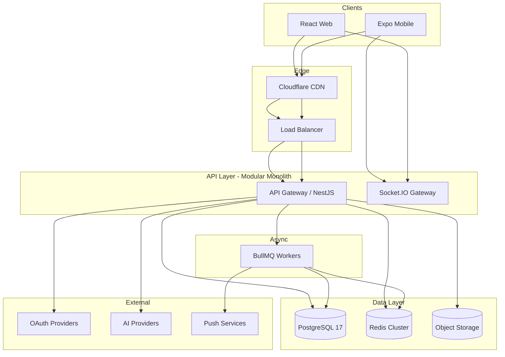

# GMRLOG OS — System Design

**Version:** 1.0.0  
**Document:** `docs/06_BACKEND/SYSTEM_DESIGN.md`  
**Status:** Approved  
**Owner:** Architecture Team  
**Classification:** Internal Engineering Documentation

---

## Purpose

Define the end-to-end system design for GMRLOG v1: bounded contexts, runtime topology, data flows, and evolution path from modular monolith to optional microservices.

A senior engineer must be able to implement the platform from this document plus domain-specific specs without architectural ambiguity.

---

## Scope

**In scope:** v1 modular monolith, client applications, API layer, persistence, cache, queues, search, realtime, AI integration boundaries.

**Out of scope:** Implementation code, infrastructure-as-code templates, vendor contract details.

---

## Definitions

| Term | Definition |
|------|------------|
| Modular Monolith | Single deployable NestJS application with strict module boundaries |
| Bounded Context | DDD domain with exclusive ownership of its aggregates and API surface |
| CQRS-ready | Command/query separation at module level; no mandatory event sourcing in v1 |
| SSOT | Single Source of Truth — `/docs` overrides code when in conflict |

---

## Goals

1. Support 1M+ registered users and 100M+ game log rows without schema redesign.
2. Enforce domain ownership matching OpenAPI modules (`AUTH`, `USER`, `SOCIAL`, etc.).
3. Enable horizontal scaling of API, workers, and WebSocket gateways.
4. Preserve future extraction of Auth, Search, AI, and Notification into services.

---

## High-Level Architecture



---

## Domain Map (Bounded Contexts)

| Context | Owns | API Module | Database Prefix |
|---------|------|------------|-----------------|
| Identity | Auth, sessions, MFA | `AUTH_API` | `auth_*` |
| Profile | User profile, privacy, gaming identity | `USER_API` | `users`, `user_*` |
| Social | Follow, friends, feed, presence | `SOCIAL_API` | `social_*` |
| Notifications | Delivery, preferences, push tokens | `NOTIFICATION_API` | `notifications_*` |
| Reviews | Reviews, comments, reactions, moderation reports, spoiler flags | `REVIEW_API` (+ `ADMIN_API` queue) | `reviews`, `review_*`, `comments` (review-threaded) |
| Feed (aggregation) | `feed_items` from review/engagement domain events | `SOCIAL_API` (`GET /feed`) | `feed_items` |
| Game Log | Game logs (user–game relationship), play sessions (future), progress | `GAME_LOG_API` | `game_logs`, `play_sessions`, `game_progress` |
| Catalog | Games, metadata, IGDB sync | `GAME_API` | `games`, `igdb_*` |
| Game Log | Play sessions, progress, timeline | `GAME_LOG_API` | `game_logs_*` |
| Collections | User collections | `COLLECTION_API` | `collections_*` |
| Lists | Ranked/custom lists | `LIST_API` | `lists_*` |
| Tier Lists | Tier lists, votes | `TIERLIST_API` | `tierlists_*` |
| Search | Global search, discover | `SEARCH_API` | read models + FTS |
| AI | Recommendations, moderation, NL search | `AI_API` | `ai_*` audit only |
| Admin | Moderation, CMS, audit | `ADMIN_API` | `admin_*` |

**Rule:** No bounded context may expose another context's write operations. Cross-context reads use public read models or API composition at the gateway.

---

## Clean Architecture Layers

```text
Presentation  → Controllers, DTOs, OpenAPI operation handlers
Application   → Use cases, command/query handlers, orchestration
Domain        → Entities, value objects, domain events, invariants
Infrastructure → Prisma, Redis, S3, BullMQ, external HTTP clients
```

Dependency rule: inner layers never import outer layers. Domain has zero framework imports.

---

## CQRS-Ready Pattern (v1)

| Operation type | Pattern | Example |
|----------------|---------|---------|
| Commands | Single write aggregate + domain event | `CreateReviewCommand` |
| Queries | Read-optimized repository / view | `GetUserFeedQuery` |
| Projections | Async worker updates denormalized tables | Feed item materialization |

Event sourcing is **not** required in v1. Domain events are published to BullMQ for side effects (notifications, search index, analytics).

---

## Communication Patterns

| Pattern | Use case | Technology |
|---------|----------|------------|
| Sync REST | Client ↔ API | OpenAPI 3.1, `/api/v1` |
| Sync WebSocket | Presence, typing, live counters | Socket.IO |
| Async events | Notifications, search index, AI jobs | BullMQ + Redis |
| Webhooks (future) | Developer integrations | Signed HTTP callbacks |

---

## Deployment Unit (v1)

Single Docker image: `gmrlog-api` containing:

- HTTP module (NestJS)
- WebSocket gateway (same process or sidecar in v1.1)
- Worker process (separate container, same codebase)

Scale independently: `api` replicas, `worker` replicas, `ws` replicas (when split).

---

## Security Boundaries

- All authenticated REST: `BearerAuth` JWT (see `AUTH_API`).
- Public reads explicitly marked `security: []` in OpenAPI.
- Admin operations require `ADMIN` role + separate audit log.
- PII never logged; see `LOGGING.md`.

---

## Performance Targets

| Metric | Target |
|--------|--------|
| API p95 (read) | < 200ms |
| API p95 (write) | < 400ms |
| WebSocket connect | < 500ms |
| Search p95 | < 300ms |
| Feed first page | < 250ms |

See `PERFORMANCE_GUIDE.md` and `PERFORMANCE_BUDGET.md`.

---

## Failure Modes

| Failure | Behavior |
|---------|----------|
| PostgreSQL unavailable | 503, circuit breaker, no partial writes |
| Redis unavailable | Degrade cache; queue pauses; rate limit fails open (logged) |
| S3 unavailable | Media upload fails; reads from CDN cache if present |
| AI provider timeout | Return graceful fallback; job retries with backoff |

---

## Future Considerations

- Extract Search to dedicated service with Elasticsearch/OpenSearch.
- Split WebSocket gateway when connection count exceeds single-node limits.
- GraphQL federation (not planned for v1).
- Multi-region active-active (v2).

---

## Acceptance Criteria

- [ ] Every new feature maps to exactly one bounded context.
- [ ] No duplicate endpoints across OpenAPI modules.
- [ ] Domain events documented in `EVENT_ARCHITECTURE.md`.
- [ ] Database tables align with `DATABASE_SPECIFICATION.md` ownership.

---

## Related Documents

- [BACKEND_ARCHITECTURE.md](BACKEND_ARCHITECTURE.md)
- [EVENT_ARCHITECTURE.md](EVENT_ARCHITECTURE.md)
- [WEBSOCKET_ARCHITECTURE.md](WEBSOCKET_ARCHITECTURE.md)
- [API_ARCHITECTURE.md](../08_API/API_ARCHITECTURE.md)
- [DATABASE_SPECIFICATION.md](../07_DATABASE/DATABASE_SPECIFICATION.md)
- [SYSTEM_ARCHITECTURE.md](../10_DEVOPS/SYSTEM_ARCHITECTURE.md)
- [TECH_STACK_DECISIONS.md](../00_PROJECT/TECH_STACK_DECISIONS.md)

---

## Revision History

| Version | Date | Author | Change |
|---------|------|--------|--------|
| 1.0.0 | 2026-07-10 | Architecture | Initial system design — Documentation Freeze v1 |
