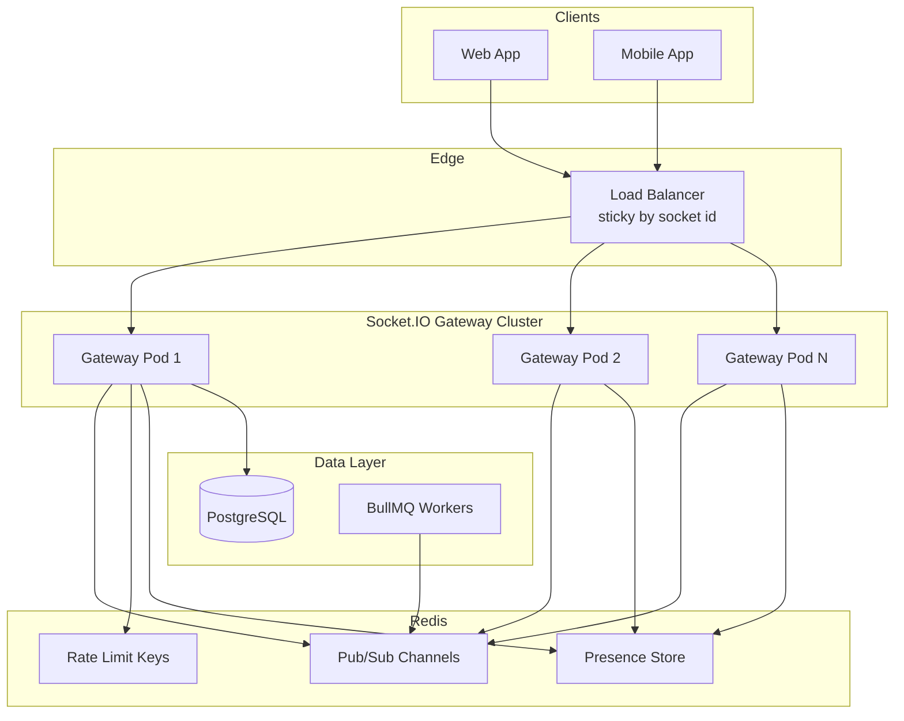
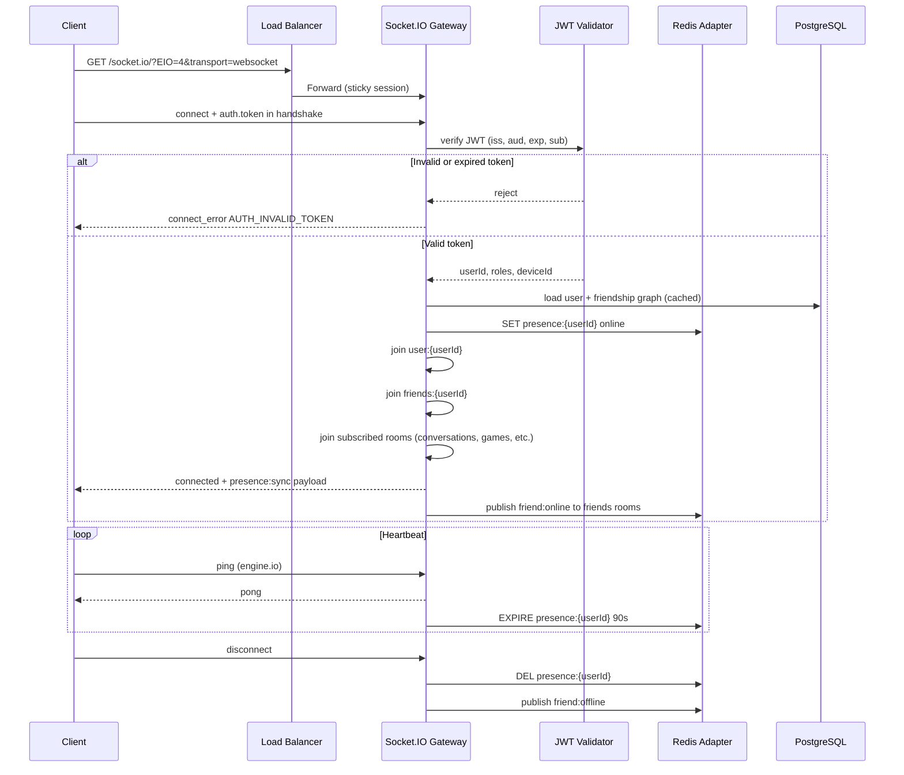

# GMRLOG OS — WebSocket Architecture

**Version:** 1.0.0  
**Document:** `docs/06_BACKEND/WEBSOCKET_ARCHITECTURE.md`  
**Status:** Approved  
**Owner:** Backend Team

---

## Purpose

Define the **implementation-level** WebSocket architecture for GMRLOG: Socket.IO gateway configuration, authentication handshake, room membership, presence, event contracts, Redis adapter wiring, and horizontal scale-out.

This document complements [REALTIME_ARCHITECTURE.md](REALTIME_ARCHITECTURE.md), which describes product-level realtime capabilities. Engineers implementing the NestJS gateway, client SDKs, and observability must follow this specification.

---

## Scope

| In scope | Out of scope |
|----------|--------------|
| Socket.IO server configuration and namespaces | REST API design |
| JWT handshake and room authorization | Push notification delivery (see [BACKGROUND_JOBS.md](BACKGROUND_JOBS.md)) |
| Room naming, join/leave rules, presence | Full domain event catalog (see [EVENT_ARCHITECTURE.md](EVENT_ARCHITECTURE.md)) |
| Client/server event payloads and validation | Mobile offline sync |
| Redis adapter, sticky sessions, scale-out | Voice channels, watch parties (future) |

---

## Technology Stack

| Layer | Choice | Package / Module |
|-------|--------|------------------|
| Framework | NestJS WebSocket Gateway | `@nestjs/websockets` |
| Engine | Socket.IO v4 | `socket.io` |
| Redis adapter | `@socket.io/redis-adapter` | Pub/Sub via `ioredis` |
| Auth | JWT (same issuer as REST) | `@gmrlog/auth` |
| Validation | Zod event schemas | `@gmrlog/types` |
| Rate limiting | Redis sliding window | `@gmrlog/rate-limit` |

Transport order: `['websocket', 'polling']`. Polling is fallback only; clients must prefer WebSocket.

---

## High-Level Topology



Every gateway pod is stateless. Connection metadata, presence, and cross-pod fan-out live in Redis. Background workers publish to rooms via the Redis adapter without holding sockets.

---

## Connection Flow



### Handshake Contract

Clients pass credentials in `auth` (preferred) or `Authorization` header on the initial HTTP upgrade:

```typescript
interface SocketHandshakeAuth {
  token: string;           // Access JWT (not refresh)
  platform: 'web' | 'ios' | 'android';
  appVersion: string;
  deviceId: string;        // Stable per installation
}
```

Server rejects connection when:

- Token missing, malformed, or expired → `connect_error` code `AUTH_INVALID_TOKEN` or `AUTH_EXPIRED_TOKEN`
- User account disabled → `AUTH_ACCOUNT_DISABLED`
- Origin not in allowlist (web only) → `FORBIDDEN`
- Connection rate limit exceeded → `RATE_LIMIT_EXCEEDED` with `retryAfter` seconds

Unauthenticated connections are **not** permitted in v1. Public broadcast channels (developer announcements) use a separate read-only namespace with API-key or anonymous token issued by REST — not raw unauthenticated sockets.

---

## Namespaces

| Namespace | Path | Auth | Purpose |
|-----------|------|------|---------|
| Global | `/` | Required | Presence, friend status, system broadcasts |
| Feed | `/feed` | Required | Home feed live updates |
| Messages | `/messages` | Required | DMs, typing, read receipts |
| Notifications | `/notifications` | Required | In-app notification stream |
| Developers | `/developers` | Required + verified dev | Studio/dev broadcasts |
| Admin | `/admin` | Required + admin role | Moderation live queue |

Each namespace runs as a separate NestJS `@WebSocketGateway({ namespace: '/feed' })` class sharing the same Redis adapter instance.

---

## Room Model

Rooms are the unit of fan-out. A user receives an event only if their socket has joined the target room **and** passes room-level authorization.

### Room Naming Convention

```
{entity}:{id}
```

| Room pattern | Auto-join trigger | Authorization rule |
|--------------|-------------------|---------------------|
| `user:{userId}` | On connect | Only `userId` matches JWT `sub` |
| `friends:{userId}` | On connect | Only `userId` matches JWT `sub` (server emits friend events here) |
| `conversation:{conversationId}` | Client `conversation:subscribe` | User is `conversation_members` row |
| `game:{gameId}` | Client `game:subscribe` | Public; rate-limited |
| `developer:{developerId}` | Client `developer:subscribe` | Public |
| `studio:{studioId}` | Client `studio:subscribe` | Public |
| `tierlist:{tierListId}` | Client `tierlist:subscribe` | Visibility check via DB/cache |
| `collection:{collectionId}` | Client `collection:subscribe` | Visibility check via DB/cache |
| `review:{reviewId}` | Client `review:subscribe` | Review visibility + block graph |
| `admin:moderation` | On connect (admin only) | `ADMIN` or `MODERATOR` role |

### Join / Leave Protocol

Client → server events:

| Event | Payload | Server action |
|-------|---------|---------------|
| `room:join` | `{ room: string }` | Authorize, then `socket.join(room)` |
| `room:leave` | `{ room: string }` | `socket.leave(room)` |
| `conversation:subscribe` | `{ conversationId: string }` | Join `conversation:{id}` after membership check |
| `game:subscribe` | `{ gameId: string }` | Join `game:{id}` |
| `review:subscribe` | `{ reviewId: string }` | Join `review:{id}` after visibility check |

Server never trusts client-supplied `userId`. All private rooms derive authorization from JWT `sub` and database membership.

---

## Presence System

Presence state is stored in Redis, not in gateway memory.

### Redis Keys

| Key | Type | TTL | Value |
|-----|------|-----|-------|
| `presence:{userId}` | Hash | 90s (refreshed on heartbeat) | `status`, `platform`, `deviceId`, `lastSeenAt` |
| `presence:devices:{userId}` | Set | 90s | Active `deviceId` values |

### Presence States

| Status | Meaning |
|--------|---------|
| `online` | At least one active socket |
| `away` | Client reported idle (optional client hint) |
| `offline` | Key expired or explicit disconnect |

### Server Events

| Event | Target room | Payload |
|-------|-------------|---------|
| `friend:online` | `friends:{userId}` | `{ userId, platform, lastSeenAt }` |
| `friend:offline` | `friends:{userId}` | `{ userId, lastSeenAt }` |
| `presence:sync` | Connecting socket only | `{ friends: PresenceSnapshot[] }` |

Friends receive presence deltas only — not full graph on every heartbeat. Initial connect sends `presence:sync` with online friends from Redis pipeline (`MGET` on friend IDs).

### Multi-Device Behavior

A user with web + mobile connected remains `online` until **all** device sockets disconnect. Each socket registers its `deviceId` in `presence:devices:{userId}`; offline is emitted only when the set is empty.

---

## Event Catalog

Event naming follows `domain:action` (see [REALTIME_ARCHITECTURE.md](REALTIME_ARCHITECTURE.md)). All server-emitted events wrap payloads consistently:

```typescript
interface RealtimeEnvelope<T> {
  event: string;
  timestamp: string;       // ISO 8601 UTC
  correlationId?: string;  // Matches REST requestId when applicable
  payload: T;
}
```

### Messaging (`/messages`)

| Event | Direction | Payload highlights |
|-------|-----------|-------------------|
| `message:sent` | Server → room | `messageId`, `conversationId`, `senderId`, `body`, `attachments` |
| `message:delivered` | Server → room | `messageId`, `recipientId` |
| `message:read` | Server → room | `messageId`, `readerId`, `readAt` |
| `message:typing` | Bidirectional | `conversationId`, `userId`, `isTyping` |
| `message:reaction` | Server → room | `messageId`, `emoji`, `userId` |

### Notifications (`/notifications`)

| Event | Direction | Payload highlights |
|-------|-----------|-------------------|
| `notification:new` | Server → `user:{id}` | `notificationId`, `type`, `title`, `body`, `deepLink` |
| `notification:read` | Server → `user:{id}` | `notificationId`, `readAt` |
| `notification:badge` | Server → `user:{id}` | `unreadCount` |

Workers enqueue notification delivery; the notification worker publishes via Redis adapter to the target user room (see [BACKGROUND_JOBS.md](BACKGROUND_JOBS.md)).

### Feed (`/feed`)

| Event | Target | Payload highlights |
|-------|--------|-------------------|
| `feed:item` | `user:{id}` | New feed item for home timeline |
| `feed:update` | `user:{id}` | Item edited or deleted |
| `review:created` | `game:{gameId}` + author friends | `reviewId`, `gameId`, `authorId` |
| `gamelog:logged` | `friends:{userId}` | `logId`, `gameId`, `userId` |

### Reviews (`/` or `/feed`)

| Event | Target | Payload highlights |
|-------|--------|-------------------|
| `review:updated` | `review:{reviewId}` | `reviewId`, `fieldsChanged` |
| `review:liked` | `review:{reviewId}` | `reviewId`, `userId`, `likeCount` |
| `review:comment` | `review:{reviewId}` | `commentId`, `authorId`, `excerpt` |

### Friends (`/`)

| Event | Target | Payload highlights |
|-------|--------|-------------------|
| `friend:request` | `user:{targetId}` | `requestId`, `fromUserId` |
| `friend:accepted` | Both `user:{id}` rooms | `friendshipId`, `userId` |
| `friend:removed` | Both users | `userId` |

---

## Redis Adapter Configuration

### Requirements

- Single Redis cluster (or Elasticache) for both Pub/Sub and presence; separate logical DB index from cache if needed.
- `@socket.io/redis-adapter` with dedicated `pubClient` and `subClient` (two `ioredis` connections per gateway pod).
- Channel prefix: `gmrlog:socket.io` (environment-suffixed in staging).

### Cross-Pod Emit Pattern

```typescript
// From any gateway pod or worker
io.of('/notifications').to(`user:${userId}`).emit('notification:new', envelope);
```

The Redis adapter propagates the emit to whichever pod holds the user's socket(s).

### Worker → Socket Bridge

BullMQ workers do not open WebSocket connections. They use a lightweight `SocketEmitterService` that:

1. Instantiates a Redis-only Socket.IO server (no HTTP listener).
2. Calls `emit` on target rooms.
3. Relies on Redis adapter to deliver to connected clients.

This keeps notification latency off the HTTP request path.

---

## Scale-Out Strategy

| Concern | Strategy |
|---------|----------|
| Horizontal gateway scaling | Stateless pods behind LB; Redis adapter sync |
| Sticky sessions | LB cookie on `sid` (Socket.IO session id) — required for polling fallback |
| Connection limits | 50k concurrent sockets per pod (tune per instance size); HPA on connection count + CPU |
| Memory | ~4 KB per idle connection budget; monitor pod RSS |
| Redis throughput | Shard Pub/Sub by namespace if >100k msg/sec (v2) |
| Backpressure | Drop typing indicators before messages under load |

### Deployment Topology (Production)

| Component | Replicas (baseline) | Notes |
|-----------|---------------------|-------|
| `socket-gateway` | 3+ | Dedicated from REST API pods |
| Redis | Cluster mode | Primary + replica, AOF enabled |
| Workers (notification) | 2+ | Publish to sockets via adapter |

REST API and WebSocket gateway are **separate deployables** in production to isolate connection churn from HTTP latency.

---

## Security

| Control | Implementation |
|---------|----------------|
| Authentication | JWT on handshake; short-lived access token (15 min) |
| Authorization | Per-room membership checks before `join` |
| Origin validation | `CORS_ORIGINS` env allowlist for web |
| Payload validation | Zod schema per inbound client event |
| Payload size | Max 32 KB per message event |
| Rate limiting | Per-socket Redis counters (see table below) |
| Replay protection | `message:clientId` dedup in Redis (60s window) |
| Logging | Connection id, userId, namespace; never log message body in production |

### Socket Rate Limits

| Event class | Limit | Window |
|-------------|-------|--------|
| Connection attempts | 20 | 1 minute / IP |
| `message:*` send | 120 | 1 minute / user |
| `message:typing` | 60 | 1 minute / user |
| `room:join` | 30 | 1 minute / user |
| Presence updates | 30 | 1 minute / user |
| Server → client | Unlimited | — |

Exceeded limits emit `error` event with code `RATE_LIMIT_EXCEEDED` and optionally disconnect after repeated abuse.

---

## Reconnection and Resilience

| Parameter | Value |
|-----------|-------|
| Heartbeat interval | 30 seconds |
| Heartbeat timeout | 90 seconds |
| Client reconnection | Exponential backoff: 1s, 2s, 5s, 10s, 30s (max) |
| Token refresh | Client refreshes JWT via REST, then reconnects with new token |
| Missed events | Client fetches delta via REST (`GET /notifications`, `GET /conversations/{id}/messages`) on reconnect |

On reconnect, server re-runs full join logic (user room, friends room, re-subscribe to active conversations from client state).

---

## Observability

| Metric | Type | Alert threshold |
|--------|------|-----------------|
| `socket_connections_active` | Gauge | >80% pod capacity |
| `socket_connect_errors_total` | Counter | Spike >3x baseline |
| `socket_events_in_total` | Counter by event | — |
| `socket_events_out_total` | Counter by event | — |
| `socket_room_join_denied_total` | Counter | >100/min |
| `socket_redis_publish_latency_ms` | Histogram | p99 >50ms |
| `socket_heartbeat_timeouts_total` | Counter | — |

Structured logs include `socketId`, `userId`, `namespace`, `event`, `correlationId`. Use OpenTelemetry trace propagation from REST to socket handlers where events originate from API calls.

---

## NestJS Module Structure

```
backend/apps/socket-gateway/src/
├── main.ts
├── app.module.ts
├── adapters/
│   └── redis-io.adapter.ts
├── gateways/
│   ├── global.gateway.ts
│   ├── feed.gateway.ts
│   ├── messages.gateway.ts
│   ├── notifications.gateway.ts
│   ├── developers.gateway.ts
│   └── admin.gateway.ts
├── guards/
│   ├── ws-jwt.guard.ts
│   └── room-auth.guard.ts
├── services/
│   ├── presence.service.ts
│   ├── room.service.ts
│   └── socket-emitter.service.ts
└── pipes/
    └── ws-validation.pipe.ts
```

---

## Acceptance Criteria

- [ ] Socket.IO gateway authenticates every private connection via JWT handshake before joining rooms.
- [ ] Room naming follows `{entity}:{id}` and authorization is enforced server-side for all non-public rooms.
- [ ] Presence is stored in Redis with 90s TTL, supports multi-device, and propagates `friend:online` / `friend:offline`.
- [ ] Redis adapter enables cross-pod emit; workers publish notifications without holding sockets.
- [ ] All client events validated with Zod; inbound rate limits enforced per socket.
- [ ] Connection flow documented and implemented per sequence diagram; reconnect restores subscriptions.
- [ ] Metrics and structured logs cover connections, denials, and Redis publish latency.

---

## Related Documents

- [REALTIME_ARCHITECTURE.md](REALTIME_ARCHITECTURE.md) — Product-level realtime capabilities
- [BACKEND_ARCHITECTURE.md](BACKEND_ARCHITECTURE.md) — Overall backend structure
- [EVENT_ARCHITECTURE.md](EVENT_ARCHITECTURE.md) — Domain events feeding realtime
- [BACKGROUND_JOBS.md](BACKGROUND_JOBS.md) — Notification and fan-out workers
- [RATE_LIMITING.md](RATE_LIMITING.md) — HTTP and socket rate limits
- [ERROR_HANDLING.md](ERROR_HANDLING.md) — Error codes for `connect_error`
- [ERROR_CODES.md](../08_API/ERROR_CODES.md) — Canonical error code registry
- [SECURITY.md](../11_SECURITY/SECURITY.md) — Platform security baseline

---

## Revision History

| Version | Date | Change |
|---------|------|--------|
| 1.0.0 | 2026-07-10 | Initial WebSocket implementation architecture |
