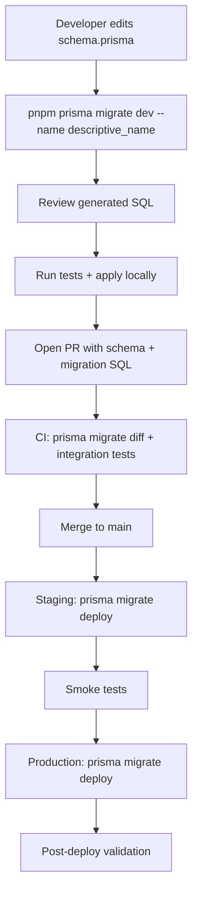

# GMRLOG OS — Database Migrations

**Version:** 1.0.0  
**Document:** `docs/07_DATABASE/DATABASE_MIGRATIONS.md`  
**Status:** Approved  
**Owner:** Backend Team

---

## Purpose

Define the **Prisma Migrate** workflow for GMRLOG schema changes: how migrations are authored, reviewed, applied, rolled back, and validated in CI/CD. This document ensures PostgreSQL schema evolution remains safe, auditable, and compatible with zero-downtime deployments at scale.

---

## Scope

| In scope | Out of scope |
|----------|--------------|
| Prisma `migrate dev` / `migrate deploy` workflow | Manual SQL hotfixes in production (forbidden) |
| Migration naming and file structure | Application-level data backfills in API code |
| Rollback strategies | Non-PostgreSQL databases |
| Zero-downtime (expand-contract) patterns | ORM query patterns (see [PRISMA_SCHEMA.md](PRISMA_SCHEMA.md)) |
| Seed data strategy | Index design details (see [INDEXING_STRATEGY.md](INDEXING_STRATEGY.md)) |

---

## Technology

| Tool | Version | Role |
|------|---------|------|
| Prisma ORM | 6.x | Schema definition, migration generation |
| PostgreSQL | 17+ | Target database |
| `prisma migrate` | CLI | Diff, apply, history |
| `prisma db seed` | CLI | Reference data bootstrap |

Connection URLs:

```text
DATABASE_URL=postgresql://...        # Pooled (PgBouncer) — runtime
DIRECT_URL=postgresql://...          # Direct — migrations only
```

Migrations **must** use `DIRECT_URL` to avoid PgBouncer transaction pooling issues with DDL.

---

## Repository Layout

```text
backend/prisma/
├── schema.prisma              # Single production schema
├── migrations/
│   ├── migration_lock.toml
│   ├── 20260701120000_init/
│   │   └── migration.sql
│   ├── 20260705143000_add_review_drafts/
│   │   └── migration.sql
│   └── ...
└── seed/
    ├── index.ts               # Entry: prisma db seed
    ├── genres.ts
    ├── platforms.ts
    ├── notification-types.ts
    └── admin-user.ts
```

---

## Migration Workflow



### Developer Commands

| Command | Environment | Purpose |
|---------|-------------|---------|
| `pnpm prisma migrate dev --name <name>` | Local | Generate + apply migration |
| `pnpm prisma migrate deploy` | Staging/Prod | Apply pending migrations only |
| `pnpm prisma migrate status` | Any | Show applied vs pending |
| `pnpm prisma migrate diff` | CI | Fail if schema drift from DB |
| `pnpm prisma db seed` | Local/Staging | Load reference data |
| `pnpm prisma generate` | Any | Regenerate client after schema change |

### Rules

1. **Never** edit applied migration SQL files — create a new migration instead.
2. **Never** run `prisma db push` against staging or production.
3. Every PR that changes `schema.prisma` must include the generated `migrations/` folder.
4. Migration SQL is reviewed by at least one senior engineer for locking and downtime risk.
5. Destructive changes (`DROP COLUMN`, `DROP TABLE`) require expand-contract (see below).

---

## Naming Convention

### Migration Folder Name

```
YYYYMMDDHHMMSS_<snake_case_description>
```

Examples:

```text
20260710120000_add_review_drafts
20260715140000_add_game_logs_completion_index
20260720100000_expand_users_display_name_length
```

Rules:

- UTC timestamp prefix ensures ordering.
- Description is verb-first, max 60 characters.
- One logical change per migration when possible (easier rollback).
- Large feature migrations may span multiple folders if phases are independently deployable.

### Prisma Model Changes

Follow [PRISMA_SCHEMA.md](PRISMA_SCHEMA.md):

- Models: `PascalCase`
- DB tables: `snake_case` via `@@map`
- Columns: `snake_case` via `@map`

---

## Migration SQL Standards

Generated SQL is reviewed and hand-edited when necessary. Allowed manual additions:

- `CREATE INDEX CONCURRENTLY` (replace Prisma default blocking index)
- `COMMENT ON` for documentation
- `CHECK` constraints not expressible in Prisma
- Extension enables: `CREATE EXTENSION IF NOT EXISTS pg_trgm`

Forbidden in migration SQL:

- `TRUNCATE` on production tables without explicit approval ticket
- Data deletes without `WHERE` clause
- Disabling triggers globally
- Setting `statement_timeout = 0` without review

### Transaction Behavior

Prisma wraps migrations in a transaction by default. For PostgreSQL operations that cannot run inside a transaction:

```sql
-- prisma migrate: no-transaction
CREATE INDEX CONCURRENTLY idx_reviews_game_id_created_at ON reviews (game_id, created_at DESC);
```

Use `-- prisma migrate: no-transaction` comment at top of file when any statement requires it.

---

## Zero-Downtime Migrations (Expand-Contract)

Production deploys run **rolling updates** — old and new code coexist during migration. Schema changes must not break running pods.

### Phase 1: Expand

Add new structures without removing old:

```sql
-- Add nullable column
ALTER TABLE reviews ADD COLUMN spoiler_level smallint;

-- Add new table
CREATE TABLE review_drafts (...);
```

Deploy code that **writes to both** old and new (dual-write) or only new nullable fields.

### Phase 2: Migrate Data

Backfill via background job or batched SQL:

```sql
UPDATE reviews SET spoiler_level = 0 WHERE spoiler_level IS NULL;
```

Run in batches of 10,000 rows with `COMMIT` between batches to avoid long locks.

### Phase 3: Contract

After all pods read new column and data is backfilled:

```sql
ALTER TABLE reviews ALTER COLUMN spoiler_level SET NOT NULL;
ALTER TABLE reviews DROP COLUMN legacy_spoiler_flag;
```

Deploy code that removes old field references.


### Safe Operations (v1 deploy without multi-phase)

| Operation | Downtime risk |
|-----------|---------------|
| Add nullable column | None |
| Add table | None |
| Add index `CONCURRENTLY` | None |
| Add enum value at end | None (PostgreSQL 12+) |
| Rename column | **High** — use expand-contract with view or alias |
| Change column type | **High** — add new column, backfill, swap |
| `NOT NULL` on existing column | **High** — backfill first |
| `DROP COLUMN` | **High** — remove code dependency first |

---

## Rollback Strategy

Prisma has no automatic `migrate down`. Rollback is operational:

### Pre-Production (Local / Feature Branch)

```bash
# Reset local DB to migration history
pnpm prisma migrate reset
```

Destroys local data — never use in staging/production.

### Staging / Production

| Scenario | Action |
|----------|--------|
| Migration not yet deployed | Remove migration folder from PR before merge |
| Migration deployed, forward fix available | New migration reversing or fixing change |
| Migration deployed, catastrophic failure | Restore from PITR backup (see [DATABASE_SPECIFICATION.md](DATABASE_SPECIFICATION.md)) |

### Forward-Fix Template

```sql
-- 20260718120000_rollback_spoiler_level_not_null
ALTER TABLE reviews ALTER COLUMN spoiler_level DROP NOT NULL;
```

Every production migration PR must include a **Rollback Plan** section describing forward-fix SQL or backup restore decision.

---

## CI/CD Integration

Pipeline steps (see [CI_CD.md](../10_DEVOPS/CI_CD.md)):

1. `prisma validate` — schema syntax
2. `prisma migrate diff --from-migrations --to-schema-datamodel` — no drift
3. Spin ephemeral PostgreSQL → `prisma migrate deploy` → run integration tests
4. On merge to `main`: auto-deploy migrations to staging
5. Production: `prisma migrate deploy` in release job **before** rolling pod update (when migration is backward-compatible) or **after expand phase** per runbook

### Deployment Ordering

| Migration type | Order |
|----------------|-------|
| Backward-compatible (add nullable) | Migrate → deploy pods |
| Breaking (contract phase) | Deploy pods reading new → migrate contract |
| Index only (`CONCURRENTLY`) | Migrate anytime; no code dependency |

---

## Seeding

### When to Seed

| Environment | Seed behavior |
|-------------|---------------|
| Local | Full seed on `migrate reset` or `db seed` |
| CI | Minimal seed (roles, enums) in test fixtures |
| Staging | Reference data + test accounts (no production PII) |
| Production | **No automatic full seed** — reference data via migrations or one-time ops |

### Seed Contents (v1)

| Dataset | Idempotent | Notes |
|---------|------------|-------|
| Genres | Yes | `upsert` on slug |
| Platforms | Yes | `upsert` on slug |
| Notification types | Yes | `upsert` on code |
| System roles | Yes | `ADMIN`, `MODERATOR`, `USER`, `DEVELOPER` |
| Badges / achievement types | Yes | Static catalog |
| Admin user | Staging only | From `SEED_ADMIN_EMAIL` env |
| Demo games | Local only | Optional flag `SEED_DEMO_DATA=true` |

### Seed Entry Point

```typescript
// prisma/seed/index.ts
async function main() {
  await seedGenres(prisma);
  await seedPlatforms(prisma);
  await seedNotificationTypes(prisma);
  await seedSystemRoles(prisma);
  if (process.env.SEED_DEMO_DATA === 'true') {
    await seedDemoGames(prisma);
  }
}
```

Seeds must be **idempotent** (`upsert`) — safe to re-run.

### package.json

```json
{
  "prisma": {
    "seed": "tsx prisma/seed/index.ts"
  }
}
```

---

## Migration History Table

Prisma maintains `_prisma_migrations`:

| Column | Purpose |
|--------|---------|
| `migration_name` | Folder name |
| `applied_at` | Timestamp |
| `checksum` | Detect edited files |

Never manually delete rows from `_prisma_migrations` in production.

---

## Locking and Performance

| DDL operation | Lock type | Mitigation |
|---------------|-----------|------------|
| `ADD COLUMN` nullable | Brief `ACCESS EXCLUSIVE` | Acceptable for small tables |
| `CREATE INDEX` (default) | `SHARE` write block | Use `CONCURRENTLY` |
| `ALTER TYPE ADD VALUE` | Brief | Add at end of enum only |
| `VALIDATE CONSTRAINT` | `SHARE UPDATE EXCLUSIVE` | Run after `NOT VALID` add |

Large table DDL (`reviews`, `game_logs`) requires runbook with estimated row count and maintenance window approval if lock exceeds 5 seconds.

---

## Security

- Migration credentials use `DIRECT_URL` with DDL privileges; runtime uses limited `DATABASE_URL` role without `DROP`.
- No secrets in migration SQL or seed files.
- Production migration logs audited; only CI and designated ops roles execute `migrate deploy`.

---

## Acceptance Criteria

- [ ] All schema changes flow through Prisma Migrate; no manual production DDL.
- [ ] Migration naming follows `YYYYMMDDHHMMSS_description` convention.
- [ ] Zero-downtime expand-contract documented and followed for breaking changes.
- [ ] `CREATE INDEX CONCURRENTLY` used for large-table indexes.
- [ ] CI runs `migrate deploy` against ephemeral DB before merge.
- [ ] Seed scripts idempotent; production seeding restricted to reference data.
- [ ] Every production migration PR includes rollback plan.

---

## Related Documents

- [PRISMA_SCHEMA.md](PRISMA_SCHEMA.md) — Model definitions and conventions
- [MIGRATION_GUIDE.md](MIGRATION_GUIDE.md) — Developer step-by-step guide
- [DATABASE_SPECIFICATION.md](DATABASE_SPECIFICATION.md) — Domain tables and backup policy
- [INDEXING_STRATEGY.md](INDEXING_STRATEGY.md) — Index creation in migrations
- [PARTITIONING.md](PARTITIONING.md) — Partition setup migrations (v2)
- [CI_CD.md](../10_DEVOPS/CI_CD.md) — Pipeline integration
- [DEPLOYMENT.md](../10_DEVOPS/DEPLOYMENT.md) — Release ordering

---

## Revision History

| Version | Date | Change |
|---------|------|--------|
| 1.0.0 | 2026-07-10 | Initial database migrations specification |
