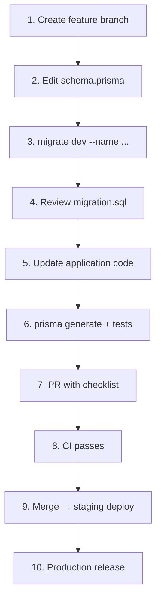

# GMRLOG OS — Migration Guide

**Version:** 1.0.0  
**Document:** `docs/07_DATABASE/MIGRATION_GUIDE.md`  
**Status:** Approved  
**Owner:** Backend Team

---

## Purpose

Provide a **practical developer guide** for making GMRLOG database schema changes safely. This document walks through day-to-day workflows from local development to production deployment, linking operational policy ([DATABASE_MIGRATIONS.md](DATABASE_MIGRATIONS.md)) with schema conventions ([PRISMA_SCHEMA.md](PRISMA_SCHEMA.md)).

Every backend engineer must read this guide before their first schema PR.

---

## Scope

| In scope | Out of scope |
|----------|--------------|
| Step-by-step local → PR → deploy workflow | DBA on-call runbooks for catastrophic failure |
| Checklists for common change types | Full index catalog (see [INDEXING_STRATEGY.md](INDEXING_STRATEGY.md)) |
| Troubleshooting common Prisma errors | Partition cutover execution (see [PARTITIONING.md](PARTITIONING.md)) |

---

## Prerequisites

| Requirement | Verify |
|-------------|--------|
| Docker / local PostgreSQL 17 | `docker compose up postgres -d` |
| Environment files | `DATABASE_URL`, `DIRECT_URL` in `backend/.env` |
| Node 22 + pnpm | `pnpm install` in monorepo root |
| Prisma CLI | `pnpm prisma --version` |

Read first:

1. [PRISMA_SCHEMA.md](PRISMA_SCHEMA.md) — naming, relations, enums
2. [DATABASE_MIGRATIONS.md](DATABASE_MIGRATIONS.md) — policy and zero-downtime rules
3. [CODING_STANDARDS.md](../00_PROJECT/CODING_STANDARDS.md) — TypeScript strict mode

---

## Quick Reference Commands

```bash
# From backend/ or via pnpm filter
cd backend

# Create and apply migration locally
pnpm prisma migrate dev --name add_review_drafts

# Regenerate client after schema change
pnpm prisma generate

# Check migration status
pnpm prisma migrate status

# Seed reference data
pnpm prisma db seed

# Reset local DB (destructive)
pnpm prisma migrate reset

# Production/staging apply (CI/CD only — not local)
pnpm prisma migrate deploy
```

---

## Standard Workflow



### Step 1: Branch

```bash
git checkout -b feat/review-drafts-schema
```

One schema feature per branch when possible — simplifies rollback.

### Step 2: Edit `schema.prisma`

Follow [PRISMA_SCHEMA.md](PRISMA_SCHEMA.md):

```prisma
model ReviewDraft {
  id        String   @id @default(uuid()) @db.Uuid
  userId    String   @map("user_id") @db.Uuid
  gameId    String   @map("game_id") @db.Uuid
  title     String?
  body      String?
  rating    Decimal? @db.Decimal(3, 1)
  createdAt DateTime @default(now()) @map("created_at")
  updatedAt DateTime @updatedAt @map("updated_at")

  user User @relation(fields: [userId], references: [id])
  game Game @relation(fields: [gameId], references: [id])

  @@unique([userId, gameId])
  @@index([userId, updatedAt(sort: Desc)])
  @@map("review_drafts")
}
```

Add reverse relations on `User` and `Game` models in the same PR.

### Step 3: Generate Migration

```bash
pnpm prisma migrate dev --name add_review_drafts
```

Prisma creates:

```text
prisma/migrations/20260710143000_add_review_drafts/migration.sql
```

### Step 4: Review SQL

Open `migration.sql`. Verify:

- [ ] Table/column names are `snake_case`
- [ ] FK constraints reference correct tables
- [ ] Indexes present for FK columns
- [ ] No unexpected `DROP` statements
- [ ] Large-table indexes use `CONCURRENTLY` (edit manually if needed)

Example manual fix for production safety:

```sql
-- Replace blocking index with concurrent (add no-transaction header to file)
CREATE INDEX CONCURRENTLY idx_review_drafts_user_id_updated_at
  ON review_drafts (user_id, updated_at DESC);
```

### Step 5: Update Application Code

- Run `pnpm prisma generate` — updates `@prisma/client` types
- Update repositories, DTOs, and services
- Export shared types from `@gmrlog/types` if API-facing

### Step 6: Test

```bash
pnpm --filter @gmrlog/api test
pnpm --filter @gmrlog/api test:integration
```

Integration tests run against ephemeral DB with `migrate deploy` in CI.

### Step 7: Pull Request

PR must include:

- `schema.prisma` changes
- `migrations/*/migration.sql`
- Application code using new schema
- Completed PR checklist (below)

---

## PR Checklist

Copy into PR description:

```markdown
## Schema Change Checklist

- [ ] Migration name follows `YYYYMMDDHHMMSS_description`
- [ ] `migration.sql` reviewed for locks and destructive ops
- [ ] Rollback plan documented (forward-fix migration or N/A)
- [ ] FK columns indexed
- [ ] Soft-delete tables use partial indexes if hot path (see INDEXING_STRATEGY.md)
- [ ] `prisma generate` committed (if generated client is vendored)
- [ ] Integration tests pass
- [ ] Zero-downtime: backward-compatible OR expand-contract phases documented
- [ ] Seed updated if new reference/enum data required
- [ ] OpenAPI / API types updated if user-facing fields added
```

---

## Common Change Recipes

### Add a New Table

| Step | Action |
|------|--------|
| 1 | Add model to `schema.prisma` with `@@map` |
| 2 | `migrate dev --name add_<table>` |
| 3 | Add repository + module |
| Risk | **Low** — deploy migration then pods |

### Add Nullable Column

| Step | Action |
|------|--------|
| 1 | Add optional field `String?` |
| 2 | Migrate |
| 3 | Deploy code reading/writing new field |
| Risk | **Low** |

### Add NOT NULL Column to Existing Table

Expand-contract required:

| Phase | Action |
|-------|--------|
| 1 | Add column nullable |
| 2 | Deploy code writing values |
| 3 | Backfill: `UPDATE ... SET col = default WHERE col IS NULL` (batched) |
| 4 | `ALTER COLUMN SET NOT NULL` in new migration |
| 5 | Deploy code assuming non-null |
| Risk | **Medium** — coordinate backfill job |

### Add Enum Value

```prisma
enum ReviewVisibility {
  PUBLIC
  FRIENDS
  PRIVATE
  UNLISTED  // new
}
```

PostgreSQL: add value at end only. Deploy code handling new value **before** traffic uses it.

### Rename Column (Avoid if Possible)

Prefer add-new + deprecate-old:

1. Add `displayNameV2` column
2. Dual-write both columns
3. Backfill
4. Switch reads to new column
5. Drop old column in later migration

Direct `RENAME COLUMN` breaks running old pods — requires coordinated fast deploy.

### Add Index on Large Table

1. Add index to schema OR raw SQL only
2. Migration file starts with `-- prisma migrate: no-transaction`
3. Use `CREATE INDEX CONCURRENTLY`
4. Do not deploy code that **requires** index until migration completes

See [INDEXING_STRATEGY.md](INDEXING_STRATEGY.md).

### Data Migration (Backfill)

Do **not** put large backfills in `migration.sql`. Use:

- One-off maintenance job in [BACKGROUND_JOBS.md](../06_BACKEND/BACKGROUND_JOBS.md)
- Or scripted batch SQL with progress logging

```sql
-- Batch backfill pattern
DO $$
DECLARE
  batch_size INT := 10000;
  rows_updated INT;
BEGIN
  LOOP
    UPDATE reviews
    SET spoiler_level = 0
    WHERE id IN (
      SELECT id FROM reviews
      WHERE spoiler_level IS NULL
      LIMIT batch_size
      FOR UPDATE SKIP LOCKED
    );
    GET DIAGNOSTICS rows_updated = ROW_COUNT;
    EXIT WHEN rows_updated = 0;
    COMMIT;
    PERFORM pg_sleep(0.1);
  END LOOP;
END $$;
```

### Seed New Reference Data

1. Add idempotent seed function in `prisma/seed/`
2. Call from `seed/index.ts`
3. Document in PR — seeds run on staging, not production (unless ops-approved)

---

## Environment-Specific Notes

### Local

- Use `migrate dev` freely
- `migrate reset` when migration history conflicts during rebase
- `SEED_DEMO_DATA=true` for UI development

### CI

- Ephemeral PostgreSQL container
- `prisma migrate deploy` only
- Fails if `schema.prisma` drifts from migrations folder

### Staging

- Auto-deploy on merge to `main`
- Validate with smoke tests before production promotion
- May include test accounts via seed

### Production

- `prisma migrate deploy` in release pipeline using `DIRECT_URL`
- Migrations run **before** pod rollout (backward-compatible changes)
- On-call notified for migrations tagged `high-risk` in PR

---

## Troubleshooting

| Error | Cause | Fix |
|-------|-------|-----|
| `P3006 migration failed to apply` | SQL error in migration | Fix SQL, `migrate dev` on clean DB |
| `P3014 migration history diverged` | Rebased branch edited old migrations | Never edit merged migrations; create fix migration |
| `P3009 migrate found failed migrations` | Partial apply in staging | `prisma migrate resolve --rolled-back <name>` after fix |
| `Drift detected` | Manual DB edit or missing migration | `prisma db pull` inspect; create corrective migration |
| `Timed out acquiring advisory lock` | Another migrate running | Wait or kill stale migration process |
| Prisma Client type mismatch | Forgot `generate` | Run `pnpm prisma generate` |

### Resolve Failed Migration (Staging/Prod)

```bash
# Mark as rolled back after fixing DB manually
pnpm prisma migrate resolve --rolled-back 20260710143000_add_review_drafts

# Or mark as applied if SQL was applied out-of-band correctly
pnpm prisma migrate resolve --applied 20260710143000_add_review_drafts
```

Requires platform ops approval in production.

---

## Coordination with Other Teams

| Change type | Notify |
|-------------|--------|
| New public API fields | Frontend / mobile — API types |
| Breaking column removal | All consumers — expand-contract complete |
| Long-running migration | DevOps — schedule deploy window |
| Search index fields | Search worker owners — reindex job |
| Partition migration | Backend + DevOps — see [PARTITIONING.md](PARTITIONING.md) |

---

## Anti-Patterns

| Do not | Do instead |
|--------|------------|
| `prisma db push` on staging/prod | `migrate deploy` |
| Edit merged migration files | New forward migration |
| Large backfill in migration.sql | Background job |
| Skip integration tests | CI gate |
| `DROP TABLE` without backup ticket | Expand-contract + archive |
| Raw SQL in application code for DDL | Prisma migrations only |

---

## Acceptance Criteria

- [ ] Developer can follow this guide to ship a schema change from local to production.
- [ ] PR checklist enforced on all database PRs.
- [ ] Common recipes cover tables, columns, indexes, enums, and backfills.
- [ ] Troubleshooting table addresses frequent Prisma CLI errors.
- [ ] Cross-links to DATABASE_MIGRATIONS.md and PRISMA_SCHEMA.md are accurate.

---

## Related Documents

- [DATABASE_MIGRATIONS.md](DATABASE_MIGRATIONS.md) — Migration policy, zero-downtime, seeding, CI/CD
- [PRISMA_SCHEMA.md](PRISMA_SCHEMA.md) — Model organization, naming, relations, enums
- [DATABASE_SPECIFICATION.md](DATABASE_SPECIFICATION.md) — Domain tables and relationships
- [INDEXING_STRATEGY.md](INDEXING_STRATEGY.md) — When and how to add indexes
- [PARTITIONING.md](PARTITIONING.md) — Large-table partition migrations
- [CI_CD.md](../10_DEVOPS/CI_CD.md) — Pipeline gates
- [BACKGROUND_JOBS.md](../06_BACKEND/BACKGROUND_JOBS.md) — Data backfill jobs
- [CODING_STANDARDS.md](../00_PROJECT/CODING_STANDARDS.md) — Code quality rules

---

## Revision History

| Version | Date | Change |
|---------|------|--------|
| 1.0.0 | 2026-07-10 | Initial developer migration guide |
