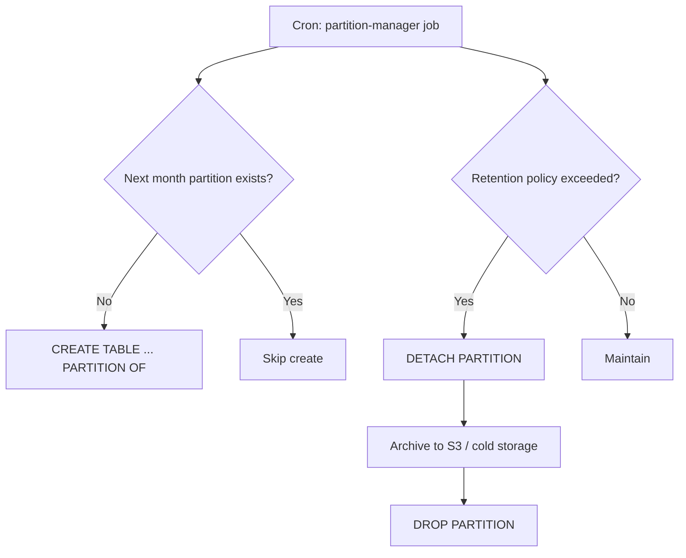

# GMRLOG OS — Partitioning

**Version:** 1.0.0  
**Document:** `docs/07_DATABASE/PARTITIONING.md`  
**Status:** Approved  
**Owner:** Backend Team

---

## Purpose

Define when and how GMRLOG partitions high-volume PostgreSQL tables. Partitioning keeps query performance predictable as `game_logs`, `reviews`, `messages`, and analytics events grow into billions of rows.

This document distinguishes **v1 (non-partitioned)** from **v2 (partitioned)** strategies so engineers do not prematurely introduce operational complexity.

---

## Scope

| In scope | Out of scope |
|----------|--------------|
| Partition candidates and thresholds | Application sharding across databases |
| Range (time) partitioning strategy | Citus / foreign data wrappers |
| Migration path from v1 → v2 | Cold storage archival vendor selection |
| Prisma compatibility constraints | ClickHouse / OLAP warehouses |

---

## Partitioning Goals

| Goal | Benefit |
|------|---------|
| Bound index size per partition | Faster seeks on recent data |
| Efficient data retention | `DROP PARTITION` vs `DELETE` millions of rows |
| Maintenance isolation | `VACUUM` / `REINDEX` per partition |
| Query pruning | Planner skips irrelevant months |

---

## v1 Strategy (Launch — No Partitioning)

At launch, GMRLOG uses **single-table PostgreSQL** for all domains. This is intentional:

| Factor | v1 decision |
|--------|-------------|
| Expected row counts (year 1) | `game_logs` <100M, `reviews` <10M |
| Operational complexity | Team focuses on product, not partition automation |
| Prisma ORM | Native partition support limited — raw SQL for DDL |
| Query patterns | Heavy indexing (see [INDEXING_STRATEGY.md](INDEXING_STRATEGY.md)) sufficient |

### v1 High-Volume Table Handling

| Table | v1 approach |
|-------|-------------|
| `game_logs` | B-tree on `(user_id, logged_at DESC)`; archive policy deferred |
| `reviews` | Partial indexes; no partition |
| `messages` | B-tree on `(conversation_id, created_at DESC)` |
| `notifications` | Aggressive TTL job deletes read notifications >90 days |
| `activity_feed` | Cursor pagination; old items archived to `activity_feed_archive` (cold table, not partition) |

### v1 Monitoring Triggers (when to plan v2)

| Table | Row count threshold | p95 query degradation |
|-------|---------------------|------------------------|
| `game_logs` | 200M rows | Timeline query >200ms |
| `reviews` | 50M rows | Game review list >150ms |
| `messages` | 500M rows | Conversation fetch >200ms |
| `notifications` | 1B rows | Inbox query >100ms |

When **two or more** thresholds are breached, initiate v2 partition migration project.

---

## v2 Strategy (Scale — Range by Time)

v2 adopts **PostgreSQL declarative range partitioning** on `created_at` or domain-specific timestamp (`logged_at`, `sent_at`).

### Partition Key Selection

| Table | Partition key | Granularity | Rationale |
|-------|---------------|-------------|-----------|
| `game_logs` | `logged_at` | Monthly | Append-heavy; queries skew recent |
| `reviews` | `created_at` | Monthly | Growth with platform; game page reads filter recent for sort |
| `messages` | `created_at` | Monthly | Conversation history mostly recent |
| `notifications` | `created_at` | Monthly | Inbox is recent-biased |
| `analytics_events` | `occurred_at` | Weekly | Very high ingest (future table) |

**Do not partition** tables <10M rows or with random access by UUID primary key only (`users`, `games`).

---

## game_logs Partitioning (Primary Candidate)

`game_logs` is the highest-volume user-generated table: every play session, status change, and note creates rows.

### Expected Growth

| Milestone | Approximate rows |
|-----------|------------------|
| 1M MAU | 50M logs/year |
| 10M MAU | 500M logs/year |
| 50M MAU | 2.5B logs/year |

### v2 Table Definition

```sql
CREATE TABLE game_logs (
  id          UUID NOT NULL,
  user_id     UUID NOT NULL,
  game_id     UUID NOT NULL,
  logged_at   TIMESTAMPTZ NOT NULL,
  log_type    VARCHAR(32) NOT NULL,
  payload     JSONB,
  created_at  TIMESTAMPTZ NOT NULL DEFAULT now(),
  PRIMARY KEY (id, logged_at)
) PARTITION BY RANGE (logged_at);
```

Composite PK `(id, logged_at)` required — partition key must be part of PK/UNIQUE constraints.

### Monthly Partitions

```sql
CREATE TABLE game_logs_2026_07 PARTITION OF game_logs
  FOR VALUES FROM ('2026-07-01') TO ('2026-08-01');

CREATE TABLE game_logs_2026_08 PARTITION OF game_logs
  FOR VALUES FROM ('2026-08-01') TO ('2026-09-01');
```

### Query Pruning Example

```sql
-- Prunes to single partition
SELECT * FROM game_logs
WHERE user_id = $1
  AND logged_at >= '2026-07-01'
  AND logged_at < '2026-08-01'
ORDER BY logged_at DESC
LIMIT 50;
```

Application must include `logged_at` bounds on timeline queries when partitioned.

### Indexes (per partition)

Created on parent — propagate to partitions:

```sql
CREATE INDEX idx_game_logs_user_logged
  ON game_logs (user_id, logged_at DESC);

-- v2 optional BRIN for time-only scans
CREATE INDEX idx_game_logs_logged_brin
  ON game_logs USING BRIN (logged_at);
```

---

## reviews Partitioning

Reviews grow with user base but slower than raw logs. Partition when game-level review lists degrade despite indexes.

### v2 Table Definition

```sql
CREATE TABLE reviews (
  id            UUID NOT NULL,
  user_id       UUID NOT NULL,
  game_id       UUID NOT NULL,
  created_at    TIMESTAMPTZ NOT NULL,
  -- ... other columns
  deleted_at    TIMESTAMPTZ,
  PRIMARY KEY (id, created_at)
) PARTITION BY RANGE (created_at);
```

### Query Considerations

| Query pattern | Partition behavior |
|---------------|-------------------|
| Game reviews sorted by `created_at` | Add `created_at` range or default to last 24 months |
| User profile all reviews | Cross-partition scan — acceptable for profile page |
| Review by `id` only | **Requires** `created_at` lookup or global index table |

### Review Lookup by ID

Store `created_at` in API path cache or auxiliary table:

```sql
CREATE TABLE review_id_lookup (
  id UUID PRIMARY KEY,
  created_at TIMESTAMPTZ NOT NULL
);
```

Alternatively, require clients to use composite identifiers after v2 migration.

---

## Partition Lifecycle Management



### Automation Job (`maintenance.partition.ensure`)

| Task | Schedule |
|------|----------|
| Create partitions 3 months ahead | Daily |
| Detach partitions older than retention | Weekly |
| Export detached partition to Parquet → S3 | Before DROP |
| Update partition catalog metadata | After create |

### Retention Policy

| Table | Hot retention (queryable) | Cold archive |
|-------|---------------------------|--------------|
| `game_logs` | 36 months | S3 Parquet, 7 years |
| `reviews` | Indefinite (partitioned, no drop) | N/A — detach only for reindex |
| `messages` | 24 months in DB | Encrypted archive per GDPR |
| `notifications` | 90 days active; 12 months partitioned | Drop after 12 months |

---

## Migration Path: v1 → v2

Zero-downtime partition adoption uses **swap via new partitioned table**:

### Phase 1: Prepare

1. Create partitioned parent `game_logs_new` with partitions.
2. Create sync trigger on `game_logs` → `game_logs_new` (dual-write).
3. Deploy application dual-write code.

### Phase 2: Backfill

```sql
INSERT INTO game_logs_new
SELECT * FROM game_logs
WHERE logged_at >= '2025-01-01' AND logged_at < '2026-01-01';
-- Batch by month
```

Track progress in `partition_migration_status` table.

### Phase 3: Cutover

1. Brief read-only window (optional) or use logical replication.
2. Rename `game_logs` → `game_logs_old`, `game_logs_new` → `game_logs`.
3. Drop sync trigger; deploy partition-aware queries.

### Phase 4: Cleanup

Drop `game_logs_old` after validation period (7 days).

Estimated effort: 2–4 weeks engineering for `game_logs`; reviews follows same template.

---

## Prisma Compatibility

| Capability | Prisma 6 support | GMRLOG approach |
|------------|------------------|-----------------|
| Read from partitioned tables | Yes | Standard models |
| `create` / `update` | Yes | Route to correct partition automatically |
| Partition DDL in migrations | Manual SQL | `prisma migrate` + `-- prisma migrate: no-transaction` |
| `@@id` composite | Yes | `[id, loggedAt]` in schema |
| Auto-create partitions | No | Custom maintenance job |

Prisma schema example:

```prisma
model GameLog {
  id        String   @db.Uuid
  userId    String   @map("user_id") @db.Uuid
  gameId    String   @map("game_id") @db.Uuid
  loggedAt  DateTime @map("logged_at")
  // ...

  @@id([id, loggedAt])
  @@index([userId, loggedAt(sort: Desc)])
  @@map("game_logs")
}
```

---

## What Not to Partition (v1 and v2)

| Table | Reason |
|-------|--------|
| `users` | Low volume; random UUID access |
| `games` | Catalog size bounded (~500k–2M) |
| `friendships` | Relationship graph; moderate size |
| `collections` | Moderate; index sufficient |
| Lookup / enum tables | Tiny |

---

## Failure Modes

| Risk | Mitigation |
|------|------------|
| Missing future partition | Daily ensure job; alert on insert failure |
| Cross-partition query slow | Enforce date bounds in repository layer |
| Prisma migration drift | Partition DDL only in reviewed raw SQL migrations |
| Detach during traffic | `DETACH CONCURRENTLY` (PostgreSQL 14+) |
| Backup size | Per-partition backup verification |

---

## Acceptance Criteria

- [ ] v1 launches without table partitioning; thresholds documented for v2 trigger.
- [ ] `game_logs` and `reviews` v2 partition designs specified with monthly range keys.
- [ ] Partition lifecycle automation (create, detach, archive) defined in maintenance jobs.
- [ ] v1 → v2 migration path documented with dual-write and backfill phases.
- [ ] Prisma composite PK and query bound requirements documented.
- [ ] Retention policies per table aligned with GDPR and product requirements.

---

## Related Documents

- [DATABASE_SPECIFICATION.md](DATABASE_SPECIFICATION.md) — Table domains and backup
- [INDEXING_STRATEGY.md](INDEXING_STRATEGY.md) — Per-partition and BRIN indexes
- [DATABASE_MIGRATIONS.md](DATABASE_MIGRATIONS.md) — Partition DDL migration rules
- [PRISMA_SCHEMA.md](PRISMA_SCHEMA.md) — Composite key models
- [BACKGROUND_JOBS.md](../06_BACKEND/BACKGROUND_JOBS.md) — Partition maintenance jobs
- [MIGRATION_GUIDE.md](MIGRATION_GUIDE.md) — Developer workflow for schema changes

---

## Revision History

| Version | Date | Change |
|---------|------|--------|
| 1.0.0 | 2026-07-10 | Initial partitioning strategy (v1 vs v2) |
