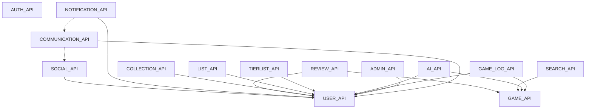

# GMRLOG API Architecture — Freeze v1

**Version:** 1.0.0  
**Document:** `docs/08_API/API_ARCHITECTURE.md`  
**Status:** Approved  
**Owner:** API Team

Single source of truth for bounded context ownership and cross-cutting OpenAPI rules.

## Related Architecture Documents

- [SYSTEM_DESIGN.md](../06_BACKEND/SYSTEM_DESIGN.md) — bounded contexts & modular monolith
- [AUTHENTICATION.md](../11_SECURITY/AUTHENTICATION.md) — auth flows
- [ERROR_HANDLING.md](../06_BACKEND/ERROR_HANDLING.md) — ProblemDetails
- [RATE_LIMITING.md](../06_BACKEND/RATE_LIMITING.md) — 429 & headers
- [AI_ARCHITECTURE.md](../09_AI/AI_ARCHITECTURE.md) — AI module
- [ADMIN_ARCHITECTURE.md](../15_ADMIN/ADMIN_ARCHITECTURE.md) — admin module
- [COMMUNICATION_ARCHITECTURE.md](../01_ARCHITECTURE/COMMUNICATION_ARCHITECTURE.md) — Communication platform
- [API_SPECIFICATION.md](API_SPECIFICATION.md) — REST conventions
- [ERROR_CODES.md](ERROR_CODES.md) — error code registry

## Module Dependency Diagram



## Domain Ownership

| Module | Owns | Must NOT contain |
|--------|------|------------------|
| `AUTH_API.yaml` | Login, register, OAuth, sessions, refresh, email verify, password reset, MFA, device auth | Profile, notifications, social |
| `USER_API.yaml` | Public/private profile, avatar, banner, username, bio, gaming identity, privacy, customization, connected accounts (read), statistics, badges, achievements, showcase | Follow, block, mute, friends, notification prefs, reviews, collections, search |
| `SOCIAL_API.yaml` | Follow, block, mute, friends, friend requests, relationship, activity feed, presence, reactions (non-message entities), share, report (non-message), user discovery (trending/recommended) | Profile editing, notifications, message reactions / DM (→ COMMUNICATION) |
| `NOTIFICATION_API.yaml` | Notifications, preferences, push tokens, read/archive state, badge count | User profile |
| `REVIEW_API.yaml` | Reviews CRUD, comments/replies, spoilers, likes, typed reactions, engagement, reports | Feed materialization (`FeedModule` / SOCIAL), Game Log sessions, drafts/media (future) |
| `GAME_API.yaml` | Game catalog, metadata, media, ratings, achievements (catalog) | User search, similar/recommendations (→ AI), play sessions (→ GAME_LOG), user `/collections` (→ COLLECTION) — IGDB metadata at `/catalog/collections` |
| `GAME_LOG_API.yaml` | Play sessions, progress, completion, timeline, playtime, platform stats | — |
| `COLLECTION_API.yaml` | User collections, members, followers, likes | Search (→ SEARCH) |
| `LIST_API.yaml` | Ranked/custom lists, list items | Search (→ SEARCH) |
| `TIERLIST_API.yaml` | Tier lists, rows, items, votes | Search (→ SEARCH) |
| `SEARCH_API.yaml` | Global/entity search, autocomplete, suggestions, filters, discover, explore | AI semantic search (→ AI) |
| `COMMUNICATION_API.yaml` | Conversations, DMs, groups, channels, messages, reactions on messages, threads, polls, pins, mentions (message), LFG channels. **Freeze v1.0** — see `docs/00_PROJECT/COMMUNICATION_PLATFORM_FREEZE_v1.md` | Notification delivery, Feed materialization, WebSocket transport, User profile, Community product UX |
| `AI_API.yaml` | Recommendations, AI search, review AI, moderation, translation, insights, chat | Deterministic catalog search |
| `ADMIN_API.yaml` | Moderation dashboard, CMS, jobs, audit, analytics, feature flags | — |

## Endpoint Uniqueness

Every path + method combination belongs to **exactly one** module. Duplicates are removed from non-owning modules; clients use the canonical owner.

## URL Conventions

- kebab-case paths only (`push-tokens`, not `pushTokens`)
- Static segments before parameterized: `/notifications/read` before `/notifications/{notificationId}`
- Actions via sub-resource: `POST /reviews/{reviewId}/like`
- Version prefix: `/api/v1`

## Pagination (cursor-only)

Preferred query params: `cursor`, `limit` (from `common/parameters.yaml`).

Paginated response shape:

```yaml
items: []
nextCursor: string | null
hasNext: boolean
```

Offset pagination (`page`, `pageSize`) is deprecated except legacy AUTH admin lists.

## Errors

All errors use `application/problem+json` → `ProblemDetails` (`common/schemas/problem-details.yaml`).

## Security

- Default: `BearerAuth` at document level
- Public endpoints: explicit `security: []`

## Shared Components

Location: `docs/08_API/common/`

```
common/
├── schemas/          # ProblemDetails, CursorPage, UserPublicProfile, UserSummary, GameSummary, AuditMetadata, …
├── parameters.yaml   # Cursor, Limit
├── responses.yaml    # Standard HTTP responses
├── headers.yaml
└── security.yaml
```

Reference pattern:

```yaml
$ref: './common/schemas/user-public-profile.yaml'
```

Do not redefine shared schemas in feature modules.

## Cross-Module References

Feature APIs may `$ref` another module's **schemas** only when necessary. Prefer `common/` for shared types.

Never duplicate endpoints across modules.

## Validation

Run the bundle pipeline after any API change:

```bash
python docs/08_API/bundle_openapi.py
```

This script:

1. Audits globally unique `operationId` values (347 operations)
2. Resolves and validates each `*_API.yaml` module (13 modules, Prance + OpenAPI 3.1)
3. Builds `docs/08_API/openapi/bundle.yaml` (289 paths, merged components)
4. Validates the resolved bundle and writes `DOCUMENTATION_FREEZE_REPORT.md`

Requirements: `pip install pyyaml openapi-spec-validator prance`
