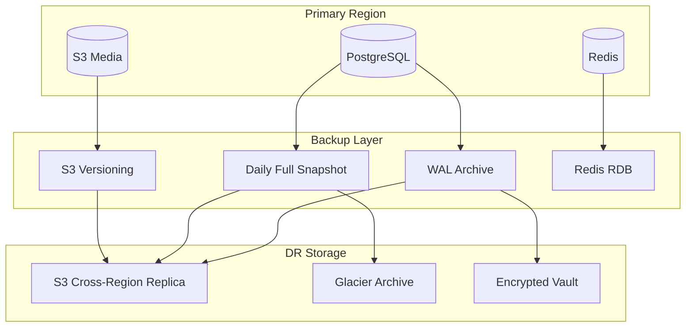
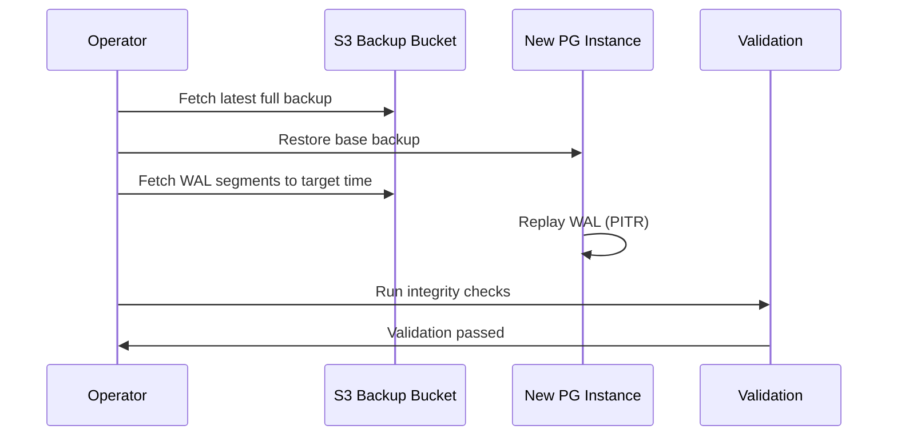

# GMRLOG OS

**Version:** 1.0.0 Alpha

**Document:** `docs/10_DEVOPS/BACKUP_STRATEGY.md`

**Status:** Approved

**Owner:** Platform Engineering

**Classification:** Internal Engineering Documentation

---

# Backup Strategy

## Purpose

This document defines backup schedules, retention policies, restore procedures, and drill requirements for all GMRLOG persistent data stores.

Backups are the last line of defense against data loss. Every backup must be restorable, encrypted, and tested regularly.

---

# Backup Scope

| Data Store | Method | Frequency | Retention |
|------------|--------|-----------|-----------|
| PostgreSQL (primary) | Full + WAL/PITR | Continuous WAL; full daily | 30 days PITR; 90 days full |
| PostgreSQL (replicas) | Streaming replication | Continuous | N/A (not a backup) |
| S3 / R2 (media) | Versioning + cross-region replication | Continuous | 365 days versions |
| S3 / R2 (backups archive) | Glacier transition | Daily | 7 years (compliance) |
| Redis | RDB snapshots + AOF | Hourly RDB; continuous AOF | 7 days |
| Configuration / IaC | Git | Every commit | Indefinite |
| Secrets | Encrypted vault backup | Daily | 90 days |
| Audit logs | Loki → S3 export | Daily | 2 years |



---

# PostgreSQL Backups

## Architecture

PostgreSQL backups use a combination of:

* **Streaming replication** to standby instances (high availability, not backup)
* **WAL archiving** for continuous point-in-time recovery (PITR)
* **Daily full backups** via `pg_basebackup` or managed service snapshots

## WAL Archiving

| Setting | Value |
|---------|-------|
| `archive_mode` | `on` |
| `archive_command` | Upload to S3 via `wal-g` |
| Archive interval | Continuous (every WAL segment, ~16 MB) |
| Archive destination | `s3://gmrlog-backups-prod/wal/` |
| Encryption | AES-256 (SSE-S3) |

## Full Backups

| Setting | Value |
|---------|-------|
| Schedule | Daily at 02:00 UTC |
| Method | `pg_basebackup` or RDS snapshot |
| Storage | `s3://gmrlog-backups-prod/full/` |
| Compression | gzip |
| Encryption | AES-256 |
| Retention | 90 days |

## Point-in-Time Recovery (PITR)

PITR allows restoration to any second within the retention window.

**RPO:** < 15 minutes (limited by WAL shipping lag).

### PITR Restore Procedure

1. Identify target recovery timestamp (UTC)
2. Provision new PostgreSQL instance (isolated from production)
3. Restore latest full backup:
   ```bash
   wal-g backup-fetch /var/lib/postgresql/data LATEST
   ```
4. Create `recovery.signal` and configure `restore_command`:
   ```
   restore_command = 'wal-g wal-fetch %f %p'
   recovery_target_time = '2026-07-10 14:00:00 UTC'
   recovery_target_action = 'promote'
   ```
5. Start PostgreSQL; it replays WAL to target time
6. Verify data integrity:
   - Row counts on critical tables
   - Latest `created_at` timestamps
   - Application smoke tests
7. Either promote as new primary or extract needed data



---

# S3 / Object Storage Backups

## Versioning

S3 versioning is enabled on all production buckets:

| Bucket | Versioning | Lifecycle |
|--------|------------|-----------|
| `gmrlog-media-prod` | Enabled | Current: indefinite; non-current: 365 days |
| `gmrlog-uploads-temp` | Disabled | 24-hour expiration |
| `gmrlog-backups-prod` | Enabled | Glacier after 90 days |

## Cross-Region Replication

Media and backup buckets replicate to `eu-west-1`:

* Replication time: < 15 minutes (RPO aligned)
* Replica bucket: `gmrlog-media-prod-replica`
* Failover: Update CDN origin to replica bucket

## Object Recovery

| Scenario | Method | RTO |
|----------|--------|-----|
| Accidental delete | Restore previous S3 version | < 5 minutes |
| Bucket corruption | Failover to replica bucket | < 30 minutes |
| Full bucket loss | Restore from Glacier archive | < 4 hours |

---

# Redis Backups

Redis is a cache and ephemeral store. Backups protect against data loss during failover, not as a primary data source.

| Method | Schedule | Retention |
|--------|----------|-----------|
| RDB snapshot | Hourly | 7 days |
| AOF | Continuous (everysec fsync) | Current only |

**Recovery note:** After Redis restore, cache warms organically. API may experience elevated latency for 15–30 minutes. No user data is permanently lost because PostgreSQL is the source of truth.

---

# Configuration and Secrets

## Infrastructure as Code

All infrastructure configuration is version-controlled in Git:

* Terraform state stored in encrypted S3 with locking
* Kubernetes manifests in repository
* Helm values per environment

Recovery: `git checkout` + `terraform apply` + `kubectl apply`.

## Secrets Backup

Secrets manager (AWS Secrets Manager / Vault) encrypted backups:

* Daily export to `s3://gmrlog-backups-prod/secrets/`
* Encrypted with KMS key separate from data encryption key
* Access restricted to break-glass IAM role

---

# Encryption

| Layer | Method |
|-------|--------|
| At rest (S3) | SSE-S3 or SSE-KMS |
| At rest (PostgreSQL) | Volume encryption (AES-256) |
| In transit | TLS 1.3 |
| Backup files | Encrypted before upload |

Backup encryption keys rotate annually. Key rotation does not require re-encryption of historical backups.

---

# Restore Drills

## Monthly Drill — Database PITR

**Objective:** Verify PITR restores to a known timestamp.

| Step | Action |
|------|--------|
| 1 | Record current row counts on 5 critical tables |
| 2 | Restore to staging instance at T-1 hour |
| 3 | Compare row counts (must match within replication lag) |
| 4 | Run API integration test suite against restored DB |
| 5 | Document actual RTO and any issues |
| 6 | Destroy staging instance |

**Success criteria:** Restore completes within 1 hour; data integrity checks pass.

## Quarterly Drill — Full Recovery Simulation

**Objective:** Simulate complete database loss and recovery.

| Step | Action |
|------|--------|
| 1 | Provision blank environment |
| 2 | Restore from latest full backup + WAL |
| 3 | Deploy application against restored DB |
| 4 | Execute synthetic monitoring suite |
| 5 | Measure and document RTO |

## Annual Drill — Cross-Region Recovery

Coordinated with `DISASTER_RECOVERY.md` region failover exercise.

---

# Monitoring and Alerting

| Alert | Condition | Severity |
|-------|-----------|----------|
| `BackupFullFailed` | Daily full backup not completed | P2 |
| `BackupWALLag` | WAL archive lag > 15 minutes | P2 |
| `BackupVerificationFailed` | Monthly restore drill failed | P1 |
| `S3ReplicationLag` | Cross-region lag > 30 minutes | P3 |
| `BackupStorageFull` | Backup bucket > 90% capacity | P3 |

Backup job metrics exported to Prometheus:

* `gmrlog_backup_last_success_timestamp`
* `gmrlog_backup_duration_seconds`
* `gmrlog_backup_size_bytes`
* `gmrlog_wal_archive_lag_seconds`

---

# Retention Summary

```text
PostgreSQL WAL (PITR)     ████████████████████████████████  30 days
PostgreSQL Full           ████████████████████████████████████████████████████████████████████████████  90 days
S3 Media Versions         ████████████████████████████████████████████████████████████████████████████  365 days
S3 Glacier Archive        ████████████████████████████████████████████████████████████████████████████████████████████████████████████████████████████████████████████████████████████████████████████████████████████████████  7 years
Redis RDB                 ███████  7 days
Secrets Backup            ████████████████████████████████  90 days
Audit Logs                ████████████████████████████████████████████████████████████████████████████████████████████████████  2 years
```

---

# Access Control

| Role | Backup Read | Backup Restore | Backup Delete |
|------|-------------|----------------|---------------|
| Automated backup service | Write | — | Lifecycle only |
| SRE / Platform Engineering | — | Yes (staging) | — |
| Engineering Lead | — | Yes (staging + prod with approval) | — |
| Break-glass role | Yes | Yes (prod emergency) | — |

Production restore requires:

1. Incident declared (SEV1 or SEV2)
2. Approval from Engineering Lead
3. Audit log entry created before execution

---

# Related Documents

* [DISASTER_RECOVERY.md](DISASTER_RECOVERY.md)
* [DEPLOYMENT.md](DEPLOYMENT.md)
* [MONITORING.md](MONITORING.md)
* [DATABASE_SPECIFICATION.md](../07_DATABASE/DATABASE_SPECIFICATION.md)
* [STORAGE_ARCHITECTURE.md](../06_BACKEND/STORAGE_ARCHITECTURE.md)
* [SECURITY.md](../11_SECURITY/SECURITY.md)

---

# Revision History

| Version | Date | Change |
|---------|------|--------|
| 1.0.0 Alpha | 2026-07-10 | Initial backup strategy |
