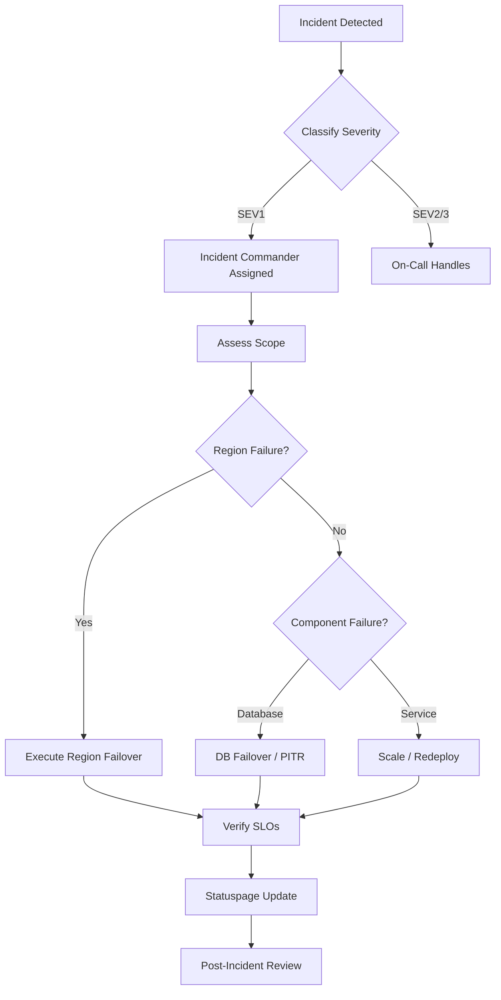
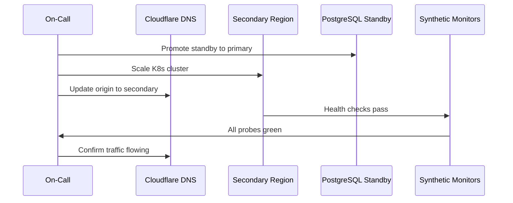

# GMRLOG OS

**Version:** 1.0.0 Alpha

**Document:** `docs/10_DEVOPS/DISASTER_RECOVERY.md`

**Status:** Approved

**Owner:** Platform Engineering

**Classification:** Internal Engineering Documentation

---

# Disaster Recovery Plan

## Purpose

This document defines GMRLOG's disaster recovery (DR) strategy, including recovery objectives, failover procedures, and region-failure response.

The platform targets 99.95% availability. DR planning ensures that catastrophic failures—region outages, database corruption, or infrastructure compromise—have documented, tested recovery paths.

---

# Recovery Objectives

## RTO and RPO

| Tier | Components | RTO | RPO |
|------|------------|-----|-----|
| Tier 1 — Critical | API, Auth, PostgreSQL primary | < 2 hours | < 15 minutes |
| Tier 2 — Important | WebSocket, Workers, Redis | < 4 hours | < 30 minutes |
| Tier 3 — Standard | CDN assets, analytics, staging | < 24 hours | < 24 hours |

RTO (Recovery Time Objective): Maximum acceptable downtime.

RPO (Recovery Point Objective): Maximum acceptable data loss window.

These targets align with `DEPLOYMENT.md` and are validated quarterly through DR drills.

---

# Disaster Scenarios

| Scenario | Likelihood | Impact | Primary Response |
|----------|------------|--------|----------------|
| Single pod failure | High | Low | Kubernetes auto-restart |
| AZ failure within region | Medium | Medium | Multi-AZ failover |
| Full region failure | Low | Critical | Cross-region failover |
| Database corruption | Low | Critical | PITR restore |
| Ransomware / compromise | Low | Critical | Isolate, restore from clean backup |
| CDN / DNS failure | Medium | High | DNS failover, origin bypass |
| Dependency outage (OAuth provider) | Medium | Medium | Graceful degradation |



---

# Infrastructure Topology

## Primary Architecture

```text
                    Cloudflare (Global)
                          │
              ┌───────────┴───────────┐
              │                       │
     Primary Region (eu-central-1)   Secondary Region (eu-west-1)
              │                       │
     ┌────────┼────────┐             │
     │        │        │      Standby K8s Cluster
   API Pods  WS Pods  Workers       (warm standby)
     │        │        │             │
     └────────┼────────┘             │
              │                       │
     PostgreSQL Primary ──replication──▶ PostgreSQL Standby
              │
         Redis Cluster
              │
          S3 (cross-region replication)
```

## Multi-Region Readiness

| Component | Primary | Secondary | Failover Mode |
|-----------|---------|-----------|---------------|
| Kubernetes | Active (eu-central-1) | Warm standby (eu-west-1) | DNS cutover |
| PostgreSQL | Primary + read replicas | Streaming replica | Promote standby |
| Redis | Active cluster | Replica (async) | Manual promotion |
| S3 / R2 | Primary bucket | Cross-region replication | Redirect origin |
| Cloudflare | Active CDN | Automatic anycast | Built-in |
| DNS | Cloudflare | Secondary records pre-configured | TTL 60s cutover |

---

# Failover Procedures

## Region Failure Failover

**Trigger:** Primary region unavailable > 15 minutes with no recovery ETA.

**Incident Commander:** Primary on-call, escalated to Engineering Lead.

### Steps

1. **Declare SEV1** — Update Statuspage: "Investigating platform outage"
2. **Verify scope** — Confirm region-level failure via cloud provider status and internal probes
3. **Promote database** — Promote PostgreSQL standby in secondary region
   - Verify replication lag was < RPO (15 min) before promotion
   - Update connection strings in secrets manager
4. **Activate secondary K8s** — Scale standby cluster to production capacity
5. **Update DNS** — Point API and WebSocket endpoints to secondary region load balancer
6. **Validate Redis** — Promote Redis replica or rebuild from snapshot
7. **Smoke test** — Run synthetic monitoring suite against secondary region
8. **Redirect traffic** — Cloudflare origin switch; monitor error rates
9. **Communicate** — Statuspage: "Service restored via failover"
10. **Monitor** — 2-hour enhanced monitoring window

**Estimated duration:** 45–90 minutes (within 2-hour RTO).



## Database Failover (Non-Region)

**Trigger:** Primary database instance failure; replicas healthy.

### Steps

1. Automatic failover promotes hottest standby (target: < 60 seconds)
2. API pods reconnect via connection pool (PgBouncer)
3. Verify replication re-established for new standby
4. Alert if failover was manual (indicates auto-failover failure)

## Redis Failover

**Trigger:** Redis primary node failure.

### Steps

1. Redis Sentinel promotes replica (automatic)
2. Applications reconnect via Sentinel discovery
3. Brief cache miss storm expected; API degrades gracefully
4. Monitor latency for 30 minutes post-failover

---

# Data Integrity

## Corruption Detection

* PostgreSQL checksums enabled
* Daily backup verification (restore to isolated instance)
* Application-level consistency checks on critical aggregates

## Corruption Response

1. Stop writes to affected tables (feature flag kill switch)
2. Identify corruption timestamp via binlog/WAL analysis
3. Restore to point-in-time before corruption (see `BACKUP_STRATEGY.md`)
4. Replay events from event store if available
5. Validate data integrity before resuming writes

---

# Communication Plan

| Audience | Channel | Update Frequency |
|----------|---------|----------------|
| Engineering | `#incidents` Slack | Real-time |
| Leadership | Direct message + email | Every 30 min (SEV1) |
| Users | Statuspage | Every 15 min (SEV1) |
| Developers (API consumers) | Developer status page | Every 30 min |

### Statuspage Templates

* **Investigating:** "We are investigating reports of [service] unavailability."
* **Identified:** "The issue has been identified as [brief description]. Recovery is in progress."
* **Monitoring:** "A fix has been implemented. We are monitoring the results."
* **Resolved:** "The incident has been resolved. Total downtime: [duration]."

---

# DR Testing

## Drill Schedule

| Drill | Frequency | Scope |
|-------|-----------|-------|
| Backup restore | Monthly | Database PITR to staging |
| Failover simulation | Quarterly | DB promotion in staging |
| Full region failover | Annually | Secondary region activation |
| Tabletop exercise | Semi-annually | Walkthrough without execution |

## Drill Success Criteria

* RTO met for exercised tier
* RPO verified (data loss within target)
* All smoke tests pass post-recovery
* Runbook gaps documented and resolved within 2 weeks

## Drill Report Template

Each drill produces a report containing:

* Scenario executed
* Actual RTO and RPO achieved
* Issues encountered
* Runbook updates required
* Next drill date

---

# Roles and Responsibilities

| Role | Responsibility |
|------|----------------|
| Incident Commander | Coordinates response, makes failover decisions |
| Database Lead | Executes DB promotion and PITR |
| Infrastructure Lead | K8s scaling, DNS, networking |
| Communications Lead | Statuspage and stakeholder updates |
| Scribe | Timeline documentation for post-incident review |

---

# Post-Incident Review

Required for all SEV1 and SEV2 incidents within 5 business days.

| Section | Content |
|---------|---------|
| Timeline | Minute-by-minute from detection to resolution |
| Root cause | Technical and procedural factors |
| Impact | Duration, users affected, data lost |
| What went well | Effective actions |
| What went poorly | Delays, gaps, tooling failures |
| Action items | Assigned owners with due dates |

---

# Related Documents

* [BACKUP_STRATEGY.md](BACKUP_STRATEGY.md)
* [DEPLOYMENT.md](DEPLOYMENT.md)
* [MONITORING.md](MONITORING.md)
* [CI_CD.md](CI_CD.md)
* [SYSTEM_ARCHITECTURE.md](SYSTEM_ARCHITECTURE.md)
* [FEATURE_FLAGS.md](../01_PRODUCT/FEATURE_FLAGS.md)

---

# Revision History

| Version | Date | Change |
|---------|------|--------|
| 1.0.0 Alpha | 2026-07-10 | Initial disaster recovery plan |
