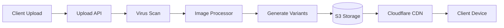
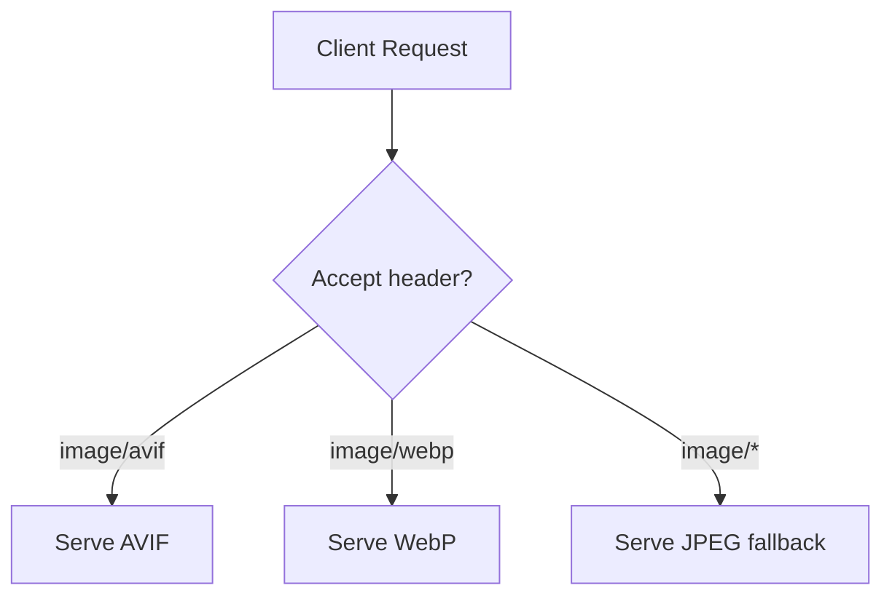

# GMRLOG OS

**Version:** 1.0.0 Alpha

**Document:** `docs/10_DEVOPS/IMAGE_OPTIMIZATION.md`

**Status:** Approved

**Owner:** Platform Engineering

**Classification:** Internal Engineering Documentation

---

# Image Optimization

## Purpose

This document defines image delivery strategy for GMRLOG, including CDN configuration, responsive variants, modern format support, and frontend integration patterns.

Images represent the largest bandwidth consumption on the platform. Optimized delivery is critical for meeting LCP budgets defined in `PERFORMANCE_BUDGET.md`.

---

# Image Pipeline Overview



---

# CDN Configuration

## Provider

Cloudflare CDN serves all public media assets.

| Setting | Value |
|---------|-------|
| Cache TTL (images) | 30 days |
| Browser cache | 7 days (`Cache-Control: public, max-age=604800`) |
| Stale-while-revalidate | 24 hours |
| Auto Minify | Disabled (pre-optimized at origin) |
| Polish | Lossless (future: lossy for thumbnails) |
| HTTP/2 | Enabled |
| HTTP/3 (QUIC) | Enabled |
| Brotli | Enabled |

## Cached Asset Types

| Asset | CDN Path Pattern |
|-------|------------------|
| Game covers | `cdn.gmrlog.com/covers/{uuid}/{variant}.webp` |
| Avatars | `cdn.gmrlog.com/avatars/{uuid}/{variant}.webp` |
| Banners | `cdn.gmrlog.com/banners/{uuid}/{variant}.webp` |
| Post images | `cdn.gmrlog.com/posts/{uuid}/{variant}.webp` |
| Review images | `cdn.gmrlog.com/reviews/{uuid}/{variant}.webp` |
| Screenshots | `cdn.gmrlog.com/screenshots/{uuid}/{variant}.webp` |
| Developer logos | `cdn.gmrlog.com/logos/{uuid}/{variant}.webp` |
| Static assets | `cdn.gmrlog.com/static/{path}` |

## Cache Invalidation

On image update or delete:

1. Application publishes `media.updated.v1` event
2. Worker issues Cloudflare cache purge for specific URL
3. CDN fetches fresh copy from S3 on next request

Purge API call:

```http
POST https://api.cloudflare.com/client/v4/zones/{zone_id}/purge_cache
{
  "files": [
    "https://cdn.gmrlog.com/avatars/{uuid}/medium.webp"
  ]
}
```

Bulk purge (game cover update affecting multiple variants) uses prefix purge.

---

# Image Variants

## Standard Variant Sizes

Automatically generated on upload (see `STORAGE_ARCHITECTURE.md`):

| Variant | Width | Use Case |
|---------|-------|----------|
| `thumbnail` | 256px | List avatars, notification icons |
| `small` | 512px | Feed cards, game grid |
| `medium` | 1024px | Game detail hero, profile banner |
| `large` | 2048px | Full-screen viewer, high-DPI displays |
| `original` | As uploaded | Download, moderation review only |

All variants maintain aspect ratio. Images are center-cropped only when explicitly configured (avatars: 1:1 crop).

## Avatar-Specific Variants

| Variant | Size | Crop |
|---------|------|------|
| `thumbnail` | 64×64 | Center crop |
| `small` | 128×128 | Center crop |
| `medium` | 256×256 | Center crop |
| `large` | 512×512 | Center crop |

---

# Format Strategy

## Supported Formats

| Format | Status | Use Case |
|--------|--------|----------|
| WebP | Production | Default delivery format |
| AVIF | Production (progressive rollout) | Supported clients via content negotiation |
| JPEG | Fallback | Legacy clients, original preservation |
| PNG | Upload + fallback | Transparency required (logos, badges) |
| GIF | Upload only | Animated content (converted to video future) |

## Content Negotiation

CDN serves the best format per client using the `Accept` header:



Priority: AVIF → WebP → JPEG/PNG.

### Format Generation

On upload, the image processor generates:

1. WebP variant at each size (required)
2. AVIF variant at each size (required for new uploads)
3. Original preserved unmodified in `original/` prefix

### Quality Settings

| Format | Quality | Notes |
|--------|---------|-------|
| WebP | 85 | Visually lossless for photos |
| AVIF | 80 | Better compression at lower quality |
| JPEG (fallback) | 90 | Generated only when needed |
| PNG | N/A | Lossless for transparency |

---

# Responsive Image Delivery

## Frontend Integration

### Mobile (Expo Image)

```typescript
import { Image } from 'expo-image';

<Image
  source={{
    uri: `${CDN_BASE}/covers/${game.coverId}/small.webp`,
  }}
  placeholder={game.coverBlurHash}
  contentFit="cover"
  transition={200}
  cachePolicy="memory-disk"
/>
```

### Responsive Srcset (Web)

```html

```

## Variant Selection Rules

| Context | Variant | Rationale |
|---------|---------|-----------|
| Feed card | `small` (512px) | Card width ≤ 400px |
| Game grid (2-column) | `small` | Fits 2× retina |
| Game detail hero | `medium` (1024px) | Full-width hero |
| Full-screen viewer | `large` (2048px) | Pinch-to-zoom |
| Avatar in feed | `thumbnail` (64px) | Small circle |
| Avatar on profile | `large` (512px) | Profile header |
| Notification icon | `thumbnail` | System notification |

**Rule:** Never serve `original` in UI. Reserve for download and moderation.

---

# Progressive Loading

## BlurHash Placeholders

Every uploaded image generates a BlurHash string stored in the database.

| Property | Value |
|----------|-------|
| Components X | 4 |
| Components Y | 3 |
| Display | Rendered as base64 data URI until image loads |
| Transition | 200ms fade from placeholder to image |

## Loading Priority

| Priority | Images | Loading |
|----------|--------|---------|
| High | Above-fold hero, avatar in header | Eager load, prefetch |
| Normal | Feed cards in viewport | Lazy load |
| Low | Below-fold, off-screen | Lazy load + Intersection Observer |

---

# Upload Constraints

From `STORAGE_ARCHITECTURE.md`:

| Type | Max Size | Formats |
|------|----------|---------|
| Avatar | 10 MB | JPEG, PNG, WebP |
| Banner | 20 MB | JPEG, PNG, WebP |
| Post image | 25 MB | JPEG, PNG, WebP, GIF |
| Review image | 25 MB | JPEG, PNG, WebP |
| Screenshot | 50 MB | JPEG, PNG, WebP |

Uploads exceeding limits are rejected at the API layer before processing.

---

# Performance Targets

| Metric | Target |
|--------|--------|
| CDN cache hit ratio | > 90% |
| Image processing time (per upload) | < 5s P95 |
| LCP image load (above fold) | < 500ms |
| Variant generation (all sizes) | < 3s |
| CDN TTFB | < 50ms (edge) |

---

# Monitoring

| Metric | Alert |
|--------|-------|
| `gmrlog_cdn_cache_hit_ratio` | < 85% for 30 min |
| `gmrlog_image_processing_duration_seconds` P95 | > 15s |
| `gmrlog_image_processing_errors_total` | > 10/hour |
| Cloudflare bandwidth | Anomaly detection |

---

# Security

* All CDN assets for private content use signed URLs (15-minute expiration)
* SVG uploads are rejected (XSS vector)
* EXIF metadata stripped on processing (GPS, camera info)
* Content-Type validated by magic number, not extension

---

# Related Documents

* [STORAGE_ARCHITECTURE.md](../06_BACKEND/STORAGE_ARCHITECTURE.md)
* [PERFORMANCE_BUDGET.md](PERFORMANCE_BUDGET.md)
* [PERFORMANCE_GUIDE.md](PERFORMANCE_GUIDE.md)
* [NETWORK_OPTIMIZATION.md](NETWORK_OPTIMIZATION.md)
* [FRONTEND_ARCHITECTURE.md](../05_FRONTEND/FRONTEND_ARCHITECTURE.md)
* [DEPLOYMENT.md](DEPLOYMENT.md)

---

# Revision History

| Version | Date | Change |
|---------|------|--------|
| 1.0.0 Alpha | 2026-07-10 | Initial image optimization specification |
