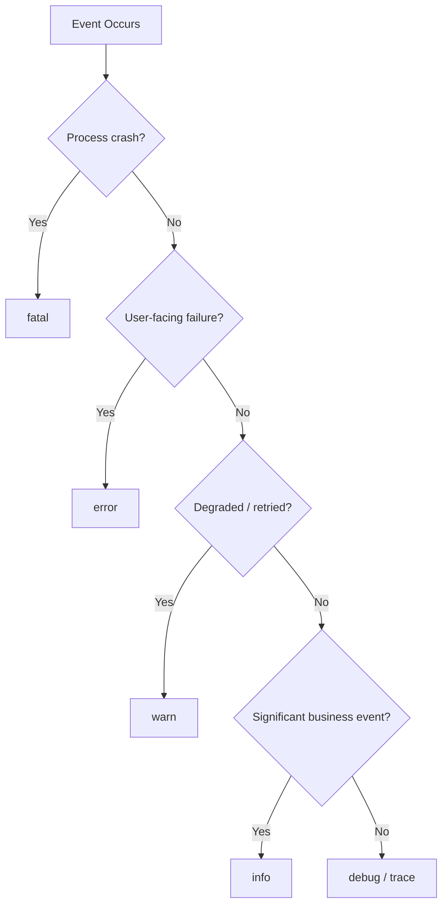
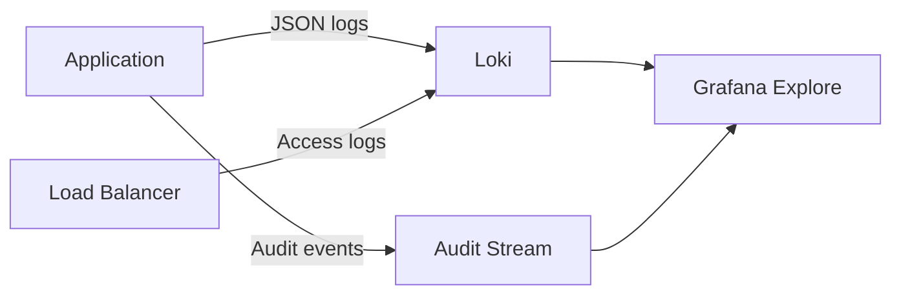

# GMRLOG OS

**Version:** 1.0.0 Alpha

**Document:** `docs/10_DEVOPS/LOGGING.md`

**Status:** Approved

**Owner:** Platform Engineering

**Classification:** Internal Engineering Documentation

---

# Logging Specification

## Purpose

This document defines structured logging standards for all GMRLOG services.

Logs are the primary forensic tool for incident investigation. Every log line must be machine-parseable, correlatable with traces, and safe for storage without leaking sensitive user data.

---

# Logging Philosophy

* **Structured over prose:** JSON only in production; no unstructured `console.log`
* **Context-rich:** Every log carries service, request, and trace identifiers
* **Actionable levels:** Log volume must be manageable; avoid `debug` in production by default
* **Privacy by design:** PII is redacted at the source, not in the log pipeline
* **Immutable audit trail:** Security and admin actions use append-only audit logs

---

# Log Format

## Standard Schema

All services emit logs conforming to this schema:

```json
{
  "timestamp": "2026-07-10T14:32:01.123Z",
  "level": "info",
  "service": "gmrlog-api",
  "environment": "production",
  "version": "a1b2c3d4",
  "requestId": "req_8f3a2b1c",
  "traceId": "4bf92f3577b34da6a3ce929d0e0e4736",
  "spanId": "00f067aa0ba902b7",
  "userId": "usr_abc123",
  "message": "Human-readable event description",
  "context": {},
  "error": null,
  "durationMs": 42
}
```

## Field Rules

| Field | Required | Description |
|-------|----------|-------------|
| `timestamp` | Yes | ISO 8601 UTC |
| `level` | Yes | See log levels below |
| `service` | Yes | Service identifier (`gmrlog-api`, `gmrlog-worker`, `gmrlog-ws`) |
| `environment` | Yes | `development`, `staging`, `production` |
| `version` | Yes | Git SHA or release tag |
| `requestId` | HTTP/WS | Unique per inbound request |
| `traceId` | When traced | OpenTelemetry trace ID |
| `spanId` | When traced | Current span ID |
| `userId` | When authenticated | Internal user UUID only |
| `message` | Yes | Static string; no interpolation of user data |
| `context` | Optional | Structured metadata (IDs, counts, operation names) |
| `error` | On failure | `{ "name", "message", "stack" }` — stack only in non-production |
| `durationMs` | Operations | Elapsed time for timed operations |

---

# Log Levels

## Level Definitions

| Level | Numeric | When to Use | Production Default |
|-------|---------|-------------|-------------------|
| `fatal` | 60 | Process cannot continue; imminent crash | Enabled |
| `error` | 50 | Operation failed; user impact likely | Enabled |
| `warn` | 40 | Degraded behavior; retry succeeded; threshold approached | Enabled |
| `info` | 30 | Significant business events; request lifecycle | Enabled |
| `debug` | 20 | Diagnostic detail for development | Disabled |
| `trace` | 10 | Verbose internal state (never in production) | Disabled |

## Level Guidelines

**`info`** — Use for:

* Request completed (with status code and duration)
* Domain events published (`review.created`, `game.logged`)
* Authentication success/failure (without credentials)
* Cache miss on critical paths
* Job started/completed

**`warn`** — Use for:

* Retry after transient failure
* Rate limit approached (80% threshold)
* Deprecated API usage
* Slow query (> 500ms) without user-facing failure
* PII redaction triggered

**`error`** — Use for:

* Unhandled exceptions
* Database connection failure
* External service timeout (after retries exhausted)
* Validation failures that indicate client bugs or attacks

**Never log at `info` or below:**

* Passwords, tokens, API keys
* Full request/response bodies containing user content
* Credit card or payment data (out of scope for V1)



---

# PII Redaction

## Redaction Policy

PII is redacted in the application logger middleware before emission. The log pipeline does not perform retroactive scrubbing as a primary defense.

## Fields Always Redacted

| Field Type | Replacement |
|------------|-------------|
| Email address | `[REDACTED_EMAIL]` |
| Password / token / API key | `[REDACTED_SECRET]` |
| IP address (production) | Last octet masked (`192.168.1.xxx`) |
| Phone number | `[REDACTED_PHONE]` |
| OAuth access/refresh tokens | `[REDACTED_TOKEN]` |
| Display name in error stacks | Omitted |
| Review/post body content | Log `contentLength` only, never body |
| DM message content | Log `messageId` only |

## Permitted Identifiers

These are safe to log:

* Internal UUIDs (`userId`, `gameId`, `reviewId`)
* Usernames (public identifiers)
* HTTP method, path, status code
* Query parameter names (not values containing PII)
* Aggregate counts and durations

## Redaction Implementation

```typescript
// packages/utils/src/logger/redact.ts
const REDACT_PATHS = [
  'password',
  'token',
  'accessToken',
  'refreshToken',
  'email',
  'authorization',
  'cookie',
];
```

Redaction runs recursively on `context` objects. If redaction modifies a field, a `warn`-level log records `piiRedactionTriggered: true` without the original value.

---

# Log Categories

## Application Logs

Standard service logs shipped to Loki. Used for debugging and incident response.

## Audit Logs

Immutable, append-only records for security-sensitive operations:

| Event | Retention |
|-------|-----------|
| Admin login | 2 years |
| User role change | 2 years |
| Content moderation action | 2 years |
| Feature flag change | 1 year |
| Data export request | 2 years |
| Account deletion | 7 years |

Audit logs are stored in a separate Loki stream (`{job="audit"}`) with stricter access controls.

## Access Logs

HTTP access logs at the load balancer (NGINX/Cloudflare) capture:

* Client IP (masked in downstream copies)
* Method, path, status
* Response size and duration
* User agent

Access logs are not duplicated in application logs to avoid double billing.



---

# Log Aggregation

## Stack

| Component | Role |
|-----------|------|
| Loki | Log storage and indexing |
| Promtail / Alloy | Log collection from pods |
| Grafana | Query and visualization |

## Label Strategy

Loki labels (low cardinality only):

* `service`
* `environment`
* `level`

High-cardinality data (`requestId`, `userId`, `traceId`) lives in JSON fields, not labels.

## Query Examples

```logql
{service="gmrlog-api", environment="production"} |= "error"
{service="gmrlog-api"} | json | userId="usr_abc123"
{job="audit"} | json | action="moderation.ban"
```

---

# Retention Policy

| Log Type | Hot (Loki) | Archive (S3) | Total |
|----------|------------|--------------|-------|
| Application (production) | 30 days | 90 days | 120 days |
| Application (staging) | 14 days | — | 14 days |
| Application (development) | 7 days | — | 7 days |
| Audit | 90 days | 2 years | 2 years |
| Access | 30 days | 90 days | 120 days |
| Security events | 90 days | 1 year | 1 year |

## GDPR and Data Subject Requests

When a user requests account deletion:

1. Application logs containing `userId` are scheduled for purge within 30 days
2. Audit logs are anonymized (`userId` replaced with `deleted_user_<hash>`)
3. Aggregated metrics are unaffected

---

# Performance and Volume

## Targets

| Metric | Target |
|--------|--------|
| Logging overhead per request | < 2ms |
| Max log lines per request | 10 (excluding errors) |
| Max `context` object size | 4 KB |

## Sampling

High-volume endpoints (feed, search) may sample `info`-level request-completion logs at 10% in production. Errors are never sampled.

---

# Client-Side Logging

Mobile and web clients do not ship application logs to Loki.

| Client | Destination | Content |
|--------|-------------|---------|
| Expo Mobile | Sentry | Crashes, ANR, performance |
| React Web | Sentry | Crashes, unhandled rejections |

Client breadcrumbs may include route names and action types but never message content or tokens.

---

# Operational Runbooks

Log-based alerts link to runbooks:

| Alert | Log Pattern | Runbook |
|-------|-------------|---------|
| Auth failure spike | `level=warn message="Auth failed"` rate > 100/min | `runbooks/auth-failure-spike` |
| DB connection errors | `level=error context.db="connection_failed"` | `runbooks/db-connectivity` |
| PII leak detected | `piiRedactionTriggered` on unexpected field | `runbooks/pii-incident` |

---

# Implementation Checklist

* [ ] Pino logger with JSON output in all NestJS services
* [ ] Request ID middleware on API and WebSocket gateway
* [ ] PII redaction middleware applied globally
* [ ] Log level configurable via `LOG_LEVEL` env var
* [ ] No `console.log` in production code paths
* [ ] Audit logger separate from application logger
* [ ] Stack traces stripped in production `error` objects sent to clients; full stacks only in logs

---

# Related Documents

* [OBSERVABILITY.md](OBSERVABILITY.md)
* [MONITORING.md](MONITORING.md)
* [SECURITY.md](../11_SECURITY/SECURITY.md)
* [BACKEND_ARCHITECTURE.md](../06_BACKEND/BACKEND_ARCHITECTURE.md)
* [ENVIRONMENT_VARIABLES.md](../00_PROJECT/ENVIRONMENT_VARIABLES.md)
* [CODING_STANDARDS.md](../00_PROJECT/CODING_STANDARDS.md)

---

# Revision History

| Version | Date | Change |
|---------|------|--------|
| 1.0.0 Alpha | 2026-07-10 | Initial logging specification |
