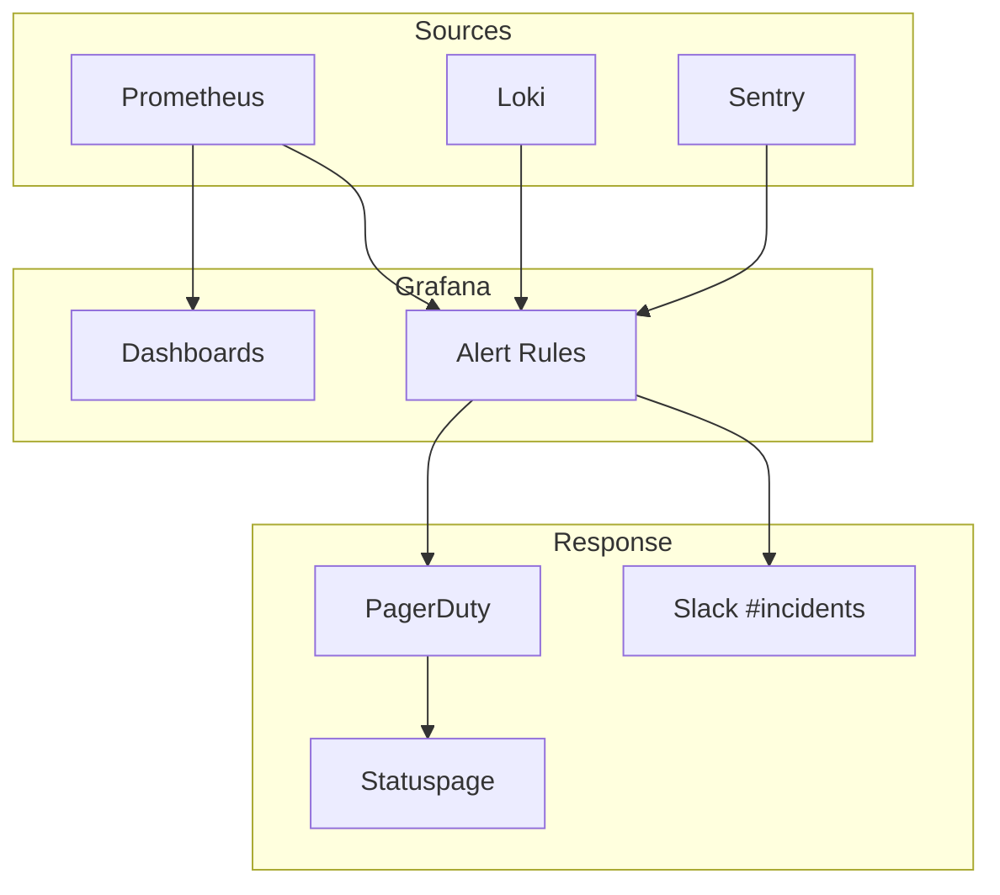
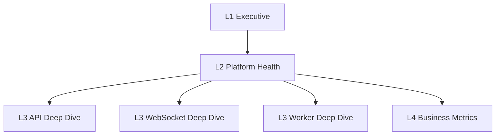
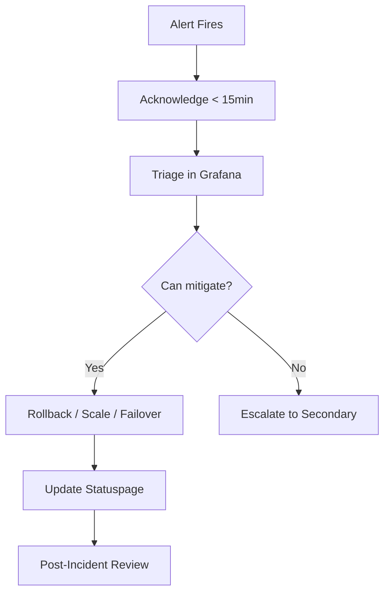

# GMRLOG OS

**Version:** 1.0.0 Alpha

**Document:** `docs/10_DEVOPS/MONITORING.md`

**Status:** Approved

**Owner:** Platform Engineering

**Classification:** Internal Engineering Documentation

---

# Monitoring and Alerting

## Purpose

This document defines dashboards, alerts, on-call procedures, and golden-signal monitoring for GMRLOG production infrastructure and application services.

Monitoring translates observability data into actionable responses before users report problems.

---

# Monitoring Stack

| Component | Role |
|-----------|------|
| Prometheus | Metrics collection and alert rule evaluation |
| Grafana | Dashboards, visualization, unified alerting UI |
| Loki | Log-based alerts (supplementary) |
| Tempo | Trace-based investigation |
| Sentry | Client and server error tracking |
| PagerDuty | On-call scheduling and escalation |
| Statuspage | Public incident communication |

---

# Golden Signals

Google SRE golden signals are the foundation of every service dashboard.

## API Service

| Signal | Metric | Warning | Critical |
|--------|--------|---------|----------|
| Latency | `histogram_quantile(0.95, gmrlog_http_request_duration_seconds)` | p95 > 500ms for 5m | p95 > 1s for 5m |
| Traffic | `sum(rate(gmrlog_http_requests_total[5m]))` | — | — |
| Errors | `sum(rate(gmrlog_http_requests_total{status=~"5.."}[5m])) / sum(rate(gmrlog_http_requests_total[5m]))` | > 1% for 5m | > 5% for 5m |
| Saturation | DB pool usage, CPU > 80%, memory > 85% | 80% for 10m | 95% for 5m |

## WebSocket Gateway

| Signal | Metric | Warning | Critical |
|--------|--------|---------|----------|
| Latency | Event delivery p95 | > 200ms | > 500ms |
| Traffic | Active connections | — | — |
| Errors | Disconnect rate | > 2% / 5m | > 5% / 5m |
| Saturation | Connections / pod limit | > 80% | > 95% |

## Background Workers

| Signal | Metric | Warning | Critical |
|--------|--------|---------|----------|
| Latency | Job duration p95 | > 30s | > 120s |
| Traffic | Jobs processed / min | — | — |
| Errors | Failed job rate | > 1% | > 5% |
| Saturation | Queue depth | > 10,000 | > 50,000 |

## Database (PostgreSQL)

| Signal | Metric | Warning | Critical |
|--------|--------|---------|----------|
| Latency | Query duration p95 | > 100ms | > 500ms |
| Traffic | Queries / sec | — | — |
| Errors | Connection errors | > 0 sustained | > 10 / min |
| Saturation | CPU, connections, disk | 80% | 95% |

## Cache (Redis)

| Signal | Metric | Warning | Critical |
|--------|--------|---------|----------|
| Latency | Command duration p95 | > 5ms | > 20ms |
| Traffic | Commands / sec | — | — |
| Errors | Rejected connections | > 0 | sustained |
| Saturation | Memory usage | > 80% | > 95% |

---

# Dashboard Hierarchy

## L1 — Executive Overview

Audience: Leadership, Product

Refresh: 5 minutes

Panels:

* Monthly Active Users (from PostHog)
* API availability (30-day rolling)
* Error rate trend
* Active incidents
* Deployment frequency

## L2 — Platform Health

Audience: Engineering, SRE

Refresh: 30 seconds

Panels:

* Golden signals per service (API, WS, Workers)
* SLO burn rate gauges
* Database and Redis health
* CDN cache hit ratio
* Queue depth and processing rate

## L3 — Service Deep Dive

Audience: Service owners

One dashboard per service (`gmrlog-api`, `gmrlog-ws`, `gmrlog-worker`):

* Request rate by route
* Latency heatmap by route
* Error breakdown by status code
* Top slow queries
* Cache hit/miss ratio
* Dependency latency (DB, Redis, S3)

## L4 — Business Metrics

Audience: Product, Analytics

Panels aligned with `SUCCESS_METRICS.md`:

* DAU / MAU
* Games logged per hour
* Reviews created
* Recommendation CTR
* Notification delivery rate

---

# Alerting Rules

## Severity Levels

| Severity | Response Time | Channel | Example |
|----------|---------------|---------|---------|
| P1 — Critical | 15 minutes | PagerDuty page | API down, data loss risk |
| P2 — High | 1 hour | PagerDuty + Slack | Elevated error rate, SLO burn |
| P3 — Medium | 4 hours | Slack ticket | Disk space warning |
| P4 — Low | Next business day | Slack | Certificate expiring in 30 days |

## Production Alert Catalog

### Infrastructure

| Alert | Condition | Severity |
|-------|-----------|----------|
| `InfraPodCrashLooping` | Pod restart > 3 in 10m | P1 |
| `InfraNodeNotReady` | Node unready > 5m | P1 |
| `InfraDiskSpaceLow` | Disk > 85% | P3 |
| `InfraCertExpiring` | TLS cert < 14 days | P4 |

### Application

| Alert | Condition | Severity |
|-------|-----------|----------|
| `APIHighErrorRate` | 5xx > 5% for 5m | P1 |
| `APIHighLatency` | p95 > 1s for 10m | P2 |
| `APIDown` | Health check failing > 2m | P1 |
| `WSDisconnectStorm` | Disconnect rate > 5% | P2 |
| `WorkerQueueBacklog` | Queue depth > 50,000 | P2 |
| `WorkerJobFailures` | Failed rate > 5% for 10m | P2 |

### Data Layer

| Alert | Condition | Severity |
|-------|-----------|----------|
| `DBConnectionsExhausted` | Pool > 95% for 5m | P1 |
| `DBReplicationLag` | Lag > 30s | P2 |
| `RedisMemoryHigh` | Memory > 95% | P2 |
| `RedisDown` | Ping failing > 1m | P1 |

### SLO-Based

| Alert | Condition | Severity |
|-------|-----------|----------|
| `SLOFastBurn` | 2% error budget in 1h | P1 |
| `SLOSlowBurn` | 10% error budget in 6h | P2 |

## Alert Hygiene

* Every alert has a linked runbook in Grafana annotations
* Alerts without runbooks are disabled until documented
* Flapping alerts require tuning, not acknowledgment
* `watchdog` heartbeat alert confirms alerting pipeline health

---

# On-Call

## Rotation

| Schedule | Coverage | Team |
|----------|----------|------|
| Primary | 24/7 | Platform Engineering |
| Secondary | 24/7 | Backend Engineering |
| Product liaison | Business hours | Product (P1 comms only) |

Rotation shifts weekly. Handoff occurs Monday 10:00 UTC with review of open incidents and in-flight deploys.

## On-Call Responsibilities

1. Acknowledge P1/P2 pages within SLA
2. Triage using Grafana → Loki → Tempo correlation
3. Mitigate (rollback, scale, failover) before root-cause analysis
4. Update `#incidents` Slack channel and Statuspage
5. Create post-incident review for P1 events

## Escalation Policy

| Step | After | Action |
|------|-------|--------|
| 1 | 0 min | Page primary on-call |
| 2 | 15 min | Page secondary if unacknowledged |
| 3 | 30 min | Page engineering lead |
| 4 | 60 min | Notify CTO for P1 |

## Incident Severity Classification

| Severity | User Impact | Example |
|----------|-------------|---------|
| SEV1 | Platform unavailable or data at risk | API down, DB corruption |
| SEV2 | Major feature degraded | Feed not loading, auth intermittent |
| SEV3 | Minor feature degraded | Search slow, non-critical WS events delayed |
| SEV4 | Cosmetic / internal only | Staging issue, dashboard glitch |

---

# Health Checks

Every service exposes:

| Endpoint | Purpose | Interval |
|----------|---------|----------|
| `GET /health` | Liveness — process alive | 10s |
| `GET /ready` | Readiness — dependencies OK | 10s |

Readiness checks verify:

* PostgreSQL connection
* Redis connection
* Required environment variables loaded

Kubernetes uses `/ready` for traffic routing and `/health` for restart policy.

---

# Synthetic Monitoring

External probes run every 60 seconds from three regions:

| Probe | Assertion |
|-------|-----------|
| `GET /api/v1/health` | 200 OK, < 200ms |
| `GET /api/v1/games?limit=1` | 200 OK, valid JSON |
| WebSocket connect + ping | Connected, pong < 500ms |
| `GET https://gmrlog.com` | 200 OK, LCP < 3s |

Failures trigger P2 alerts.

---

# Deployment Monitoring

During deployments, a dedicated Grafana panel tracks:

* Error rate (must not exceed 2x baseline)
* Latency p95 (must not exceed 1.5x baseline)
* Pod ready count

Automatic rollback triggers if error rate > 5% for 3 minutes post-deploy (see `CI_CD.md`).

---

# Related Documents

* [OBSERVABILITY.md](OBSERVABILITY.md)
* [LOGGING.md](LOGGING.md)
* [DEPLOYMENT.md](DEPLOYMENT.md)
* [DISASTER_RECOVERY.md](DISASTER_RECOVERY.md)
* [CI_CD.md](CI_CD.md)
* [SUCCESS_METRICS.md](../00_PROJECT/SUCCESS_METRICS.md)
* [SYSTEM_ARCHITECTURE.md](SYSTEM_ARCHITECTURE.md)

---

# Revision History

| Version | Date | Change |
|---------|------|--------|
| 1.0.0 Alpha | 2026-07-10 | Initial monitoring specification |
