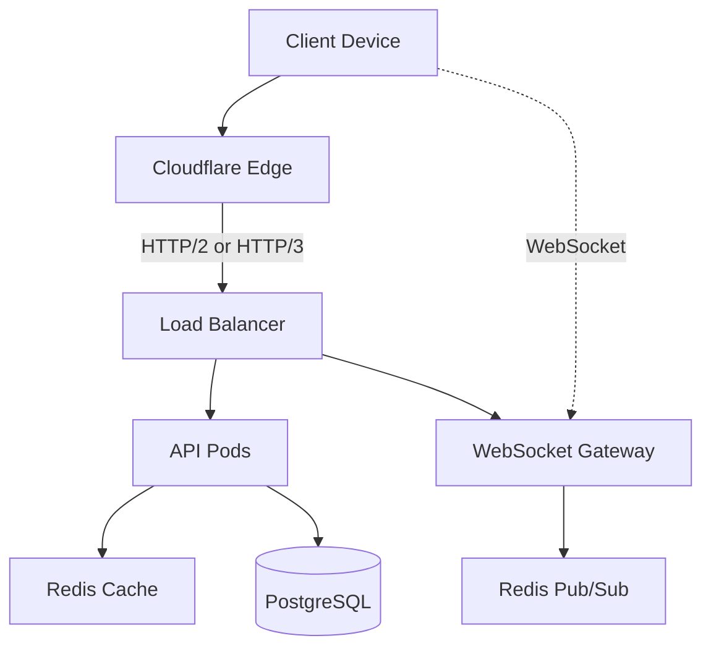
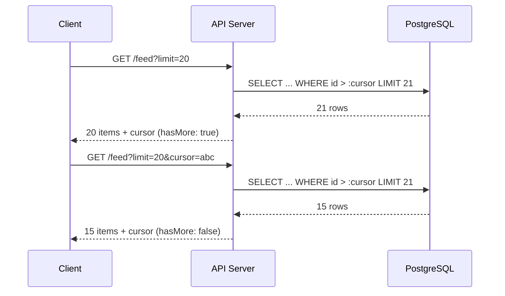

# GMRLOG OS

**Version:** 1.0.0 Alpha

**Document:** `docs/10_DEVOPS/NETWORK_OPTIMIZATION.md`

**Status:** Approved

**Owner:** Platform Engineering

**Classification:** Internal Engineering Documentation

---

# Network Optimization

## Purpose

This document defines network-level optimization strategies for GMRLOG, including HTTP protocol configuration, compression, pagination standards, and connection management.

Efficient network usage reduces latency, lowers CDN costs, and improves mobile battery life.

---

# Network Architecture



---

# HTTP Protocol

## HTTP/2

Enabled on all endpoints via Cloudflare and NGINX.

| Feature | Benefit | GMRLOG Usage |
|---------|---------|--------------|
| Multiplexing | Parallel requests over single connection | Feed loading (API + images) |
| Header compression (HPACK) | Reduced overhead | All API calls |
| Server push | Proactive resource delivery | Not used (deprecated pattern) |
| Stream prioritization | Critical resources first | HTML/JSON before images |

## HTTP/3 (QUIC)

Enabled at Cloudflare edge for supported clients.

Benefits for mobile users:

* Faster connection establishment (0-RTT on repeat visits)
* No head-of-line blocking across streams
* Connection migration on network switch (WiFi → cellular)

No application-level changes required; Cloudflare negotiates protocol automatically.

## TLS Configuration

| Setting | Value |
|---------|-------|
| Minimum version | TLS 1.2 |
| Preferred version | TLS 1.3 |
| Cipher suites | Modern only (no RC4, 3DES) |
| OCSP stapling | Enabled |
| HSTS | `max-age=31536000; includeSubDomains; preload` |

---

# Compression

## Response Compression

| Content Type | Algorithm | Min Size | Level |
|--------------|-----------|----------|-------|
| `application/json` | Brotli (br) | 1 KB | 4 |
| `application/json` | gzip (fallback) | 1 KB | 6 |
| `text/html` | Brotli | 1 KB | 4 |
| `application/javascript` | Brotli | 1 KB | 4 |
| `text/css` | Brotli | 4 |
| Images | None | — | Pre-compressed at origin |

Brotli is preferred; gzip served as fallback for clients without Brotli support.

### Compression Headers

```http
Content-Encoding: br
Vary: Accept-Encoding
```

`Vary: Accept-Encoding` is required on all compressed responses to prevent CDN cache poisoning.

## Request Compression

Client request bodies (POST/PUT) may be compressed:

```http
Content-Encoding: gzip
```

Maximum decompressed body size: 1 MB (API); 25 MB (image upload endpoints).

---

# Connection Management

## Keep-Alive

| Setting | Value |
|---------|-------|
| Keep-alive timeout | 75 seconds |
| Max requests per connection | 1,000 |
| TCP keepalive | Enabled (60s interval) |

## Connection Pooling (Server-Side)

| Pool | Size | Timeout |
|------|------|---------|
| PostgreSQL (PgBouncer) | 100 connections | 30s idle |
| Redis | 50 connections per pod | 10s idle |
| HTTP outbound (external APIs) | 20 connections | 30s idle |

## Client-Side Connection Strategy

| Client | Strategy |
|--------|----------|
| Mobile (Expo) | Single HTTP/2 connection via fetch; WebSocket separate |
| Web | HTTP/2 multiplexing; preconnect to CDN and API origin |
| API consumers | Connection reuse encouraged; rate limits per connection |

---

# Pagination

## Standard: Cursor-Based Pagination

All list endpoints use cursor-based pagination. Offset pagination is prohibited on tables exceeding 1,000 rows.

### Request Format

```http
GET /api/v1/games?limit=20&cursor=eyJpZCI6ImdhbWVfMTIzIn0
```

### Response Format

```json
{
  "items": [...],
  "cursor": "eyJpZCI6ImdhbWVfMTQ0In0",
  "hasMore": true,
  "totalCount": null
}
```

### Pagination Parameters

| Parameter | Default | Max | Description |
|-----------|---------|-----|-------------|
| `limit` | 20 | 50 | Items per page |
| `cursor` | — | — | Opaque cursor from previous response |

`totalCount` is omitted by default (expensive on large tables). Available on explicit request via `?includeTotal=true` for admin endpoints only.



### Cursor Encoding

Cursors are base64-encoded JSON containing the sort key:

```json
{ "id": "game_123", "sortValue": "2026-07-10T12:00:00Z" }
```

Cursors are opaque to clients; they must not be constructed manually.

## Pagination by Endpoint

| Endpoint | Default Limit | Max Limit | Sort |
|----------|---------------|-----------|------|
| Feed | 20 | 50 | `created_at DESC` |
| Games list | 20 | 50 | `popularity DESC` |
| Search results | 20 | 50 | `relevance DESC` |
| Reviews | 20 | 50 | `created_at DESC` |
| Notifications | 30 | 50 | `created_at DESC` |
| Messages | 50 | 100 | `created_at ASC` |
| Friends list | 50 | 100 | `username ASC` |
| User badges | 50 | 100 | `unlocked_at DESC` |

## Infinite Scroll (Frontend)

| Setting | Value |
|---------|-------|
| Prefetch threshold | 70% scroll depth |
| Prefetch pages | 1 ahead |
| TanStack Query `staleTime` | 2 minutes (feed) |
| Deduplication | Automatic via query key |
| Optimistic page append | No flash on prefetch |

---

# Request Optimization

## Field Selection

Clients may request sparse responses:

```http
GET /api/v1/games/{gameId}?fields=id,title,coverUrl,rating
```

Default: full DTO. Field selection reduces payload by 30–60% on list endpoints.

## Batch Endpoints

For multiple resource fetches:

```http
POST /api/v1/games/batch
{
  "ids": ["game_1", "game_2", "game_3"]
}
```

Maximum batch size: 50 IDs. Returns array in request order.

## Conditional Requests

| Header | Usage |
|--------|-------|
| `ETag` | Returned on cacheable GET responses |
| `If-None-Match` | Client sends ETag; server returns 304 if unchanged |
| `Last-Modified` | Available on static resources |
| `If-Modified-Since` | CDN conditional fetch |

304 responses contain no body; saves bandwidth on unchanged resources.

---

# DNS and Routing

| Setting | Value |
|---------|-------|
| DNS provider | Cloudflare |
| TTL (API) | 60 seconds (failover readiness) |
| TTL (CDN) | 300 seconds |
| Geo-routing | Cloudflare anycast (automatic) |
| API endpoint | `api.gmrlog.com` |
| CDN endpoint | `cdn.gmrlog.com` |
| WebSocket endpoint | `ws.gmrlog.com` |

---

# Rate Limiting

Network-level rate limits protect against abuse:

| Endpoint Category | Limit | Window |
|-------------------|-------|--------|
| Public read | 300 req | 1 minute |
| Authenticated read | 600 req | 1 minute |
| Write operations | 60 req | 1 minute |
| Search | 30 req | 1 minute |
| Upload presign | 10 req | 1 minute |
| Auth attempts | 10 req | 1 minute |

Rate limit headers on every response:

```http
X-RateLimit-Limit: 600
X-RateLimit-Remaining: 543
X-RateLimit-Reset: 1720612800
```

---

# WebSocket Optimization

| Setting | Value |
|---------|-------|
| Protocol | Socket.IO over WebSocket (no polling in production) |
| Compression | Per-message deflate for payloads > 1 KB |
| Heartbeat | 30s ping/pong |
| Reconnection | Exponential backoff (1s → 30s max) |
| Message batching | Typing indicators debounced 300ms |
| Room subscription | Only joined rooms receive events |

---

# Mobile-Specific Optimizations

| Optimization | Implementation |
|--------------|----------------|
| Request coalescing | TanStack Query deduplication |
| Background fetch | Expo BackgroundFetch for notification sync |
| Network awareness | Reduce prefetch on cellular (NetInfo) |
| Offline queue | Mutations queued in MMKV; replay on reconnect |
| Image prefetch | Only on WiFi for non-critical images |
| Gzip request bodies | Enabled for batch operations |

---

# Monitoring

| Metric | Target | Alert |
|--------|--------|-------|
| API response size P95 | < 50 KB | > 100 KB |
| Compression ratio | > 60% on JSON | < 40% |
| HTTP/2 adoption | > 95% of requests | < 90% |
| Pagination avg items/page | 15–25 | — |
| 304 response rate (cacheable) | > 30% | < 10% |
| WebSocket connection success | > 99% | < 98% |

---

# Related Documents

* [PERFORMANCE_GUIDE.md](PERFORMANCE_GUIDE.md)
* [PERFORMANCE_BUDGET.md](PERFORMANCE_BUDGET.md)
* [IMAGE_OPTIMIZATION.md](IMAGE_OPTIMIZATION.md)
* [CACHE_STRATEGY.md](../06_BACKEND/CACHE_STRATEGY.md)
* [API_SPECIFICATION.md](../08_API/API_SPECIFICATION.md)
* [REALTIME_ARCHITECTURE.md](../06_BACKEND/REALTIME_ARCHITECTURE.md)
* [DEPLOYMENT.md](DEPLOYMENT.md)

---

# Revision History

| Version | Date | Change |
|---------|------|--------|
| 1.0.0 Alpha | 2026-07-10 | Initial network optimization specification |
