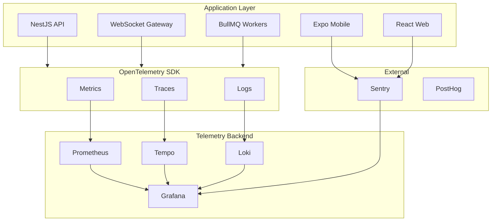
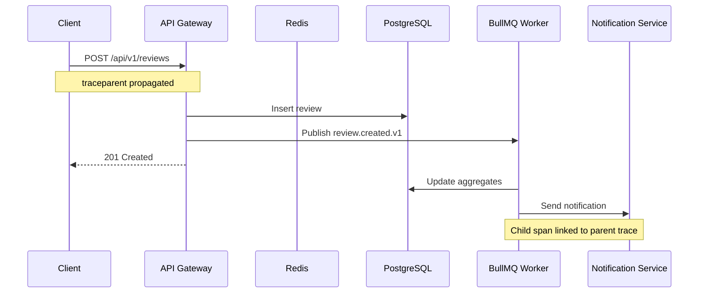
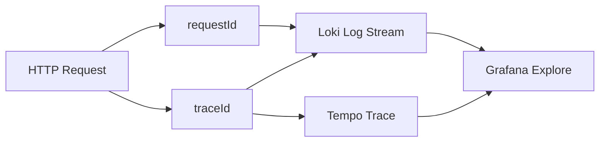
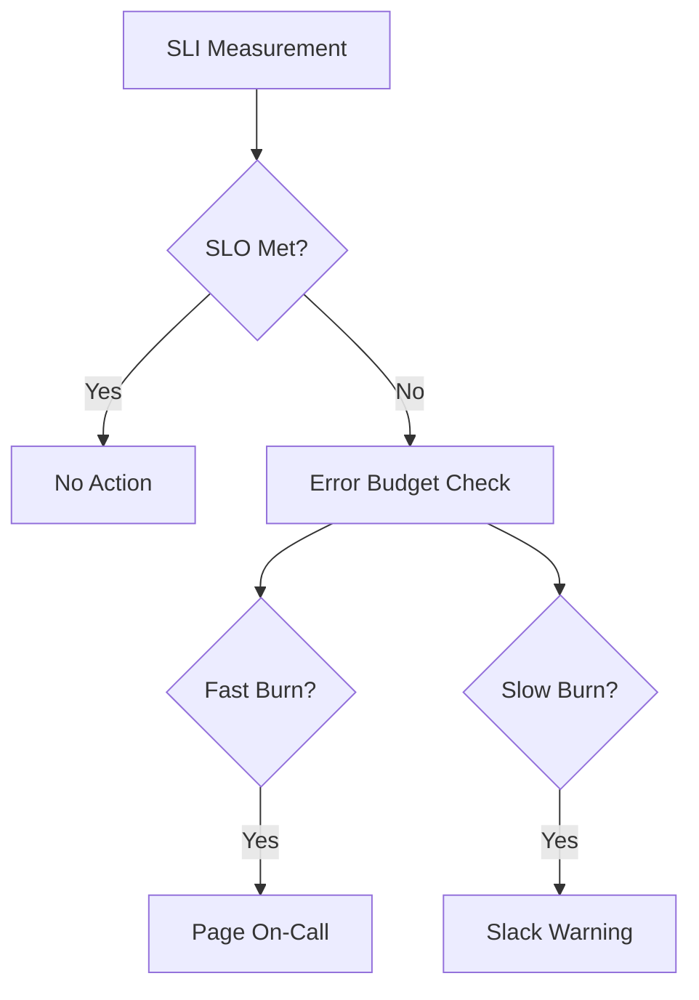

# GMRLOG OS

**Version:** 1.0.0 Alpha

**Document:** `docs/10_DEVOPS/OBSERVABILITY.md`

**Status:** Approved

**Owner:** Platform Engineering

**Classification:** Internal Engineering Documentation

---

# Observability Architecture

## Purpose

This document defines the unified observability strategy for GMRLOG across traces, metrics, and logs.

Every production service must emit telemetry that enables engineers to diagnose incidents within minutes, measure SLO compliance, and correlate user-facing failures with root causes.

Observability is not optional instrumentation—it is a production requirement for every deployable service.

---

# Objectives

The observability stack must provide:

* End-to-end request tracing across API, WebSocket, workers, and database
* Golden-signal metrics with SLO-aligned alerting
* Structured, searchable logs correlated with trace and request identifiers
* Vendor-neutral instrumentation via OpenTelemetry
* Low-overhead collection suitable for high-traffic social workloads
* Environment isolation (dev, staging, production)

---

# Observability Pillars



---

# OpenTelemetry Instrumentation

## Standard

All backend services use the OpenTelemetry SDK with auto-instrumentation for:

* HTTP ingress and egress
* PostgreSQL (Prisma query spans)
* Redis commands
* BullMQ job execution
* Socket.IO connections and events

Mobile and web clients do not export full distributed traces in production. They report performance spans and errors to Sentry.

## Resource Attributes

Every span and metric series includes:

| Attribute | Example |
|-----------|---------|
| `service.name` | `gmrlog-api` |
| `service.version` | Git SHA from CI |
| `deployment.environment` | `production` |
| `gmrlog.region` | `eu-central-1` |
| `gmrlog.tenant` | `default` |

## Trace Context Propagation

* W3C `traceparent` header on all internal HTTP calls
* `x-request-id` generated at the API gateway and injected into logs
* WebSocket connections inherit trace context on handshake
* Background jobs carry parent trace ID in job metadata

## Exporter Configuration

| Environment | Exporter |
|-------------|----------|
| Local | OTLP to local collector (optional) |
| Staging | OTLP → Tempo |
| Production | OTLP → Tempo (sampling enabled) |

Environment variable: `OTEL_EXPORTER` (see `ENVIRONMENT_VARIABLES.md`).

## Sampling Strategy

| Environment | Head Sampling |
|-------------|---------------|
| Development | 100% |
| Staging | 100% |
| Production | 10% baseline; 100% for errors and latency > 2s |

Tail-based sampling is applied at the collector for error traces.

---

# Distributed Tracing

## Span Naming Convention

```
<service>.<operation>
```

Examples:

* `api.http.GET /api/v1/games/{gameId}`
* `api.prisma.game.findUnique`
* `worker.job.notification.send`
* `ws.event.message.deliver`

## Critical Trace Paths

The following user journeys must produce complete traces:

1. Authentication (OAuth callback → session creation)
2. Feed load (cache → DB → composition)
3. Game log write (validation → DB → event publish → notification)
4. Real-time message delivery (WS → Redis pub/sub → recipient)
5. Image upload (presign → S3 → processing → CDN invalidation)
6. AI recommendation request (cache → model inference → response)



## Trace Retention

| Tier | Retention |
|------|-----------|
| Hot (Tempo) | 14 days |
| Cold archive | 90 days (error traces only) |

---

# Metrics

## Collection

Prometheus scrapes:

* Kubernetes pod metrics (`/metrics` endpoint)
* Node and cluster metrics
* PostgreSQL exporter
* Redis exporter
* Custom application counters and histograms

`PROMETHEUS_ENABLED=true` in production (see `ENVIRONMENT_VARIABLES.md`).

## Metric Naming

Follow Prometheus conventions:

```
gmrlog_<subsystem>_<metric>_<unit>
```

Examples:

* `gmrlog_http_request_duration_seconds`
* `gmrlog_db_query_duration_seconds`
* `gmrlog_cache_hit_total`
* `gmrlog_ws_connections_active`
* `gmrlog_queue_jobs_processed_total`

## Golden Signals per Service

| Signal | API | WebSocket | Workers |
|--------|-----|-----------|---------|
| Latency | p50, p95, p99 | Event delivery time | Job duration |
| Traffic | RPS by route | Connections/min | Jobs/min |
| Errors | 5xx rate, error codes | Disconnect rate | Failed jobs |
| Saturation | CPU, memory, pool usage | Connection limit | Queue depth |

## Business Metrics

Product-critical counters exported alongside infrastructure metrics:

* `gmrlog_reviews_created_total`
* `gmrlog_games_logged_total`
* `gmrlog_recommendation_clicks_total`
* `gmrlog_auth_failures_total`

These align with KPIs defined in `SUCCESS_METRICS.md`.

---

# Logs

## Correlation Model

Every log line includes:

```json
{
  "timestamp": "2026-07-10T14:32:01.123Z",
  "level": "info",
  "service": "gmrlog-api",
  "requestId": "req_8f3a2b1c",
  "traceId": "4bf92f3577b34da6a3ce929d0e0e4736",
  "spanId": "00f067aa0ba902b7",
  "userId": "usr_abc123",
  "message": "Review created",
  "context": {
    "reviewId": "rev_xyz789",
    "gameId": "game_456"
  }
}
```

Correlation flow:



Detailed log schema, levels, PII redaction, and retention are defined in `LOGGING.md`.

---

# SLO Framework

## Platform SLOs

| Service | SLI | SLO Target | Error Budget (30d) |
|---------|-----|------------|-------------------|
| API (read) | Availability + latency p95 < 300ms | 99.95% | 21.6 min downtime |
| API (write) | Availability + latency p95 < 500ms | 99.9% | 43.2 min downtime |
| WebSocket | Connection success + delivery < 200ms | 99.9% | 43.2 min downtime |
| Auth | Successful token validation | 99.99% | 4.3 min downtime |
| Search | Results within 300ms p95 | 99.5% | 3.6 hours degraded |

## SLO Calculation

```
SLI = (good_events / total_events) × 100
Error Budget Remaining = 1 - (bad_events / allowed_bad_events)
```

Burn-rate alerts fire at:

* **Fast burn:** 2% budget consumed in 1 hour → page on-call
* **Slow burn:** 10% budget consumed in 6 hours → ticket + Slack alert



## SLO Dashboards

Grafana dashboards per service display:

* Current SLI vs target
* Error budget remaining (gauge)
* Burn rate (1h, 6h, 3d windows)
* Top contributing error types

---

# Alerting Integration

Observability data feeds alerting rules defined in `MONITORING.md`.

Alert severity mapping:

| Condition | Severity |
|-----------|----------|
| SLO fast burn | P1 — Page |
| SLO slow burn | P2 — Slack + ticket |
| Error rate > 5% (5 min) | P1 — Page |
| Latency p99 > 2s (10 min) | P2 — Slack |
| Trace ingestion failure | P3 — Ticket |

---

# Service Instrumentation Checklist

Every new service or endpoint must satisfy:

* [ ] OpenTelemetry SDK initialized at boot
* [ ] Health and readiness probes exposed
* [ ] `/metrics` endpoint with standard HTTP histograms
* [ ] Structured JSON logging with `requestId` and `traceId`
* [ ] Error spans marked with `error=true` and exception recorded
* [ ] SLO-relevant routes added to Grafana dashboard
* [ ] Runbook linked in alert annotations

---

# Local Development

Developers run the observability stack via Docker Compose:

* Grafana → `http://localhost:3001`
* Prometheus → `http://localhost:9090`
* Tempo → `http://localhost:3200`
* Loki → `http://localhost:3100`

Traces and logs from local API calls appear in Grafana Explore when `OTEL_EXPORTER=otlp://localhost:4317`.

---

# Security and Compliance

* Trace and log payloads must not contain passwords, tokens, or full PII
* `userId` is permitted; email and display name are redacted in logs
* Production trace export uses TLS
* Telemetry data retention follows `LOGGING.md` and GDPR requirements
* Access to production Grafana is RBAC-restricted (Engineering, SRE, Admin)

---

# Related Documents

* [LOGGING.md](LOGGING.md)
* [MONITORING.md](MONITORING.md)
* [DEPLOYMENT.md](DEPLOYMENT.md)
* [SYSTEM_ARCHITECTURE.md](SYSTEM_ARCHITECTURE.md)
* [BACKEND_ARCHITECTURE.md](../06_BACKEND/BACKEND_ARCHITECTURE.md)
* [ENVIRONMENT_VARIABLES.md](../00_PROJECT/ENVIRONMENT_VARIABLES.md)
* [SUCCESS_METRICS.md](../00_PROJECT/SUCCESS_METRICS.md)
* [ANALYTICS_SPECIFICATION.md](../13_ANALYTICS/ANALYTICS_SPECIFICATION.md)

---

# Revision History

| Version | Date | Change |
|---------|------|--------|
| 1.0.0 Alpha | 2026-07-10 | Initial observability architecture |
