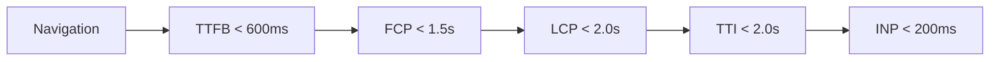
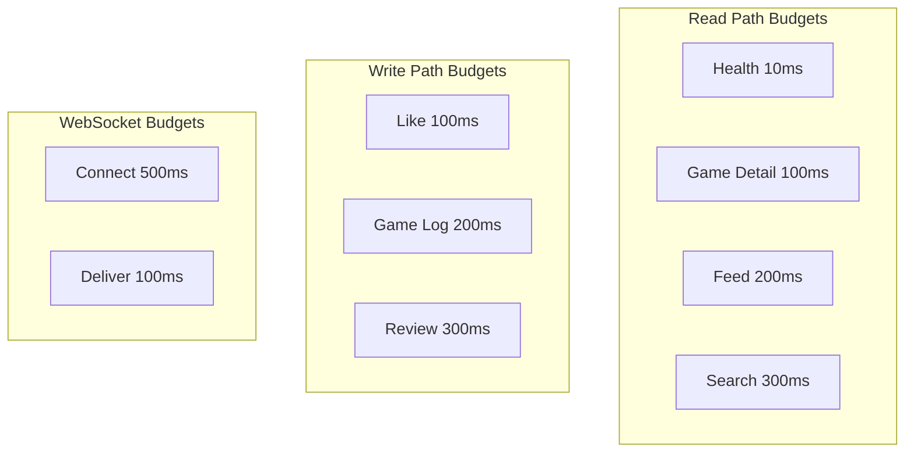

# GMRLOG OS

**Version:** 1.0.0 Alpha

**Document:** `docs/10_DEVOPS/PERFORMANCE_BUDGET.md`

**Status:** Approved

**Owner:** Platform Engineering

**Classification:** Internal Engineering Documentation

---

# Performance Budgets

## Purpose

This document defines quantitative performance budgets for frontend rendering, API latency, and infrastructure targets.

Budgets are enforced in CI, monitored in production, and treated as SLO commitments. Exceeding a budget requires explicit approval with a remediation plan.

---

# Budget Philosophy

* Budgets are **maximums**, not targets — teams should consistently perform better
* Budgets apply to **P95** unless otherwise noted
* Mobile budgets are **stricter** than web (mobile-first product)
* Budgets are reviewed quarterly and tightened as infrastructure improves

---

# Frontend Budgets

## Core Web Vitals

| Metric | Mobile Budget | Web Budget | Measurement |
|--------|---------------|------------|-------------|
| LCP (Largest Contentful Paint) | < 2.0s | < 2.5s | Lighthouse, RUM |
| INP (Interaction to Next Paint) | < 200ms | < 200ms | RUM |
| CLS (Cumulative Layout Shift) | < 0.1 | < 0.1 | Lighthouse, RUM |
| FCP (First Contentful Paint) | < 1.5s | < 1.8s | Lighthouse |
| TTFB (Time to First Byte) | < 600ms | < 500ms | RUM |

## Time to Interactive (TTI)

| Screen | Mobile Budget | Web Budget |
|--------|---------------|------------|
| App cold start | < 2.0s | < 2.5s |
| Feed (authenticated) | < 1.0s | < 1.2s |
| Game detail | < 0.5s | < 0.6s |
| User profile | < 0.8s | < 1.0s |
| Search results | < 0.3s | < 0.3s |
| Review compose | < 0.5s | < 0.5s |
| Messages (conversation) | < 0.5s | < 0.5s |

TTI is measured from navigation event to first meaningful interaction (tap/click response).

## Bundle Size Budgets

| Bundle | Mobile (gzip) | Web (gzip) |
|--------|---------------|------------|
| Initial JS | < 300 KB | < 250 KB |
| Initial CSS | < 50 KB | < 40 KB |
| Per-route chunk | < 100 KB | < 80 KB |
| Total app (all routes) | < 2 MB | < 1.5 MB |
| Font files | < 150 KB | < 150 KB |

## Screen-Level Targets

Aligned with `FRONTEND_ARCHITECTURE.md`:

| Interaction | Budget |
|-------------|--------|
| Navigation transition | < 300ms |
| Feed load (cached) | < 1s |
| Feed load (network) | < 2s |
| Game detail load | < 500ms |
| Search response | < 300ms |
| Message send (optimistic) | < 100ms perceived |
| Image load (above fold) | < 500ms |
| Pull-to-refresh | < 1.5s |

---

# API Latency Budgets

## Read Endpoints (P95)

| Endpoint Category | Budget | Cache Expected |
|-------------------|--------|----------------|
| Health check | < 10ms | — |
| Game detail | < 100ms | 80%+ hit |
| User profile (public) | < 150ms | 70%+ hit |
| Feed page | < 200ms | 60%+ hit |
| Search | < 300ms | 50%+ hit |
| Game list (filtered) | < 200ms | 60%+ hit |
| Notifications list | < 150ms | — |
| Recommendations | < 500ms | 40%+ hit |

## Write Endpoints (P95)

| Endpoint Category | Budget | Notes |
|-------------------|--------|-------|
| Authentication | < 300ms | Includes OAuth redirect |
| Game log | < 200ms | Async side effects |
| Review create | < 300ms | Async notification |
| Like / bookmark | < 100ms | Optimistic UI |
| Follow / friend request | < 150ms | — |
| Message send | < 100ms | WebSocket delivery separate |
| Image upload (presign) | < 200ms | Upload itself excluded |
| Profile update | < 200ms | Cache invalidation async |

## WebSocket (P95)

| Event | Budget |
|-------|--------|
| Connection establishment | < 500ms |
| Message delivery | < 100ms |
| Typing indicator propagation | < 200ms |
| Notification push | < 200ms |
| Presence update | < 300ms |

---

# Infrastructure Budgets

| Resource | Budget | Alert Threshold |
|----------|--------|-----------------|
| API availability | 99.95% | < 99.9% (30d rolling) |
| Database query P95 | < 50ms | > 100ms |
| Redis command P95 | < 2ms | > 5ms |
| CDN cache hit ratio | > 90% | < 85% |
| Image processing | < 5s | > 15s |
| Background job P95 | < 30s | > 60s |
| Deployment duration | < 15 min | > 20 min |

---

# Payload Size Budgets

| Response Type | Max Size (gzip) |
|---------------|-----------------|
| Feed page (20 items) | < 50 KB |
| Game detail | < 30 KB |
| Search results (20 items) | < 40 KB |
| User profile | < 20 KB |
| Notification list (20 items) | < 15 KB |
| Single game card (in list) | < 2 KB |

Image payloads are excluded (served via CDN; see `IMAGE_OPTIMIZATION.md`).

---

# Measurement and Enforcement

## CI Pipeline

| Check | Tool | Gate |
|-------|------|------|
| Lighthouse Performance | Lighthouse CI | Score ≥ 80 |
| Bundle size | `bundlesize` | Per budget table |
| API latency | k6 smoke test | P95 within budget |
| Visual regression | Percy / Chromatic | No unintended layout shift |

## Production Monitoring

| Budget | Dashboard | Alert |
|--------|-----------|-------|
| API latency | Grafana L3 — API Deep Dive | P95 exceeds budget for 10 min |
| LCP | Sentry Performance | P75 LCP > budget for 1 hour |
| Error rate | Grafana L2 — Platform Health | > 1% for 5 min |
| CDN hit ratio | Grafana L2 | < 85% for 30 min |

## Budget Review Process

1. Metrics collected over 30-day rolling window
2. If P50 consistently < 50% of budget → budget tightened by 20%
3. If P95 consistently > 80% of budget → optimization sprint scheduled
4. Budget changes require Platform Engineering approval

---

# Budget Allocation by Screen

Priority screens receive the strictest budgets:

| Priority | Screens | Rationale |
|----------|---------|-----------|
| P0 | Feed, Game Detail, Auth | Core engagement loop |
| P1 | Profile, Search, Messages | Daily use |
| P2 | Settings, Collections, Tier Lists | Frequent but not entry |
| P3 | Admin, Developer Portal | Internal / low traffic |

P0 screens that exceed budgets block release.

---

# Related Documents

* [PERFORMANCE_GUIDE.md](PERFORMANCE_GUIDE.md)
* [IMAGE_OPTIMIZATION.md](IMAGE_OPTIMIZATION.md)
* [NETWORK_OPTIMIZATION.md](NETWORK_OPTIMIZATION.md)
* [FRONTEND_ARCHITECTURE.md](../05_FRONTEND/FRONTEND_ARCHITECTURE.md)
* [OBSERVABILITY.md](OBSERVABILITY.md)
* [MONITORING.md](MONITORING.md)
* [SUCCESS_METRICS.md](../00_PROJECT/SUCCESS_METRICS.md)

---

# Revision History

| Version | Date | Change |
|---------|------|--------|
| 1.0.0 Alpha | 2026-07-10 | Initial performance budgets |
