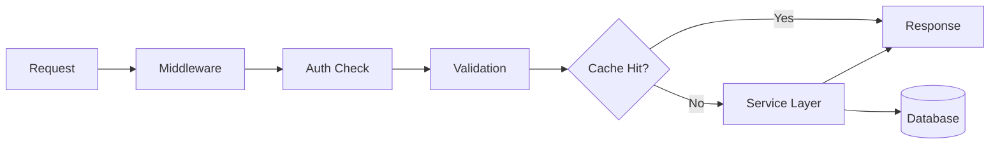
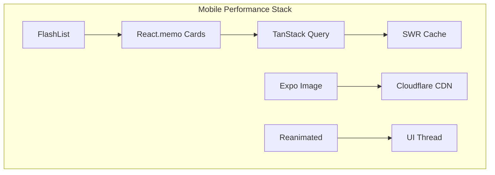

# GMRLOG OS

**Version:** 1.0.0 Alpha

**Document:** `docs/10_DEVOPS/PERFORMANCE_GUIDE.md`

**Status:** Approved

**Owner:** Platform Engineering

**Classification:** Internal Engineering Documentation

---

# Performance Engineering Guide

## Purpose

This document defines performance patterns, optimization strategies, and engineering standards for backend and frontend teams.

Performance is a product feature. Slow experiences reduce engagement, increase churn, and violate SLO commitments defined in `PERFORMANCE_BUDGET.md`.

---

# Performance Philosophy

1. **Measure first** — Profile before optimizing; no premature optimization
2. **User-perceived speed** — Optimize what users feel (LCP, TTI, interaction latency)
3. **P95 over averages** — Tail latency matters for social platforms
4. **Cache aggressively, invalidate precisely** — See `CACHE_STRATEGY.md`
5. **Ship less** — Smaller bundles and payloads beat faster networks

---

# Backend Performance Patterns

## API Layer

### Request Lifecycle Optimization



### Patterns

| Pattern | Application | Expected Impact |
|---------|-------------|-----------------|
| Connection pooling | PgBouncer between API and PostgreSQL | Eliminates connection overhead |
| Response caching | Redis for read-heavy endpoints (feed, game detail) | 80%+ cache hit on hot paths |
| Cursor pagination | All list endpoints | Constant-time page loads |
| Field selection | `?fields=` or sparse DTOs | 30–60% payload reduction |
| Batch queries | DataLoader for N+1 prevention | Reduces DB round-trips |
| Async side effects | Domain events via BullMQ | Write path < 200ms |
| Compression | gzip/brotli on responses > 1 KB | 60–80% transfer reduction |

### Database Query Standards

* All queries must use indexes verified by `EXPLAIN ANALYZE`
* No unbounded `SELECT *` on tables > 10,000 rows
* Read replicas for analytics and search indexing queries
* Materialized views for aggregate statistics (refreshed by workers)
* Query timeout: 5 seconds (hard kill at 10 seconds)

```sql
-- Required: every production query must hit an index
EXPLAIN (ANALYZE, BUFFERS)
SELECT id, title, cover_url
FROM games
WHERE slug = 'hollow-knight'
LIMIT 1;
```

### N+1 Prevention

Use DataLoader pattern in NestJS resolvers and service layers:

```typescript
// Batch load game summaries within a single request
const gameLoader = new DataLoader<string, GameSummary>(async (ids) => {
  const games = await gameRepository.findByIds([...ids]);
  return ids.map((id) => games.find((g) => g.id === id) ?? null);
});
```

### Background Job Performance

| Job Type | Max Duration | Concurrency | Priority |
|----------|-------------|-------------|----------|
| Notification delivery | 5s | 50 | High |
| Search index update | 30s | 20 | Medium |
| Analytics aggregation | 120s | 5 | Low |
| Image processing | 60s | 10 | Medium |
| Recommendation refresh | 300s | 3 | Low |

Jobs exceeding max duration are logged, retried with backoff, and moved to dead-letter queue after 5 attempts.

---

## Caching Patterns

Detailed cache architecture is in `CACHE_STRATEGY.md`. Performance-critical rules:

| Resource | TTL | Invalidation |
|----------|-----|--------------|
| Game detail | 1 hour | On game update event |
| User profile (public) | 15 minutes | On profile update |
| Feed page | 2 minutes | On new post from followed user |
| Search results | 5 minutes | On index update |
| Trending | 10 minutes | Scheduled refresh |
| Feature flags | 60 seconds | On flag change event |

---

## WebSocket Performance

* Connection-per-pod limit: 10,000
* Message batching for typing indicators (debounce 300ms)
* Room-based pub/sub via Redis (not broadcast-all)
* Binary protocol for high-frequency events (future)
* Heartbeat interval: 30 seconds

---

# Frontend Performance Patterns

## Mobile (Expo / React Native)

### Rendering

| Pattern | Usage |
|---------|-------|
| FlashList | All scrollable lists (feed, games, messages) |
| `React.memo` | Card components rendered in lists |
| `useCallback` / `useMemo` | Event handlers and derived data in list items |
| Reanimated | Animations on UI thread (never JS-thread layout animations) |
| Expo Image | All remote images with caching and progressive loading |
| Lazy screens | React.lazy for non-critical screens |

### Data Fetching

| Pattern | Usage |
|---------|-------|
| TanStack Query | All API data with stale-while-revalidate |
| Prefetching | Next feed page prefetched at 70% scroll |
| Optimistic updates | Likes, bookmarks, follows |
| Request deduplication | TanStack Query automatic dedup |
| Pagination | Cursor-based infinite scroll |

### Bundle Optimization

* Hermes engine enabled
* Tree-shaking via Metro bundler
* No lodash full import; use `lodash-es` specific functions
* Shared packages via monorepo (`@gmrlog/ui`, `@gmrlog/types`)
* OTA updates via Expo EAS for JS-only changes



## Web (React)

| Pattern | Usage |
|---------|-------|
| Code splitting | Route-based lazy loading |
| SSR / SSG | Static pages (landing, game detail SEO) |
| Image optimization | Responsive srcset via CDN variants |
| Font loading | `font-display: swap` with preload |
| Service worker | Asset caching (PWA future) |

---

# Network Performance

See `NETWORK_OPTIMIZATION.md` for HTTP/2, compression, and pagination standards.

Key rules:

* API responses < 50 KB for list endpoints
* Images served via CDN with appropriate variant
* WebSocket for real-time; no polling except fallback
* GraphQL gateway deferred; REST with field selection for V1

---

# Image Performance

See `IMAGE_OPTIMIZATION.md` for CDN, format, and variant strategy.

Frontend rules:

* Always request appropriately sized variant (not original)
* BlurHash placeholder during load
* Lazy load images below the fold
* Prefetch hero images for detail pages

---

# Performance Testing

## Load Testing

| Scenario | Tool | Target |
|----------|------|--------|
| API read throughput | k6 | 5,000 RPS, p95 < 300ms |
| API write throughput | k6 | 500 RPS, p95 < 500ms |
| WebSocket connections | k6 | 10,000 concurrent |
| Feed scroll simulation | k6 | 1,000 users, p95 < 1s |

Run load tests:

* Before major releases
* After infrastructure changes
* Monthly baseline comparison

## Profiling

| Layer | Tool | When |
|-------|------|------|
| Backend CPU | Node.js `--inspect` + clinic.js | Latency regression |
| Database | `pg_stat_statements` | Slow query alerts |
| Mobile JS | React DevTools Profiler | Frame drops reported |
| Mobile native | Xcode Instruments / Android Profiler | Startup regression |
| Web | Lighthouse CI | Every PR to main |

---

# Performance Regression Prevention

## CI Gates

| Check | Threshold | Action |
|-------|-----------|--------|
| Lighthouse Performance | > 80 | Block merge |
| Bundle size | < 5% increase | Warn |
| API integration test latency | p95 < budget | Block merge |
| k6 smoke test | p95 < 2x budget | Block deploy |

## Release Checklist

* [ ] No new unindexed database queries
* [ ] Cache invalidation tested for new endpoints
* [ ] List endpoints use cursor pagination
* [ ] Images use CDN variants
* [ ] No synchronous external API calls in write path
* [ ] Performance budgets in `PERFORMANCE_BUDGET.md` met

---

# Anti-Patterns

| Anti-Pattern | Why | Alternative |
|--------------|-----|-------------|
| Offset pagination on large tables | O(n) scan degrades | Cursor pagination |
| Loading all relations eagerly | Memory and latency spike | DataLoader / lazy load |
| Polling for notifications | Wastes bandwidth and battery | WebSocket push |
| Full-size images in feed | Wastes bandwidth | 512px variant |
| `console.time` in production | Overhead and noise | OpenTelemetry spans |
| Blocking the event loop | Latency spikes for all users | Offload to worker threads |
| Unbounded in-memory caches | OOM kills | Redis with TTL |

---

# Related Documents

* [PERFORMANCE_BUDGET.md](PERFORMANCE_BUDGET.md)
* [IMAGE_OPTIMIZATION.md](IMAGE_OPTIMIZATION.md)
* [NETWORK_OPTIMIZATION.md](NETWORK_OPTIMIZATION.md)
* [CACHE_STRATEGY.md](../06_BACKEND/CACHE_STRATEGY.md)
* [FRONTEND_ARCHITECTURE.md](../05_FRONTEND/FRONTEND_ARCHITECTURE.md)
* [BACKEND_ARCHITECTURE.md](../06_BACKEND/BACKEND_ARCHITECTURE.md)
* [OBSERVABILITY.md](OBSERVABILITY.md)

---

# Revision History

| Version | Date | Change |
|---------|------|--------|
| 1.0.0 Alpha | 2026-07-10 | Initial performance guide |
