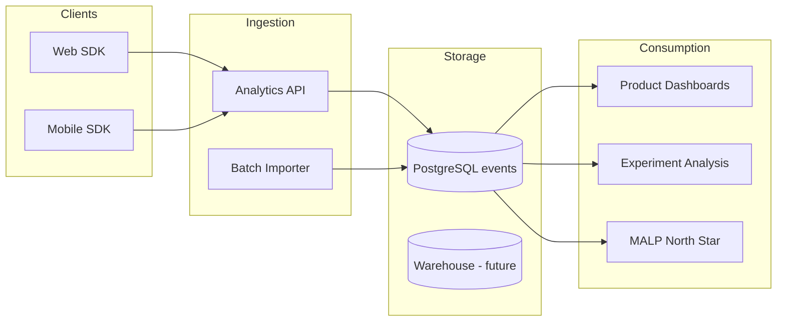

# GMRLOG OS — Analytics Architecture

**Version:** 1.0.0  
**Document:** `docs/13_ANALYTICS/ANALYTICS_ARCHITECTURE.md`  
**Status:** Approved  
**Owner:** Data & Product Team

---

## Purpose

Define how product analytics, engineering telemetry, and business metrics are collected, stored, and consumed — separate from application observability (`OBSERVABILITY.md`).

---

## Architecture

---

## Event Pipeline

1. Client fires typed event (see `ANALYTICS_SPECIFICATION.md`).
2. SDK batches (max 20 events or 30s).
3. `POST /api/v1/analytics/events` (internal, authenticated).
4. Server validates schema, enriches `userId`, `sessionId`, `platform`.
5. Insert `analytics_events` (partitioned monthly in v2).

---

## Identity & Privacy

- Anonymous until login; merge on `identify(userId)`.
- No PII in event properties (no email, IP stored hashed only).
- GDPR: `DATA_RETENTION.md` retention windows.

---

## North Star (MALP)

Monthly Active Logged Players — defined in `SUCCESS_METRICS.md`. Computed nightly from `game_logs` + `analytics_events`.

---

## Related Documents

- [ANALYTICS_SPECIFICATION.md](ANALYTICS_SPECIFICATION.md)
- [PRODUCT_METRICS.md](PRODUCT_METRICS.md)
- [DATA_RETENTION.md](DATA_RETENTION.md)
- [SUCCESS_METRICS.md](../00_PROJECT/SUCCESS_METRICS.md)
- [OBSERVABILITY.md](../10_DEVOPS/OBSERVABILITY.md)

---

## Revision History

| Version | Date | Change |
|---------|------|--------|
| 1.0.0 | 2026-07-10 | Initial analytics architecture |
